## New insights into the role of epilithic biological crust in arid rock weathering
This script reproduces all sequence analysis steps and plots included in the paper plus some additional exploratory analyses.
The analysis is heavily based on the phyloseq package [@mcmurdie_phyloseq_2013], but also on many other R packages.


```r
set.seed(123456789)
bootstraps <- 1000
min_lib_size <- 1000
```

**Load data**

```r
read.csv("Data/Rock_weathering_new2_otuTab.txt", header = TRUE, row.names = 1, sep = "\t") %>%
  t() %>% 
  as.data.frame() ->
  Rock_weathering_OTUmat

sort_order <- as.numeric(gsub("OTU([0-9]+)", "\\1", colnames(Rock_weathering_OTUmat)))
Rock_weathering_OTUmat <- Rock_weathering_OTUmat[, order(sort_order)]
row.names(Rock_weathering_OTUmat) <- gsub("(.*)Nimrod[0-9]+|Osnat[0-9]+", "\\1", row.names(Rock_weathering_OTUmat))

Metadata <- read.csv("Data/Rock_weathering_metadata_RA.csv", row.names = 1, header = TRUE)
# Order abundance_mat samples according to the metadata
sample_order <- match(row.names(Rock_weathering_OTUmat), row.names(Metadata))
Rock_weathering_OTUmat %<>% arrange(., sample_order)
Metadata$sample_names <- row.names(Metadata)
Metadata$Uni.Source <- fct_collapse(Metadata$Source, Rock = c("Dolomite", "Limestone"))
Metadata$Climate.Source <-
  factor(
    paste(
      Metadata$Climate,
      Metadata$Source
    ),
    levels = c(
      "Arid Limestone",
      "Arid Dust",
      "Arid Loess soil",
      "Hyperarid Dolomite",
      "Hyperarid Dust",
      "Hyperarid Loess soil"
    ),
    labels = c(
      "Arid limestone",
      "Arid dust",
      "Arid loess soil",
      "Hyperarid dolomite",
      "Hyperarid dust",
      "Hyperarid loess soil"
    )
  )

Metadata$Climate.UniSource <-
  factor(
    paste(
      Metadata$Climate,
      Metadata$Uni.Source
    ),
    levels = c(
      "Arid Rock",
      "Arid Dust",
      "Arid Loess soil",
      "Hyperarid Rock",
      "Hyperarid Dust",
      "Hyperarid Loess soil"
    ),
    labels = c(
      "Arid rock",
      "Arid dust",
      "Arid loess soil",
      "Hyperarid rock",
      "Hyperarid dust",
      "Hyperarid loess soil"
    )
  )
# calculate sample size
Metadata$Lib.size = rowSums(Rock_weathering_OTUmat)
row.names(Rock_weathering_OTUmat) <- row.names(Metadata)

# Load taxonomy data
tax.file <- "Data/Rock_weathering_new2_silva.nrv119.taxonomy"
Taxonomy <- read.table(tax.file,  stringsAsFactors = FALSE) # read taxonomy file

# count how many ';' in each cell and add up to 6
for (i in 1:nrow(Taxonomy)) {
  semicolons <- length(gregexpr(";", Taxonomy$V2[i])[[1]])
  if (semicolons < 6) {
    x <- paste0(rep("Unclassified;", 6 - semicolons), collapse = "")
    Taxonomy$V2[i] <- paste0(Taxonomy$V2[i], x, sep = "")
  }
}

do.call( "rbind", strsplit( Taxonomy$V1, ";", fixed = TRUE)) %>% 
  gsub( "size=([0-9]+)", "\\1", .) %>%
  data.frame( ., do.call( "rbind", strsplit( Taxonomy$V2, ";", fixed = TRUE)), stringsAsFactors = F) %>% 
  apply(., 2, function(x) gsub( "\\(.*\\)", "", x)) %>% 
  replace(., . == "unclassified", "Unclassified") -> 
  Taxonomy

colnames( Taxonomy ) <- c( "OTU", "Frequency", "Domain", "Phylum", "Class", "Order", "Family", "Genus" )
# rownames(Taxonomy) <- colnames(Rock_weathering_OTUmat)
rownames(Taxonomy) <- Taxonomy[, 1]

# generate phyloseq object
Rock_dust <- phyloseq(otu_table(Rock_weathering_OTUmat, taxa_are_rows = FALSE),
                        tax_table(Taxonomy[, -c(1, 2)]),
                        sample_data(Metadata)
                        )

# Reorder factors for plotting
sample_data(Rock_dust)$Source %<>% fct_relevel("Limestone", "Dolomite", "Dust", "Loess soil")
```

Remove samples not for analysis

```r
samples2remove <- c(2, 3, 4, 5, 6, 7, 8, 10, 12) 
Rock_dust <- subset_samples(Rock_dust, !grepl(paste(c(sample_names(Rock_dust)[samples2remove]), collapse = "|"), sample_names(Rock_dust)))
Rock_dust <- filter_taxa(Rock_dust, function(x) sum(x) > 0, TRUE)

domains2remove <- c("", "Eukaryota", "Unclassified")
classes2remove <- c("Chloroplast")
families2remove <- c("Mitochondria")

Rock_weathering_filt <- subset_taxa(Rock_dust, !is.na(Phylum) &
                        !Domain %in% domains2remove &
                      !Class %in% classes2remove &
                      !Family %in% families2remove)
```

First let's explore the prevalence of different taxa in the database.

```r
prevdf <- apply(X = otu_table(Rock_weathering_filt),
                 MARGIN = ifelse(taxa_are_rows(Rock_weathering_filt), yes = 1, no = 2),
                 FUN = function(x){sum(x > 0)})
# Add taxonomy and total read counts to this data.frame
prevdf <- data.frame(Prevalence = prevdf,
                      TotalAbundance = taxa_sums(Rock_weathering_filt),
                      tax_table(Rock_weathering_filt))

prevdf %>%
  group_by(Phylum) %>%
  summarise(`Mean prevalence` = mean(Prevalence),
            `Sum prevalence` = sum(Prevalence)) ->
  Prevalence_phylum_summary

Prevalence_phylum_summary %>% 
  kable(., digits = c(0, 1, 0)) %>%
  kable_styling(bootstrap_options = c("striped", "hover", "condensed", "responsive"), full_width = F)
```

<table class="table table-striped table-hover table-condensed table-responsive" style="width: auto !important; margin-left: auto; margin-right: auto;">
 <thead>
  <tr>
   <th style="text-align:left;"> Phylum </th>
   <th style="text-align:right;"> Mean prevalence </th>
   <th style="text-align:right;"> Sum prevalence </th>
  </tr>
 </thead>
<tbody>
  <tr>
   <td style="text-align:left;"> Acidobacteria </td>
   <td style="text-align:right;"> 16.9 </td>
   <td style="text-align:right;"> 1281 </td>
  </tr>
  <tr>
   <td style="text-align:left;"> Actinobacteria </td>
   <td style="text-align:right;"> 20.1 </td>
   <td style="text-align:right;"> 5660 </td>
  </tr>
  <tr>
   <td style="text-align:left;"> Aquificae </td>
   <td style="text-align:right;"> 14.3 </td>
   <td style="text-align:right;"> 43 </td>
  </tr>
  <tr>
   <td style="text-align:left;"> Armatimonadetes </td>
   <td style="text-align:right;"> 15.8 </td>
   <td style="text-align:right;"> 79 </td>
  </tr>
  <tr>
   <td style="text-align:left;"> Bacteroidetes </td>
   <td style="text-align:right;"> 16.2 </td>
   <td style="text-align:right;"> 2337 </td>
  </tr>
  <tr>
   <td style="text-align:left;"> Caldiserica </td>
   <td style="text-align:right;"> 2.0 </td>
   <td style="text-align:right;"> 2 </td>
  </tr>
  <tr>
   <td style="text-align:left;"> Candidate_division_BRC1 </td>
   <td style="text-align:right;"> 14.0 </td>
   <td style="text-align:right;"> 28 </td>
  </tr>
  <tr>
   <td style="text-align:left;"> Candidate_division_OD1 </td>
   <td style="text-align:right;"> 20.2 </td>
   <td style="text-align:right;"> 81 </td>
  </tr>
  <tr>
   <td style="text-align:left;"> Candidate_division_OP11 </td>
   <td style="text-align:right;"> 9.0 </td>
   <td style="text-align:right;"> 9 </td>
  </tr>
  <tr>
   <td style="text-align:left;"> Candidate_division_TM7 </td>
   <td style="text-align:right;"> 18.3 </td>
   <td style="text-align:right;"> 440 </td>
  </tr>
  <tr>
   <td style="text-align:left;"> Chlorobi </td>
   <td style="text-align:right;"> 15.5 </td>
   <td style="text-align:right;"> 62 </td>
  </tr>
  <tr>
   <td style="text-align:left;"> Chloroflexi </td>
   <td style="text-align:right;"> 14.9 </td>
   <td style="text-align:right;"> 2753 </td>
  </tr>
  <tr>
   <td style="text-align:left;"> Cyanobacteria </td>
   <td style="text-align:right;"> 19.4 </td>
   <td style="text-align:right;"> 874 </td>
  </tr>
  <tr>
   <td style="text-align:left;"> Deinococcus-Thermus </td>
   <td style="text-align:right;"> 19.6 </td>
   <td style="text-align:right;"> 274 </td>
  </tr>
  <tr>
   <td style="text-align:left;"> Elusimicrobia </td>
   <td style="text-align:right;"> 11.0 </td>
   <td style="text-align:right;"> 22 </td>
  </tr>
  <tr>
   <td style="text-align:left;"> Fibrobacteres </td>
   <td style="text-align:right;"> 16.2 </td>
   <td style="text-align:right;"> 65 </td>
  </tr>
  <tr>
   <td style="text-align:left;"> Firmicutes </td>
   <td style="text-align:right;"> 16.2 </td>
   <td style="text-align:right;"> 1164 </td>
  </tr>
  <tr>
   <td style="text-align:left;"> Fusobacteria </td>
   <td style="text-align:right;"> 14.0 </td>
   <td style="text-align:right;"> 28 </td>
  </tr>
  <tr>
   <td style="text-align:left;"> Gemmatimonadetes </td>
   <td style="text-align:right;"> 15.4 </td>
   <td style="text-align:right;"> 848 </td>
  </tr>
  <tr>
   <td style="text-align:left;"> Nitrospirae </td>
   <td style="text-align:right;"> 22.0 </td>
   <td style="text-align:right;"> 44 </td>
  </tr>
  <tr>
   <td style="text-align:left;"> NPL-UPA2 </td>
   <td style="text-align:right;"> 6.0 </td>
   <td style="text-align:right;"> 6 </td>
  </tr>
  <tr>
   <td style="text-align:left;"> Planctomycetes </td>
   <td style="text-align:right;"> 12.7 </td>
   <td style="text-align:right;"> 420 </td>
  </tr>
  <tr>
   <td style="text-align:left;"> Proteobacteria </td>
   <td style="text-align:right;"> 19.1 </td>
   <td style="text-align:right;"> 4979 </td>
  </tr>
  <tr>
   <td style="text-align:left;"> SBYG-2791 </td>
   <td style="text-align:right;"> 9.0 </td>
   <td style="text-align:right;"> 9 </td>
  </tr>
  <tr>
   <td style="text-align:left;"> SM2F11 </td>
   <td style="text-align:right;"> 20.0 </td>
   <td style="text-align:right;"> 20 </td>
  </tr>
  <tr>
   <td style="text-align:left;"> Spirochaetae </td>
   <td style="text-align:right;"> 15.0 </td>
   <td style="text-align:right;"> 15 </td>
  </tr>
  <tr>
   <td style="text-align:left;"> Synergistetes </td>
   <td style="text-align:right;"> 11.0 </td>
   <td style="text-align:right;"> 11 </td>
  </tr>
  <tr>
   <td style="text-align:left;"> Tenericutes </td>
   <td style="text-align:right;"> 3.0 </td>
   <td style="text-align:right;"> 3 </td>
  </tr>
  <tr>
   <td style="text-align:left;"> Thaumarchaeota </td>
   <td style="text-align:right;"> 21.0 </td>
   <td style="text-align:right;"> 21 </td>
  </tr>
  <tr>
   <td style="text-align:left;"> Verrucomicrobia </td>
   <td style="text-align:right;"> 13.2 </td>
   <td style="text-align:right;"> 383 </td>
  </tr>
  <tr>
   <td style="text-align:left;"> WCHB1-60 </td>
   <td style="text-align:right;"> 19.0 </td>
   <td style="text-align:right;"> 57 </td>
  </tr>
</tbody>
</table>

```r
prevdf %>%
  group_by(Order) %>%
  summarise(`Mean prevalence` = mean(Prevalence),
            `Sum prevalence` = sum(Prevalence)) ->
  Prevalence_Order_summary

Prevalence_Order_summary %>% 
  kable(., digits = c(0, 1, 0)) %>%
  kable_styling(bootstrap_options = c("striped", "hover", "condensed", "responsive"), full_width = F)
```

<table class="table table-striped table-hover table-condensed table-responsive" style="width: auto !important; margin-left: auto; margin-right: auto;">
 <thead>
  <tr>
   <th style="text-align:left;"> Order </th>
   <th style="text-align:right;"> Mean prevalence </th>
   <th style="text-align:right;"> Sum prevalence </th>
  </tr>
 </thead>
<tbody>
  <tr>
   <td style="text-align:left;"> 11B-2 </td>
   <td style="text-align:right;"> 9.2 </td>
   <td style="text-align:right;"> 55 </td>
  </tr>
  <tr>
   <td style="text-align:left;"> Acidimicrobiales </td>
   <td style="text-align:right;"> 18.2 </td>
   <td style="text-align:right;"> 709 </td>
  </tr>
  <tr>
   <td style="text-align:left;"> Acidithiobacillales </td>
   <td style="text-align:right;"> 21.0 </td>
   <td style="text-align:right;"> 21 </td>
  </tr>
  <tr>
   <td style="text-align:left;"> Actinomycetales </td>
   <td style="text-align:right;"> 12.0 </td>
   <td style="text-align:right;"> 12 </td>
  </tr>
  <tr>
   <td style="text-align:left;"> Aeromonadales </td>
   <td style="text-align:right;"> 21.0 </td>
   <td style="text-align:right;"> 21 </td>
  </tr>
  <tr>
   <td style="text-align:left;"> AKIW781 </td>
   <td style="text-align:right;"> 11.0 </td>
   <td style="text-align:right;"> 592 </td>
  </tr>
  <tr>
   <td style="text-align:left;"> AKYG1722 </td>
   <td style="text-align:right;"> 17.4 </td>
   <td style="text-align:right;"> 157 </td>
  </tr>
  <tr>
   <td style="text-align:left;"> Alteromonadales </td>
   <td style="text-align:right;"> 14.5 </td>
   <td style="text-align:right;"> 29 </td>
  </tr>
  <tr>
   <td style="text-align:left;"> Anaerolineales </td>
   <td style="text-align:right;"> 21.0 </td>
   <td style="text-align:right;"> 63 </td>
  </tr>
  <tr>
   <td style="text-align:left;"> Aquificales </td>
   <td style="text-align:right;"> 14.3 </td>
   <td style="text-align:right;"> 43 </td>
  </tr>
  <tr>
   <td style="text-align:left;"> Ardenticatenales </td>
   <td style="text-align:right;"> 9.8 </td>
   <td style="text-align:right;"> 98 </td>
  </tr>
  <tr>
   <td style="text-align:left;"> AT425-EubC11_terrestrial_group </td>
   <td style="text-align:right;"> 18.2 </td>
   <td style="text-align:right;"> 328 </td>
  </tr>
  <tr>
   <td style="text-align:left;"> Bacillales </td>
   <td style="text-align:right;"> 18.3 </td>
   <td style="text-align:right;"> 475 </td>
  </tr>
  <tr>
   <td style="text-align:left;"> Bacteroidales </td>
   <td style="text-align:right;"> 10.7 </td>
   <td style="text-align:right;"> 192 </td>
  </tr>
  <tr>
   <td style="text-align:left;"> BD2-11_terrestrial_group </td>
   <td style="text-align:right;"> 26.0 </td>
   <td style="text-align:right;"> 26 </td>
  </tr>
  <tr>
   <td style="text-align:left;"> BD72BR169 </td>
   <td style="text-align:right;"> 14.0 </td>
   <td style="text-align:right;"> 14 </td>
  </tr>
  <tr>
   <td style="text-align:left;"> Bdellovibrionales </td>
   <td style="text-align:right;"> 14.5 </td>
   <td style="text-align:right;"> 58 </td>
  </tr>
  <tr>
   <td style="text-align:left;"> BG.g7 </td>
   <td style="text-align:right;"> 26.0 </td>
   <td style="text-align:right;"> 26 </td>
  </tr>
  <tr>
   <td style="text-align:left;"> Bifidobacteriales </td>
   <td style="text-align:right;"> 9.0 </td>
   <td style="text-align:right;"> 18 </td>
  </tr>
  <tr>
   <td style="text-align:left;"> Brocadiales </td>
   <td style="text-align:right;"> 15.5 </td>
   <td style="text-align:right;"> 31 </td>
  </tr>
  <tr>
   <td style="text-align:left;"> Burkholderiales </td>
   <td style="text-align:right;"> 19.3 </td>
   <td style="text-align:right;"> 559 </td>
  </tr>
  <tr>
   <td style="text-align:left;"> C0119 </td>
   <td style="text-align:right;"> 12.0 </td>
   <td style="text-align:right;"> 120 </td>
  </tr>
  <tr>
   <td style="text-align:left;"> Caenarcaniphilales </td>
   <td style="text-align:right;"> 23.0 </td>
   <td style="text-align:right;"> 23 </td>
  </tr>
  <tr>
   <td style="text-align:left;"> Caldilineales </td>
   <td style="text-align:right;"> 17.0 </td>
   <td style="text-align:right;"> 102 </td>
  </tr>
  <tr>
   <td style="text-align:left;"> Caldisericales </td>
   <td style="text-align:right;"> 2.0 </td>
   <td style="text-align:right;"> 2 </td>
  </tr>
  <tr>
   <td style="text-align:left;"> Campylobacterales </td>
   <td style="text-align:right;"> 14.6 </td>
   <td style="text-align:right;"> 73 </td>
  </tr>
  <tr>
   <td style="text-align:left;"> Caulobacterales </td>
   <td style="text-align:right;"> 23.4 </td>
   <td style="text-align:right;"> 257 </td>
  </tr>
  <tr>
   <td style="text-align:left;"> Chlorobiales </td>
   <td style="text-align:right;"> 15.5 </td>
   <td style="text-align:right;"> 62 </td>
  </tr>
  <tr>
   <td style="text-align:left;"> Chloroflexales </td>
   <td style="text-align:right;"> 7.4 </td>
   <td style="text-align:right;"> 52 </td>
  </tr>
  <tr>
   <td style="text-align:left;"> Chromatiales </td>
   <td style="text-align:right;"> 16.8 </td>
   <td style="text-align:right;"> 84 </td>
  </tr>
  <tr>
   <td style="text-align:left;"> Chthoniobacterales </td>
   <td style="text-align:right;"> 14.1 </td>
   <td style="text-align:right;"> 226 </td>
  </tr>
  <tr>
   <td style="text-align:left;"> Clostridiales </td>
   <td style="text-align:right;"> 15.4 </td>
   <td style="text-align:right;"> 401 </td>
  </tr>
  <tr>
   <td style="text-align:left;"> Corynebacteriales </td>
   <td style="text-align:right;"> 16.9 </td>
   <td style="text-align:right;"> 203 </td>
  </tr>
  <tr>
   <td style="text-align:left;"> Cytophagales </td>
   <td style="text-align:right;"> 18.6 </td>
   <td style="text-align:right;"> 1113 </td>
  </tr>
  <tr>
   <td style="text-align:left;"> Dehalococcoidales </td>
   <td style="text-align:right;"> 8.0 </td>
   <td style="text-align:right;"> 16 </td>
  </tr>
  <tr>
   <td style="text-align:left;"> Deinococcales </td>
   <td style="text-align:right;"> 19.6 </td>
   <td style="text-align:right;"> 255 </td>
  </tr>
  <tr>
   <td style="text-align:left;"> Desulfobacterales </td>
   <td style="text-align:right;"> 8.4 </td>
   <td style="text-align:right;"> 42 </td>
  </tr>
  <tr>
   <td style="text-align:left;"> Desulfovibrionales </td>
   <td style="text-align:right;"> 8.0 </td>
   <td style="text-align:right;"> 8 </td>
  </tr>
  <tr>
   <td style="text-align:left;"> Desulfurellales </td>
   <td style="text-align:right;"> 11.0 </td>
   <td style="text-align:right;"> 11 </td>
  </tr>
  <tr>
   <td style="text-align:left;"> Desulfuromonadales </td>
   <td style="text-align:right;"> 22.0 </td>
   <td style="text-align:right;"> 22 </td>
  </tr>
  <tr>
   <td style="text-align:left;"> Elev-16S-976 </td>
   <td style="text-align:right;"> 23.5 </td>
   <td style="text-align:right;"> 47 </td>
  </tr>
  <tr>
   <td style="text-align:left;"> EMP-G18 </td>
   <td style="text-align:right;"> 3.0 </td>
   <td style="text-align:right;"> 3 </td>
  </tr>
  <tr>
   <td style="text-align:left;"> Enterobacteriales </td>
   <td style="text-align:right;"> 27.0 </td>
   <td style="text-align:right;"> 135 </td>
  </tr>
  <tr>
   <td style="text-align:left;"> Erysipelotrichales </td>
   <td style="text-align:right;"> 11.0 </td>
   <td style="text-align:right;"> 33 </td>
  </tr>
  <tr>
   <td style="text-align:left;"> Euzebyales </td>
   <td style="text-align:right;"> 19.4 </td>
   <td style="text-align:right;"> 252 </td>
  </tr>
  <tr>
   <td style="text-align:left;"> Fibrobacterales </td>
   <td style="text-align:right;"> 16.2 </td>
   <td style="text-align:right;"> 65 </td>
  </tr>
  <tr>
   <td style="text-align:left;"> Flavobacteriales </td>
   <td style="text-align:right;"> 16.4 </td>
   <td style="text-align:right;"> 164 </td>
  </tr>
  <tr>
   <td style="text-align:left;"> Frankiales </td>
   <td style="text-align:right;"> 28.2 </td>
   <td style="text-align:right;"> 367 </td>
  </tr>
  <tr>
   <td style="text-align:left;"> Fusobacteriales </td>
   <td style="text-align:right;"> 14.0 </td>
   <td style="text-align:right;"> 28 </td>
  </tr>
  <tr>
   <td style="text-align:left;"> Gaiellales </td>
   <td style="text-align:right;"> 18.4 </td>
   <td style="text-align:right;"> 386 </td>
  </tr>
  <tr>
   <td style="text-align:left;"> Gammaproteobacteria_Incertae_Sedis </td>
   <td style="text-align:right;"> 8.0 </td>
   <td style="text-align:right;"> 8 </td>
  </tr>
  <tr>
   <td style="text-align:left;"> Gemmatimonadales </td>
   <td style="text-align:right;"> 14.4 </td>
   <td style="text-align:right;"> 446 </td>
  </tr>
  <tr>
   <td style="text-align:left;"> GR-WP33-30 </td>
   <td style="text-align:right;"> 23.0 </td>
   <td style="text-align:right;"> 46 </td>
  </tr>
  <tr>
   <td style="text-align:left;"> HOC36 </td>
   <td style="text-align:right;"> 8.0 </td>
   <td style="text-align:right;"> 8 </td>
  </tr>
  <tr>
   <td style="text-align:left;"> JG30-KF-CM45 </td>
   <td style="text-align:right;"> 20.8 </td>
   <td style="text-align:right;"> 604 </td>
  </tr>
  <tr>
   <td style="text-align:left;"> Kineosporiales </td>
   <td style="text-align:right;"> 24.2 </td>
   <td style="text-align:right;"> 145 </td>
  </tr>
  <tr>
   <td style="text-align:left;"> Lactobacillales </td>
   <td style="text-align:right;"> 14.4 </td>
   <td style="text-align:right;"> 158 </td>
  </tr>
  <tr>
   <td style="text-align:left;"> Legionellales </td>
   <td style="text-align:right;"> 9.0 </td>
   <td style="text-align:right;"> 27 </td>
  </tr>
  <tr>
   <td style="text-align:left;"> Lineage_IIb </td>
   <td style="text-align:right;"> 9.0 </td>
   <td style="text-align:right;"> 9 </td>
  </tr>
  <tr>
   <td style="text-align:left;"> Lineage_IV </td>
   <td style="text-align:right;"> 13.0 </td>
   <td style="text-align:right;"> 13 </td>
  </tr>
  <tr>
   <td style="text-align:left;"> LNR_A2-18 </td>
   <td style="text-align:right;"> 15.0 </td>
   <td style="text-align:right;"> 15 </td>
  </tr>
  <tr>
   <td style="text-align:left;"> Methylophilales </td>
   <td style="text-align:right;"> 11.5 </td>
   <td style="text-align:right;"> 23 </td>
  </tr>
  <tr>
   <td style="text-align:left;"> Micrococcales </td>
   <td style="text-align:right;"> 24.3 </td>
   <td style="text-align:right;"> 365 </td>
  </tr>
  <tr>
   <td style="text-align:left;"> Micromonosporales </td>
   <td style="text-align:right;"> 16.2 </td>
   <td style="text-align:right;"> 130 </td>
  </tr>
  <tr>
   <td style="text-align:left;"> Myxococcales </td>
   <td style="text-align:right;"> 15.4 </td>
   <td style="text-align:right;"> 200 </td>
  </tr>
  <tr>
   <td style="text-align:left;"> Neisseriales </td>
   <td style="text-align:right;"> 14.5 </td>
   <td style="text-align:right;"> 58 </td>
  </tr>
  <tr>
   <td style="text-align:left;"> Nitriliruptorales </td>
   <td style="text-align:right;"> 21.3 </td>
   <td style="text-align:right;"> 64 </td>
  </tr>
  <tr>
   <td style="text-align:left;"> Nitrosomonadales </td>
   <td style="text-align:right;"> 28.0 </td>
   <td style="text-align:right;"> 28 </td>
  </tr>
  <tr>
   <td style="text-align:left;"> Nitrospirales </td>
   <td style="text-align:right;"> 22.0 </td>
   <td style="text-align:right;"> 44 </td>
  </tr>
  <tr>
   <td style="text-align:left;"> NKB5 </td>
   <td style="text-align:right;"> 21.0 </td>
   <td style="text-align:right;"> 21 </td>
  </tr>
  <tr>
   <td style="text-align:left;"> Obscuribacterales </td>
   <td style="text-align:right;"> 12.5 </td>
   <td style="text-align:right;"> 50 </td>
  </tr>
  <tr>
   <td style="text-align:left;"> Oceanospirillales </td>
   <td style="text-align:right;"> 15.0 </td>
   <td style="text-align:right;"> 15 </td>
  </tr>
  <tr>
   <td style="text-align:left;"> Opitutales </td>
   <td style="text-align:right;"> 10.0 </td>
   <td style="text-align:right;"> 30 </td>
  </tr>
  <tr>
   <td style="text-align:left;"> Order_II </td>
   <td style="text-align:right;"> 16.0 </td>
   <td style="text-align:right;"> 32 </td>
  </tr>
  <tr>
   <td style="text-align:left;"> Order_III </td>
   <td style="text-align:right;"> 16.0 </td>
   <td style="text-align:right;"> 48 </td>
  </tr>
  <tr>
   <td style="text-align:left;"> Order_IV </td>
   <td style="text-align:right;"> 26.0 </td>
   <td style="text-align:right;"> 26 </td>
  </tr>
  <tr>
   <td style="text-align:left;"> Pasteurellales </td>
   <td style="text-align:right;"> 14.0 </td>
   <td style="text-align:right;"> 14 </td>
  </tr>
  <tr>
   <td style="text-align:left;"> Phycisphaerales </td>
   <td style="text-align:right;"> 19.0 </td>
   <td style="text-align:right;"> 19 </td>
  </tr>
  <tr>
   <td style="text-align:left;"> Planctomycetales </td>
   <td style="text-align:right;"> 12.3 </td>
   <td style="text-align:right;"> 344 </td>
  </tr>
  <tr>
   <td style="text-align:left;"> Propionibacteriales </td>
   <td style="text-align:right;"> 19.6 </td>
   <td style="text-align:right;"> 352 </td>
  </tr>
  <tr>
   <td style="text-align:left;"> Pseudomonadales </td>
   <td style="text-align:right;"> 19.6 </td>
   <td style="text-align:right;"> 372 </td>
  </tr>
  <tr>
   <td style="text-align:left;"> Pseudonocardiales </td>
   <td style="text-align:right;"> 20.7 </td>
   <td style="text-align:right;"> 352 </td>
  </tr>
  <tr>
   <td style="text-align:left;"> PYR10d3 </td>
   <td style="text-align:right;"> 22.0 </td>
   <td style="text-align:right;"> 22 </td>
  </tr>
  <tr>
   <td style="text-align:left;"> Rhizobiales </td>
   <td style="text-align:right;"> 20.8 </td>
   <td style="text-align:right;"> 955 </td>
  </tr>
  <tr>
   <td style="text-align:left;"> Rhodobacterales </td>
   <td style="text-align:right;"> 21.9 </td>
   <td style="text-align:right;"> 219 </td>
  </tr>
  <tr>
   <td style="text-align:left;"> Rhodocyclales </td>
   <td style="text-align:right;"> 19.0 </td>
   <td style="text-align:right;"> 57 </td>
  </tr>
  <tr>
   <td style="text-align:left;"> Rhodospirillales </td>
   <td style="text-align:right;"> 18.0 </td>
   <td style="text-align:right;"> 450 </td>
  </tr>
  <tr>
   <td style="text-align:left;"> Rickettsiales </td>
   <td style="text-align:right;"> 19.2 </td>
   <td style="text-align:right;"> 115 </td>
  </tr>
  <tr>
   <td style="text-align:left;"> Rubrobacterales </td>
   <td style="text-align:right;"> 28.5 </td>
   <td style="text-align:right;"> 484 </td>
  </tr>
  <tr>
   <td style="text-align:left;"> S0134_terrestrial_group </td>
   <td style="text-align:right;"> 9.6 </td>
   <td style="text-align:right;"> 48 </td>
  </tr>
  <tr>
   <td style="text-align:left;"> SC-I-84 </td>
   <td style="text-align:right;"> 15.0 </td>
   <td style="text-align:right;"> 15 </td>
  </tr>
  <tr>
   <td style="text-align:left;"> Selenomonadales </td>
   <td style="text-align:right;"> 19.0 </td>
   <td style="text-align:right;"> 19 </td>
  </tr>
  <tr>
   <td style="text-align:left;"> Solirubrobacterales </td>
   <td style="text-align:right;"> 21.0 </td>
   <td style="text-align:right;"> 989 </td>
  </tr>
  <tr>
   <td style="text-align:left;"> Sphaerobacterales </td>
   <td style="text-align:right;"> 14.3 </td>
   <td style="text-align:right;"> 43 </td>
  </tr>
  <tr>
   <td style="text-align:left;"> Sphingobacteriales </td>
   <td style="text-align:right;"> 15.3 </td>
   <td style="text-align:right;"> 751 </td>
  </tr>
  <tr>
   <td style="text-align:left;"> Sphingomonadales </td>
   <td style="text-align:right;"> 24.0 </td>
   <td style="text-align:right;"> 552 </td>
  </tr>
  <tr>
   <td style="text-align:left;"> Streptomycetales </td>
   <td style="text-align:right;"> 23.0 </td>
   <td style="text-align:right;"> 69 </td>
  </tr>
  <tr>
   <td style="text-align:left;"> Streptosporangiales </td>
   <td style="text-align:right;"> 22.5 </td>
   <td style="text-align:right;"> 45 </td>
  </tr>
  <tr>
   <td style="text-align:left;"> Subgroup_10 </td>
   <td style="text-align:right;"> 15.0 </td>
   <td style="text-align:right;"> 30 </td>
  </tr>
  <tr>
   <td style="text-align:left;"> Subgroup_2 </td>
   <td style="text-align:right;"> 13.0 </td>
   <td style="text-align:right;"> 13 </td>
  </tr>
  <tr>
   <td style="text-align:left;"> Subgroup_3 </td>
   <td style="text-align:right;"> 16.1 </td>
   <td style="text-align:right;"> 129 </td>
  </tr>
  <tr>
   <td style="text-align:left;"> Subgroup_4 </td>
   <td style="text-align:right;"> 16.9 </td>
   <td style="text-align:right;"> 523 </td>
  </tr>
  <tr>
   <td style="text-align:left;"> Subgroup_6 </td>
   <td style="text-align:right;"> 19.2 </td>
   <td style="text-align:right;"> 441 </td>
  </tr>
  <tr>
   <td style="text-align:left;"> Subgroup_7 </td>
   <td style="text-align:right;"> 18.0 </td>
   <td style="text-align:right;"> 90 </td>
  </tr>
  <tr>
   <td style="text-align:left;"> SubsectionI </td>
   <td style="text-align:right;"> 20.7 </td>
   <td style="text-align:right;"> 62 </td>
  </tr>
  <tr>
   <td style="text-align:left;"> SubsectionII </td>
   <td style="text-align:right;"> 23.8 </td>
   <td style="text-align:right;"> 285 </td>
  </tr>
  <tr>
   <td style="text-align:left;"> SubsectionIII </td>
   <td style="text-align:right;"> 18.5 </td>
   <td style="text-align:right;"> 351 </td>
  </tr>
  <tr>
   <td style="text-align:left;"> SubsectionIV </td>
   <td style="text-align:right;"> 19.0 </td>
   <td style="text-align:right;"> 76 </td>
  </tr>
  <tr>
   <td style="text-align:left;"> Synergistales </td>
   <td style="text-align:right;"> 11.0 </td>
   <td style="text-align:right;"> 11 </td>
  </tr>
  <tr>
   <td style="text-align:left;"> Thermales </td>
   <td style="text-align:right;"> 19.0 </td>
   <td style="text-align:right;"> 19 </td>
  </tr>
  <tr>
   <td style="text-align:left;"> Thermoanaerobacterales </td>
   <td style="text-align:right;"> 13.2 </td>
   <td style="text-align:right;"> 53 </td>
  </tr>
  <tr>
   <td style="text-align:left;"> Thermogemmatisporales </td>
   <td style="text-align:right;"> 14.5 </td>
   <td style="text-align:right;"> 29 </td>
  </tr>
  <tr>
   <td style="text-align:left;"> Thermophilales </td>
   <td style="text-align:right;"> 22.8 </td>
   <td style="text-align:right;"> 91 </td>
  </tr>
  <tr>
   <td style="text-align:left;"> Thiotrichales </td>
   <td style="text-align:right;"> 13.0 </td>
   <td style="text-align:right;"> 39 </td>
  </tr>
  <tr>
   <td style="text-align:left;"> TRA3-20 </td>
   <td style="text-align:right;"> 20.2 </td>
   <td style="text-align:right;"> 101 </td>
  </tr>
  <tr>
   <td style="text-align:left;"> Unclassified </td>
   <td style="text-align:right;"> 16.7 </td>
   <td style="text-align:right;"> 2355 </td>
  </tr>
  <tr>
   <td style="text-align:left;"> Unknown_Order </td>
   <td style="text-align:right;"> 14.6 </td>
   <td style="text-align:right;"> 73 </td>
  </tr>
  <tr>
   <td style="text-align:left;"> Vampirovibrionales </td>
   <td style="text-align:right;"> 12.0 </td>
   <td style="text-align:right;"> 12 </td>
  </tr>
  <tr>
   <td style="text-align:left;"> Verrucomicrobiales </td>
   <td style="text-align:right;"> 8.0 </td>
   <td style="text-align:right;"> 24 </td>
  </tr>
  <tr>
   <td style="text-align:left;"> Xanthomonadales </td>
   <td style="text-align:right;"> 17.9 </td>
   <td style="text-align:right;"> 233 </td>
  </tr>
</tbody>
</table>

Based on that we'll remove all phyla with a prevalence of under 7

```r
Prevalence_phylum_summary %>% 
  filter(`Sum prevalence` < 7) %>% 
  select(Phylum) %>% 
  map(as.character) %>% 
  unlist() ->
  filterPhyla

Rock_weathering_filt2 <- subset_taxa(Rock_weathering_filt, !Phylum %in% filterPhyla)
sample_data(Rock_weathering_filt2)$Lib.size <- rowSums(otu_table(Rock_weathering_filt2))
print(Rock_weathering_filt)
```

```
## phyloseq-class experiment-level object
## otu_table()   OTU Table:         [ 1259 taxa and 34 samples ]
## sample_data() Sample Data:       [ 34 samples by 13 sample variables ]
## tax_table()   Taxonomy Table:    [ 1259 taxa by 6 taxonomic ranks ]
```

```r
print(Rock_weathering_filt2)
```

```
## phyloseq-class experiment-level object
## otu_table()   OTU Table:         [ 1256 taxa and 34 samples ]
## sample_data() Sample Data:       [ 34 samples by 13 sample variables ]
## tax_table()   Taxonomy Table:    [ 1256 taxa by 6 taxonomic ranks ]
```

Plot general prevalence features of the phyla

```r
# Subset to the remaining phyla
prevdf_phylum_filt <- subset(prevdf, Phylum %in% get_taxa_unique(Rock_weathering_filt2, "Phylum"))
ggplot(prevdf_phylum_filt,
       aes(TotalAbundance, Prevalence / nsamples(Rock_weathering_filt2), color = Phylum)) +
  # Include a guess for parameter
  geom_hline(yintercept = 0.05,
             alpha = 0.5,
             linetype = 2) + geom_point(size = 2, alpha = 0.7) +
  scale_x_log10() +  xlab("Total Abundance") + ylab("Prevalence [Frac. Samples]") +
  facet_wrap( ~ Phylum) + theme(legend.position = "none")
```

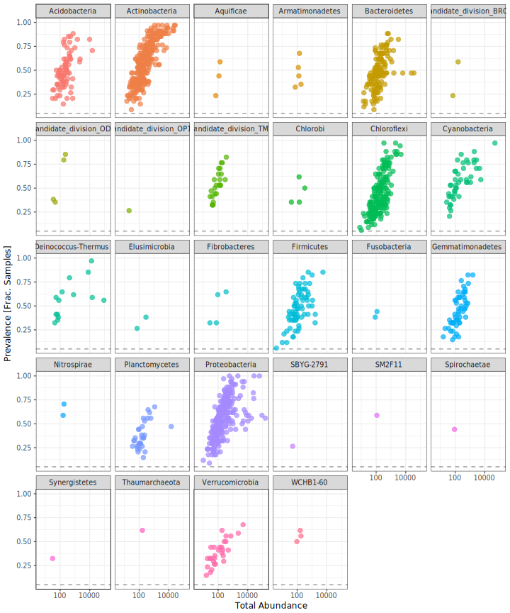<!-- -->

Plot general prevalence features of the top 20 orders

```r
# Subset to the remaining phyla
prevdf_order_filt <- subset(prevdf, Order %in% get_taxa_unique(Rock_weathering_filt2, "Order"))

# grab the top 30 most abundant orders
prevdf_order_filt %>% 
  group_by(Order) %>%
  summarise(Combined.abundance = sum(TotalAbundance)) %>% 
  arrange(desc(Combined.abundance)) %>% 
  .[1:30, "Order"]  ->
  Orders2plot

prevdf_order_filt2 <- subset(prevdf, Order %in% Orders2plot$Order)

ggplot(prevdf_order_filt2,
       aes(TotalAbundance, Prevalence / nsamples(Rock_weathering_filt2), color = Order)) +
  # Include a guess for parameter
  geom_hline(yintercept = 0.05,
             alpha = 0.5,
             linetype = 2) + geom_point(size = 2, alpha = 0.7) +
  scale_x_log10() +  xlab("Total Abundance") + ylab("Prevalence [Frac. Samples]") +
  facet_wrap( ~ Order) + theme(legend.position = "none")
```

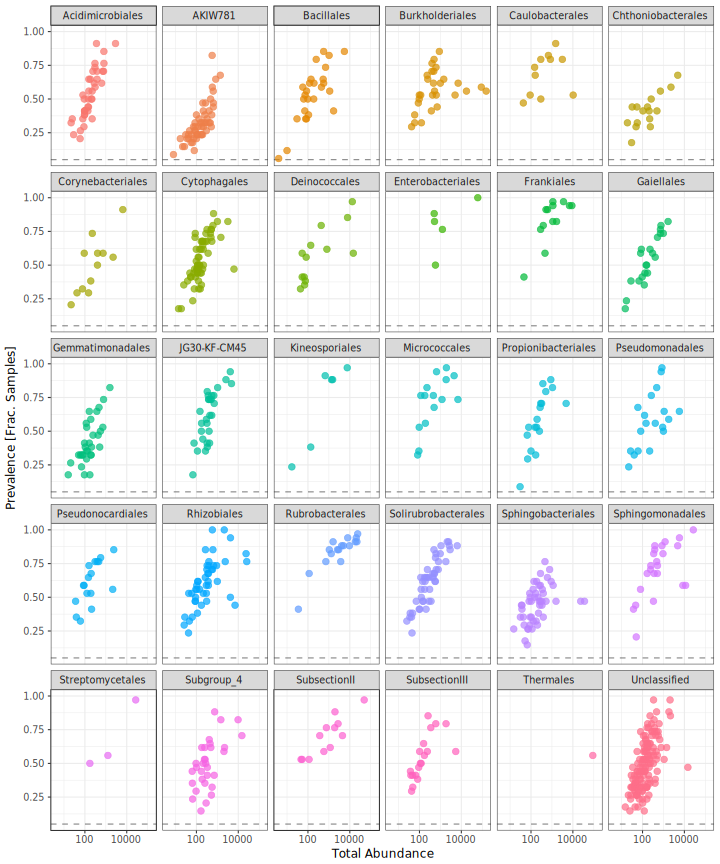<!-- -->

#### Unsupervised filtering by prevalence
We'll remove all sequences which appear in less than 10% of the samples

```r
# Define prevalence threshold as 10% of total samples
prevalenceThreshold <- 0.1 * nsamples(Rock_weathering_filt)
prevalenceThreshold
```

```
## [1] 3.4
```

```r
# Execute prevalence filter, using `prune_taxa()` function
keepTaxa <-
  row.names(prevdf_phylum_filt)[(prevdf_phylum_filt$Prevalence >= prevalenceThreshold)]
Rock_weathering_filt3 <- prune_taxa(keepTaxa, Rock_weathering_filt2)
sample_data(Rock_weathering_filt3)$Lib.size <- rowSums(otu_table(Rock_weathering_filt3))
print(Rock_weathering_filt2)
```

```
## phyloseq-class experiment-level object
## otu_table()   OTU Table:         [ 1256 taxa and 34 samples ]
## sample_data() Sample Data:       [ 34 samples by 13 sample variables ]
## tax_table()   Taxonomy Table:    [ 1256 taxa by 6 taxonomic ranks ]
```

```r
print(Rock_weathering_filt3)
```

```
## phyloseq-class experiment-level object
## otu_table()   OTU Table:         [ 1249 taxa and 34 samples ]
## sample_data() Sample Data:       [ 34 samples by 13 sample variables ]
## tax_table()   Taxonomy Table:    [ 1249 taxa by 6 taxonomic ranks ]
```
This removed 7 or 0.557% of the sequences.

### Exploring Rock_dust dataset features
First let's look at the count data distribution

```r
PlotLibDist(Rock_weathering_filt3)
```

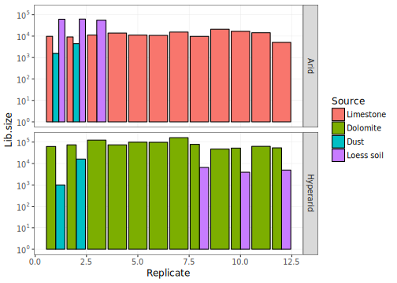<!-- -->

```r
sample_data(Rock_weathering_filt3) %>% 
  remove_rownames %>% 
  select(sample_title, Lib.size) %>% 
  as(., "data.frame") %>% 
  kable(.) %>%
  kable_styling(bootstrap_options = c("striped", "hover", "condensed", "responsive"), full_width = F)
```

<table class="table table-striped table-hover table-condensed table-responsive" style="width: auto !important; margin-left: auto; margin-right: auto;">
 <thead>
  <tr>
   <th style="text-align:left;"> sample_title </th>
   <th style="text-align:right;"> Lib.size </th>
  </tr>
 </thead>
<tbody>
  <tr>
   <td style="text-align:left;"> Arid_Settled Dust_1 </td>
   <td style="text-align:right;"> 1562 </td>
  </tr>
  <tr>
   <td style="text-align:left;"> Hyperarid_Loess soil_8 </td>
   <td style="text-align:right;"> 6536 </td>
  </tr>
  <tr>
   <td style="text-align:left;"> Hyperarid_Loess soil_10 </td>
   <td style="text-align:right;"> 3921 </td>
  </tr>
  <tr>
   <td style="text-align:left;"> Hyperarid_Loess soil_12 </td>
   <td style="text-align:right;"> 4935 </td>
  </tr>
  <tr>
   <td style="text-align:left;"> Arid_Settled Dust_2 </td>
   <td style="text-align:right;"> 4421 </td>
  </tr>
  <tr>
   <td style="text-align:left;"> Hyperarid_Settled Dust_1 </td>
   <td style="text-align:right;"> 1001 </td>
  </tr>
  <tr>
   <td style="text-align:left;"> Hyperarid_Settled Dust_2 </td>
   <td style="text-align:right;"> 16095 </td>
  </tr>
  <tr>
   <td style="text-align:left;"> Arid_Limestone_1 </td>
   <td style="text-align:right;"> 9765 </td>
  </tr>
  <tr>
   <td style="text-align:left;"> Arid_Limestone_2 </td>
   <td style="text-align:right;"> 9130 </td>
  </tr>
  <tr>
   <td style="text-align:left;"> Arid_Limestone_3 </td>
   <td style="text-align:right;"> 11218 </td>
  </tr>
  <tr>
   <td style="text-align:left;"> Arid_Limestone_4 </td>
   <td style="text-align:right;"> 13838 </td>
  </tr>
  <tr>
   <td style="text-align:left;"> Arid_Limestone_5 </td>
   <td style="text-align:right;"> 11177 </td>
  </tr>
  <tr>
   <td style="text-align:left;"> Arid_Limestone_6 </td>
   <td style="text-align:right;"> 10781 </td>
  </tr>
  <tr>
   <td style="text-align:left;"> Arid_Limestone_7 </td>
   <td style="text-align:right;"> 15417 </td>
  </tr>
  <tr>
   <td style="text-align:left;"> Arid_Limestone_8 </td>
   <td style="text-align:right;"> 9721 </td>
  </tr>
  <tr>
   <td style="text-align:left;"> Arid_Limestone_9 </td>
   <td style="text-align:right;"> 20927 </td>
  </tr>
  <tr>
   <td style="text-align:left;"> Arid_Limestone_10 </td>
   <td style="text-align:right;"> 16812 </td>
  </tr>
  <tr>
   <td style="text-align:left;"> Arid_Limestone_11 </td>
   <td style="text-align:right;"> 14325 </td>
  </tr>
  <tr>
   <td style="text-align:left;"> Arid_Limestone_12 </td>
   <td style="text-align:right;"> 5112 </td>
  </tr>
  <tr>
   <td style="text-align:left;"> Hyperarid_Dolomite_1 </td>
   <td style="text-align:right;"> 62166 </td>
  </tr>
  <tr>
   <td style="text-align:left;"> Hyperarid_Dolomite_2 </td>
   <td style="text-align:right;"> 73930 </td>
  </tr>
  <tr>
   <td style="text-align:left;"> Hyperarid_Dolomite_3 </td>
   <td style="text-align:right;"> 123438 </td>
  </tr>
  <tr>
   <td style="text-align:left;"> Hyperarid_Dolomite_4 </td>
   <td style="text-align:right;"> 74161 </td>
  </tr>
  <tr>
   <td style="text-align:left;"> Hyperarid_Dolomite_5 </td>
   <td style="text-align:right;"> 98998 </td>
  </tr>
  <tr>
   <td style="text-align:left;"> Hyperarid_Dolomite_6 </td>
   <td style="text-align:right;"> 97834 </td>
  </tr>
  <tr>
   <td style="text-align:left;"> Hyperarid_Dolomite_7 </td>
   <td style="text-align:right;"> 160207 </td>
  </tr>
  <tr>
   <td style="text-align:left;"> Hyperarid_Dolomite_8 </td>
   <td style="text-align:right;"> 78535 </td>
  </tr>
  <tr>
   <td style="text-align:left;"> Hyperarid_Dolomite_9 </td>
   <td style="text-align:right;"> 47155 </td>
  </tr>
  <tr>
   <td style="text-align:left;"> Hyperarid_Dolomite_10 </td>
   <td style="text-align:right;"> 52276 </td>
  </tr>
  <tr>
   <td style="text-align:left;"> Hyperarid_Dolomite_11 </td>
   <td style="text-align:right;"> 63267 </td>
  </tr>
  <tr>
   <td style="text-align:left;"> Hyperarid_Dolomite_12 </td>
   <td style="text-align:right;"> 53859 </td>
  </tr>
  <tr>
   <td style="text-align:left;"> Arid_Loess soil_1 </td>
   <td style="text-align:right;"> 61130 </td>
  </tr>
  <tr>
   <td style="text-align:left;"> Arid_Loess soil_2 </td>
   <td style="text-align:right;"> 62204 </td>
  </tr>
  <tr>
   <td style="text-align:left;"> Arid_Loess soil_3 </td>
   <td style="text-align:right;"> 55724 </td>
  </tr>
</tbody>
</table>
The figure and table indicate only a small deviation in the number of reads per samples.


```r
(mod1 <- adonis(
  otu_table(Rock_weathering_filt3) ~ Lib.size,
  data = as(sample_data(Rock_weathering_filt3), "data.frame"), 
  method = "bray",
  permutations = 9999
))
```

```
## 
## Call:
## adonis(formula = otu_table(Rock_weathering_filt3) ~ Lib.size,      data = as(sample_data(Rock_weathering_filt3), "data.frame"),      permutations = 9999, method = "bray") 
## 
## Permutation: free
## Number of permutations: 9999
## 
## Terms added sequentially (first to last)
## 
##           Df SumsOfSqs MeanSqs F.Model      R2 Pr(>F)    
## Lib.size   1    2.5245 2.52447  8.7483 0.21469  1e-04 ***
## Residuals 32    9.2341 0.28857         0.78531           
## Total     33   11.7586                 1.00000           
## ---
## Signif. codes:  0 '***' 0.001 '**' 0.01 '*' 0.05 '.' 0.1 ' ' 1
```

```r
PlotReadHist(as(otu_table(Rock_weathering_filt3), "matrix"))
```

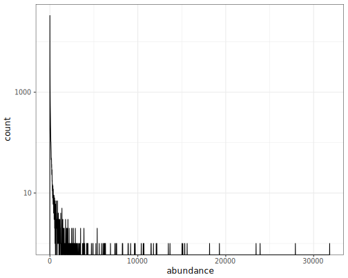<!-- -->

```r
notAllZero <- (rowSums(t(otu_table(Rock_weathering_filt3))) > 0)
meanSdPlot(as.matrix(log2(t(otu_table(Rock_weathering_filt3))[notAllZero, ] + 1)))
```

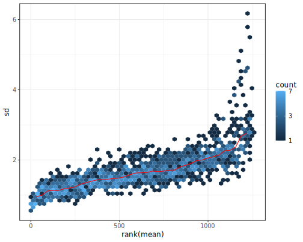<!-- -->

### Account for variation in library read-depth
We'll use the GMPR method [@chen_gmpr:_2017]

```r
Rock_weathering_filt3_GMPR <- Rock_weathering_filt3
Rock_weathering_filt3 %>%
  otu_table(.) %>%
  t() %>%
  as(., "matrix") %>%
  GMPR() ->
  GMPR_factors
```

```
## Begin GMPR size factor calculation ...
## Completed!
## Please watch for the samples with limited sharing with other samples based on NSS! They may be outliers!
```

```r
Rock_weathering_filt3 %>%
  otu_table(.) %>%
  t() %*% diag(1 / GMPR_factors$gmpr) %>%
  t() %>%
  as.data.frame(., row.names = sample_names(Rock_weathering_filt3)) %>%
  otu_table(., taxa_are_rows = FALSE) ->
  otu_table(Rock_weathering_filt3_GMPR)
sample_data(Rock_weathering_filt3_GMPR)$Lib.size <- sample_sums(Rock_weathering_filt3_GMPR)

adonis(
  otu_table(Rock_weathering_filt3_GMPR) ~ Lib.size,
  data = as(sample_data(Rock_weathering_filt3_GMPR), "data.frame"),
  method = "bray",
  permutations = 9999
)
```

```
## 
## Call:
## adonis(formula = otu_table(Rock_weathering_filt3_GMPR) ~ Lib.size,      data = as(sample_data(Rock_weathering_filt3_GMPR), "data.frame"),      permutations = 9999, method = "bray") 
## 
## Permutation: free
## Number of permutations: 9999
## 
## Terms added sequentially (first to last)
## 
##           Df SumsOfSqs MeanSqs F.Model      R2 Pr(>F)    
## Lib.size   1    2.5834 2.58337  9.4557 0.22809  1e-04 ***
## Residuals 32    8.7426 0.27321         0.77191           
## Total     33   11.3260                 1.00000           
## ---
## Signif. codes:  0 '***' 0.001 '**' 0.01 '*' 0.05 '.' 0.1 ' ' 1
```

```r
PlotLibDist(Rock_weathering_filt3_GMPR)
```

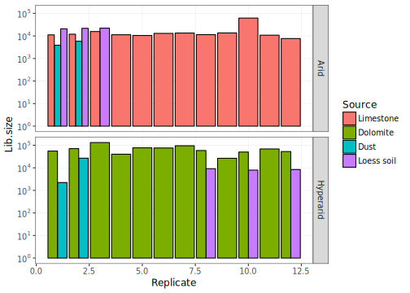<!-- -->

```r
PlotReadHist(as(otu_table(Rock_weathering_filt3_GMPR), "matrix"))
```

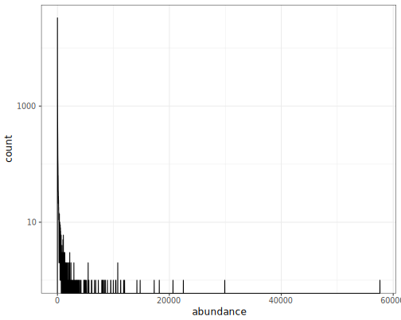<!-- -->

```r
notAllZero <- (rowSums(t(otu_table(Rock_weathering_filt3_GMPR))) > 0)
meanSdPlot(as.matrix(log2(t(otu_table(Rock_weathering_filt3_GMPR))[notAllZero, ] + 1)))
```

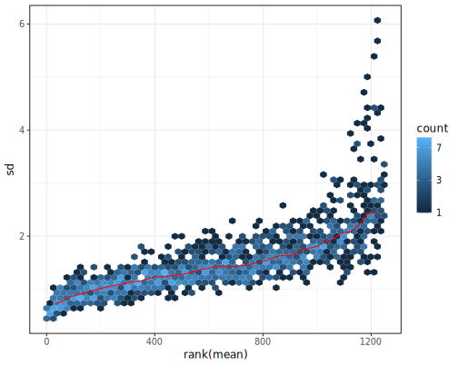<!-- -->

### Alpha diversity 
Calculate and plot alpha diversity mertrics.

```r
# non-parametric richness estimates
rarefaction.mat <- matrix(0, nrow = nsamples(Rock_weathering_filt3), ncol = bootstraps)
rownames(rarefaction.mat) <- sample_names(Rock_weathering_filt3)
rich.ests <- list(S.obs = rarefaction.mat, S.chao1 = rarefaction.mat, se.chao1 = rarefaction.mat,
                   S.ACE = rarefaction.mat, se.ACE = rarefaction.mat)

for (i in seq(bootstraps)) {
  sub.OTUmat <- rrarefy(otu_table(Rock_weathering_filt3), min(rowSums(otu_table(Rock_weathering_filt3))))
  for (j in seq(length(rich.ests))) {
    rich.ests[[j]][, i] <- t(estimateR(sub.OTUmat))[, j]
  }
}

Richness <- data.frame(row.names = row.names(rich.ests[[1]]))
for (i in c(1, seq(2, length(rich.ests), 2))) {
  S <- apply(rich.ests[[i]], 1, mean)
  if (i == 1) { 
    se <- apply(rich.ests[[i]], 1, function(x) (mean(x)/sqrt(length(x))))
    } else se <- apply(rich.ests[[i + 1]], 1, mean)
  Richness <- cbind(Richness, S, se)
}
colnames(Richness) <- c("S.obs", "S.obs.se", "S.chao1", "S.chao1.se", "S.ACE", "S.ACE.se")


saveRDS(Richness, file = "Results/Rock_weathering_Richness.Rds")
write.csv(Richness, file = "Results/Rock_weathering_Richness.csv")

ses <- grep("\\.se", colnames(Richness))
Richness[, ses] %>% 
  gather(key = "est.se") -> se.dat
Richness[, -unique(ses)] %>% 
  gather(key = "est") -> mean.dat

n <- length(unique(mean.dat$est))

# diversity indices
diversity.inds <- list(Shannon = rarefaction.mat, inv.simpson = rarefaction.mat, BP = rarefaction.mat)
for (i in seq(bootstraps)) {
  sub.OTUmat <- rrarefy(otu_table(Rock_weathering_filt3), min(rowSums(otu_table(Rock_weathering_filt3))))
  diversity.inds$Shannon[, i] <- diversityresult(sub.OTUmat, index = 'Shannon', method = 'each site', digits = 3)[, 1]
  diversity.inds$inv.simpson[, i] <- diversityresult(sub.OTUmat, index = 'inverseSimpson', method = 'each site', digits = 3)[, 1]
  diversity.inds$BP[, i] <- diversityresult(sub.OTUmat, index = 'Berger', method = 'each site', digits = 3)[, 1]
}

Diversity <- data.frame(row.names = row.names(diversity.inds[[1]]))
for (i in seq(length(diversity.inds))) {
  S <- apply(diversity.inds[[i]], 1, mean)
  se <- apply(diversity.inds[[i]], 1, function(x) (mean(x)/sqrt(length(x))))
  Diversity <- cbind(Diversity, S, se)
}
colnames(Diversity) <- c("Shannon", "Shannon.se", "Inv.simpson", "Inv.simpson.se", "BP", "BP.se")

ses <- grep("\\.se", colnames(Diversity))
Diversity[, ses] %>% gather(key = "est.se") -> se.dat
Diversity[, -unique(ses)] %>% gather(key = "est") -> mean.dat

saveRDS(Diversity, file = "Results/Rock_weathering_Diversity.Rds")
write.csv(Diversity, file = "Results/Rock_weathering_Diversity.csv")
```

Test the differences in alpha diversity.

```r
# make combined richness diversity
Richness_Diversity <- cbind(Richness, Diversity)
ses <- grep("\\.se", colnames(Richness_Diversity))
Richness_Diversity[, ses] %>% 
  gather(key = "est.se") -> 
  se.dat
Richness_Diversity[, -unique(ses)] %>% 
  gather(key = "Metric", 
         value = "Estimate") -> 
  mean.dat

Richness_Diversity_long <-
  cbind(
    Sample = rep(rownames(Richness_Diversity), times = length(unique(mean.dat$Metric))),
    mean.dat,
    lerr = mean.dat$Estimate - se.dat$value,
    herr = mean.dat$Estimate + se.dat$value
  )

Richness_Diversity_long$Metric <-
  factor(
    Richness_Diversity_long$Metric,
    levels = c("S.obs", "S.chao1", "S.ACE", "Shannon", "Inv.simpson", "BP"),
    labels = c("S obs.", "Chao1", "ACE", "Shannon", "Inv. Simpson" , "Berger Parker")
  )

Richness_Diversity_long %<>%
  cbind(., 
        sample_data(Rock_weathering_filt3))

data2test <- Richness_Diversity_long[Richness_Diversity_long$Metric == "S obs.", ] 
mod_data <- TestAlpha(data = data2test, boxcox.trans = TRUE)
```

```
## Levene's Test for Homogeneity of Variance (center = median)
##       Df F value Pr(>F)  
## group  5    2.13  0.092 .
##       28                 
## ---
## Signif. codes:  0 '***' 0.001 '**' 0.01 '*' 0.05 '.' 0.1 ' ' 1
## [1] "Performing Box-Cox transformation of the data"
```

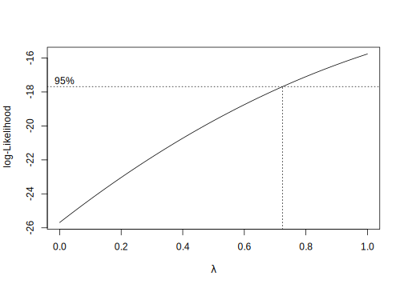<!-- -->

```
## [1] 0.73 1.00
## [1] 1
## Call:
##    aov(formula = as.formula(paste("Estimate.box", paste(factor_names[1], 
##     factor_names[2], sep = " * "), sep = " ~ ")), data = data2test)
## 
## Terms:
##                 Climate Uni.Source Climate:Uni.Source Residuals
## Sum of Squares    53211     136228              24788     65358
## Deg. of Freedom       1          2                  2        28
## 
## Residual standard error: 48.3
## Estimated effects may be unbalanced
```

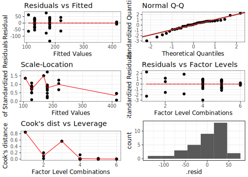<!-- -->

```
##                    Df Sum Sq Mean Sq F value  Pr(>F)    
## Climate             1  53211   53211   22.80 5.1e-05 ***
## Uni.Source          2 136228   68114   29.18 1.4e-07 ***
## Climate:Uni.Source  2  24788   12394    5.31   0.011 *  
## Residuals          28  65358    2334                    
## ---
## Signif. codes:  0 '***' 0.001 '**' 0.01 '*' 0.05 '.' 0.1 ' ' 1
## Tables of means
## Grand mean
##     
## 181 
## 
##  Climate 
##     Arid Hyperarid
##      221       141
## rep   17        17
## 
##  Uni.Source 
##     Rock Dust Loess soil
##      154  137        317
## rep   24    4          6
## 
##  Climate:Uni.Source 
##            Uni.Source
## Climate     Rock Dust Loess soil
##   Arid      181  168  415       
##   rep        12    2    3       
##   Hyperarid 128  106  219       
##   rep        12    2    3
```

```r
TukeyHSD(mod_data)
```

```
##   Tukey multiple comparisons of means
##     95% family-wise confidence level
## 
## Fit: aov(formula = as.formula(paste("Estimate.box", paste(factor_names[1], factor_names[2], sep = " * "), sep = " ~ ")), data = data2test)
## 
## $Climate
##                 diff  lwr   upr p adj
## Hyperarid-Arid -79.1 -113 -45.2     0
## 
## $Uni.Source
##                  diff   lwr   upr p adj
## Dust-Rock       -16.9 -81.5  47.6 0.794
## Loess soil-Rock 163.0 108.5 217.6 0.000
## Loess soil-Dust 180.0 102.8 257.1 0.000
## 
## $`Climate:Uni.Source`
##                                        diff     lwr    upr p adj
## Hyperarid:Rock-Arid:Rock              -52.9 -113.13   7.42 0.111
## Arid:Dust-Arid:Rock                   -12.4 -125.13 100.40 0.999
## Hyperarid:Dust-Arid:Rock              -74.4 -187.12  38.41 0.359
## Arid:Loess soil-Arid:Rock             234.4  139.10 329.70 0.000
## Hyperarid:Loess soil-Arid:Rock         38.8  -56.51 134.09 0.812
## Arid:Dust-Hyperarid:Rock               40.5  -72.27 153.25 0.878
## Hyperarid:Dust-Hyperarid:Rock         -21.5 -134.26  91.26 0.991
## Arid:Loess soil-Hyperarid:Rock        287.3  191.95 382.56 0.000
## Hyperarid:Loess soil-Hyperarid:Rock    91.6   -3.66 186.95 0.065
## Hyperarid:Dust-Arid:Dust              -62.0 -209.63  85.65 0.792
## Arid:Loess soil-Arid:Dust             246.8  111.99 381.54 0.000
## Hyperarid:Loess soil-Arid:Dust         51.2  -83.62 185.93 0.852
## Arid:Loess soil-Hyperarid:Dust        308.8  173.98 443.53 0.000
## Hyperarid:Loess soil-Hyperarid:Dust   113.1  -21.63 247.92 0.140
## Hyperarid:Loess soil-Arid:Loess soil -195.6 -316.16 -75.06 0.000
```

```r
factors2test <- c("Climate", "Uni.Source")
(ph_Sobs <- HSD.test(mod_data, factors2test, group = TRUE, console = TRUE))
```

```
## 
## Study: mod_data ~ factors2test
## 
## HSD Test for Estimate.box 
## 
## Mean Square Error:  2334 
## 
## Climate:Uni.Source,  means
## 
##                      Estimate.box    std  r   Min Max
## Arid:Dust                     168 109.02  2  91.2 245
## Arid:Loess soil               415   8.28  3 406.8 423
## Arid:Rock                     181  51.17 12  42.8 223
## Hyperarid:Dust                106  88.73  2  43.5 169
## Hyperarid:Loess soil          219  54.40  3 158.2 262
## Hyperarid:Rock                128  31.26 12  74.1 165
## 
## Alpha: 0.05 ; DF Error: 28 
## Critical Value of Studentized Range: 4.32 
## 
## Groups according to probability of means differences and alpha level( 0.05 )
## 
## Treatments with the same letter are not significantly different.
## 
##                      Estimate.box groups
## Arid:Loess soil               415      a
## Hyperarid:Loess soil          219      b
## Arid:Rock                     181      b
## Arid:Dust                     168      b
## Hyperarid:Rock                128      b
## Hyperarid:Dust                106      b
```

```
## $statistics
##   MSerror Df Mean   CV
##      2334 28  181 26.7
## 
## $parameters
##    test             name.t ntr StudentizedRange alpha
##   Tukey Climate:Uni.Source   6             4.32  0.05
## 
## $means
##                      Estimate.box    std  r   Min Max   Q25 Q50 Q75
## Arid:Dust                     168 109.02  2  91.2 245 129.7 168 207
## Arid:Loess soil               415   8.28  3 406.8 423 410.8 415 419
## Arid:Rock                     181  51.17 12  42.8 223 166.4 192 216
## Hyperarid:Dust                106  88.73  2  43.5 169  74.9 106 138
## Hyperarid:Loess soil          219  54.40  3 158.2 262 197.9 238 250
## Hyperarid:Rock                128  31.26 12  74.1 165 100.1 134 153
## 
## $comparison
## NULL
## 
## $groups
##                      Estimate.box groups
## Arid:Loess soil               415      a
## Hyperarid:Loess soil          219      b
## Arid:Rock                     181      b
## Arid:Dust                     168      b
## Hyperarid:Rock                128      b
## Hyperarid:Dust                106      b
## 
## attr(,"class")
## [1] "group"
```

```r
# Richness_Diversity_long$groups[Richness_Diversity_long$Metric == "S obs."] <- ph_Sobs$groups$groups

#But the problem is that Tukey assumes varience homogeneity. If we doubt that we should use something like the Games-Howell method. 
posthocTGH(y = data2test$Estimate, x = data2test$Climate.Source)
```

```
##                       n means variances
## Arid limestone       12   182      2618
## Arid dust             2   169     11884
## Arid loess soil       3   416        69
## Hyperarid dolomite   12   129       977
## Hyperarid dust        2   107      7872
## Hyperarid loess soil  3   220      2959
## 
##                                         diff ci.lo  ci.hi     t   df    p
## Arid dust-Arid limestone                 -12   NaN    NaN  0.16  1.1 <NA>
## Arid loess soil-Arid limestone           234   183  286.1 15.10 12.7 <.01
## Hyperarid dolomite-Arid limestone        -53  -108    2.1  3.05 18.2  .06
## Hyperarid dust-Arid limestone            -74   NaN    NaN  1.15  1.1 <NA>
## Hyperarid loess soil-Arid limestone       39  -161  238.2  1.12  3.0  .85
## Arid loess soil-Arid dust                247   NaN    NaN  3.20  1.0 <NA>
## Hyperarid dolomite-Arid dust             -40   NaN    NaN  0.52  1.0 <NA>
## Hyperarid dust-Arid dust                 -62   NaN    NaN  0.62  1.9 <NA>
## Hyperarid loess soil-Arid dust            51   NaN    NaN  0.61  1.3 <NA>
## Hyperarid dolomite-Arid loess soil      -287  -321 -253.2 28.13 12.6 <.01
## Hyperarid dust-Arid loess soil          -309   NaN    NaN  4.91  1.0 <NA>
## Hyperarid loess soil-Arid loess soil    -196  -446   54.8  6.16  2.1  .08
## Hyperarid dust-Hyperarid dolomite        -21   NaN    NaN  0.34  1.0 <NA>
## Hyperarid loess soil-Hyperarid dolomite   92  -138  320.9  2.80  2.3  .31
## Hyperarid loess soil-Hyperarid dust      113   NaN    NaN  1.61  1.5 <NA>
```

```r
data2test <- Richness_Diversity_long[Richness_Diversity_long$Metric == "Shannon", ] 
mod_data <- TestAlpha(data = data2test, boxcox.trans = TRUE)
```

```
## Levene's Test for Homogeneity of Variance (center = median)
##       Df F value Pr(>F)
## group  5    1.18   0.35
##       28               
## [1] "Performing Box-Cox transformation of the data"
```

<!-- -->

```
## [1] 0.86 1.00
## [1] 1
## Call:
##    aov(formula = as.formula(paste("Estimate.box", paste(factor_names[1], 
##     factor_names[2], sep = " * "), sep = " ~ ")), data = data2test)
## 
## Terms:
##                 Climate Uni.Source Climate:Uni.Source Residuals
## Sum of Squares     5.71      14.53               2.77     18.64
## Deg. of Freedom       1          2                  2        28
## 
## Residual standard error: 0.816
## Estimated effects may be unbalanced
```

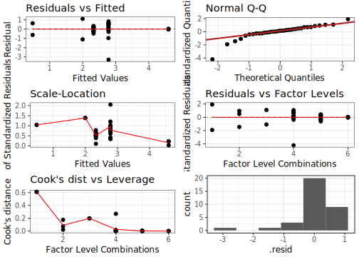<!-- -->

```
##                    Df Sum Sq Mean Sq F value  Pr(>F)    
## Climate             1   5.71    5.71    8.57 0.00672 ** 
## Uni.Source          2  14.53    7.27   10.91 0.00031 ***
## Climate:Uni.Source  2   2.77    1.39    2.08 0.14368    
## Residuals          28  18.64    0.67                    
## ---
## Signif. codes:  0 '***' 0.001 '**' 0.01 '*' 0.05 '.' 0.1 ' ' 1
## Tables of means
## Grand mean
##     
## 2.6 
## 
##  Climate 
##      Arid Hyperarid
##      3.01      2.19
## rep 17.00     17.00
## 
##  Uni.Source 
##      Rock Dust Loess soil
##      2.56 1.24       3.69
## rep 24.00 4.00       6.00
## 
##  Climate:Uni.Source 
##            Uni.Source
## Climate     Rock  Dust  Loess soil
##   Arid       2.78  2.00  4.59     
##   rep       12.00  2.00  3.00     
##   Hyperarid  2.33  0.48  2.78     
##   rep       12.00  2.00  3.00
```

```r
TukeyHSD(mod_data)
```

```
##   Tukey multiple comparisons of means
##     95% family-wise confidence level
## 
## Fit: aov(formula = as.formula(paste("Estimate.box", paste(factor_names[1], factor_names[2], sep = " * "), sep = " ~ ")), data = data2test)
## 
## $Climate
##                  diff   lwr    upr p adj
## Hyperarid-Arid -0.819 -1.39 -0.246 0.007
## 
## $Uni.Source
##                  diff   lwr    upr p adj
## Dust-Rock       -1.31 -2.41 -0.224 0.016
## Loess soil-Rock  1.13  0.21  2.053 0.014
## Loess soil-Dust  2.45  1.14  3.750 0.000
## 
## $`Climate:Uni.Source`
##                                          diff     lwr     upr p adj
## Hyperarid:Rock-Arid:Rock             -0.45435 -1.4723  0.5636 0.747
## Arid:Dust-Arid:Rock                  -0.78460 -2.6891  1.1199 0.804
## Hyperarid:Dust-Arid:Rock             -2.29925 -4.2037 -0.3948 0.011
## Arid:Loess soil-Arid:Rock             1.81237  0.2028  3.4220 0.020
## Hyperarid:Loess soil-Arid:Rock       -0.00311 -1.6127  1.6065 1.000
## Arid:Dust-Hyperarid:Rock             -0.33024 -2.2347  1.5742 0.994
## Hyperarid:Dust-Hyperarid:Rock        -1.84490 -3.7494  0.0596 0.062
## Arid:Loess soil-Hyperarid:Rock        2.26672  0.6571  3.8763 0.002
## Hyperarid:Loess soil-Hyperarid:Rock   0.45124 -1.1583  2.0608 0.954
## Hyperarid:Dust-Arid:Dust             -1.51466 -4.0082  0.9789 0.448
## Arid:Loess soil-Arid:Dust             2.59697  0.3207  4.8733 0.018
## Hyperarid:Loess soil-Arid:Dust        0.78148 -1.4948  3.0578 0.897
## Arid:Loess soil-Hyperarid:Dust        4.11163  1.8353  6.3879 0.000
## Hyperarid:Loess soil-Hyperarid:Dust   2.29614  0.0198  4.5724 0.047
## Hyperarid:Loess soil-Arid:Loess soil -1.81549 -3.8515  0.2205 0.102
```

```r
(ph_Shannon <- HSD.test(mod_data, factors2test, group = TRUE, console = TRUE))
```

```
## 
## Study: mod_data ~ factors2test
## 
## HSD Test for Estimate.box 
## 
## Mean Square Error:  0.666 
## 
## Climate:Uni.Source,  means
## 
##                      Estimate.box    std  r    Min  Max
## Arid:Dust                   1.998 1.5634  2  0.892 3.10
## Arid:Loess soil             4.595 0.0319  3  4.563 4.63
## Arid:Rock                   2.783 1.0940 12 -0.509 3.61
## Hyperarid:Dust              0.483 0.8891  2 -0.145 1.11
## Hyperarid:Loess soil        2.779 0.8513  3  1.811 3.41
## Hyperarid:Rock              2.328 0.2684 12  1.856 2.66
## 
## Alpha: 0.05 ; DF Error: 28 
## Critical Value of Studentized Range: 4.32 
## 
## Groups according to probability of means differences and alpha level( 0.05 )
## 
## Treatments with the same letter are not significantly different.
## 
##                      Estimate.box groups
## Arid:Loess soil             4.595      a
## Arid:Rock                   2.783      b
## Hyperarid:Loess soil        2.779      b
## Hyperarid:Rock              2.328     bc
## Arid:Dust                   1.998     bc
## Hyperarid:Dust              0.483      c
```

```
## $statistics
##   MSerror Df Mean   CV
##     0.666 28  2.6 31.4
## 
## $parameters
##    test             name.t ntr StudentizedRange alpha
##   Tukey Climate:Uni.Source   6             4.32  0.05
## 
## $means
##                      Estimate.box    std  r    Min  Max   Q25   Q50   Q75
## Arid:Dust                   1.998 1.5634  2  0.892 3.10 1.445 1.998 2.551
## Arid:Loess soil             4.595 0.0319  3  4.563 4.63 4.579 4.595 4.611
## Arid:Rock                   2.783 1.0940 12 -0.509 3.61 2.687 3.058 3.327
## Hyperarid:Dust              0.483 0.8891  2 -0.145 1.11 0.169 0.483 0.798
## Hyperarid:Loess soil        2.779 0.8513  3  1.811 3.41 2.463 3.115 3.263
## Hyperarid:Rock              2.328 0.2684 12  1.856 2.66 2.128 2.391 2.552
## 
## $comparison
## NULL
## 
## $groups
##                      Estimate.box groups
## Arid:Loess soil             4.595      a
## Arid:Rock                   2.783      b
## Hyperarid:Loess soil        2.779      b
## Hyperarid:Rock              2.328     bc
## Arid:Dust                   1.998     bc
## Hyperarid:Dust              0.483      c
## 
## attr(,"class")
## [1] "group"
```

```r
posthocTGH(y = data2test$Estimate, x = data2test$Climate.Source)
```

```
##                       n means variances
## Arid limestone       12   3.8     1.197
## Arid dust             2   3.0     2.444
## Arid loess soil       3   5.6     0.001
## Hyperarid dolomite   12   3.3     0.072
## Hyperarid dust        2   1.5     0.791
## Hyperarid loess soil  3   3.8     0.725
## 
##                                            diff ci.lo ci.hi       t   df    p
## Arid dust-Arid limestone                -0.7846   NaN   NaN  0.6824  1.2 <NA>
## Arid loess soil-Arid limestone           1.8124  0.73  2.89  5.7292 11.1 <.01
## Hyperarid dolomite-Arid limestone       -0.4544 -1.54  0.63  1.3973 12.3  .73
## Hyperarid dust-Arid limestone           -2.2993   NaN   NaN  3.2681  1.6 <NA>
## Hyperarid loess soil-Arid limestone     -0.0031 -2.82  2.82  0.0053  3.9    1
## Arid loess soil-Arid dust                2.5970   NaN   NaN  2.3488  1.0 <NA>
## Hyperarid dolomite-Arid dust             0.3302   NaN   NaN  0.2980  1.0 <NA>
## Hyperarid dust-Arid dust                -1.5147   NaN   NaN  1.1910  1.6 <NA>
## Hyperarid loess soil-Arid dust           0.7815   NaN   NaN  0.6459  1.4 <NA>
## Hyperarid dolomite-Arid loess soil      -2.2667 -2.53 -2.00 28.4608 12.1 <.01
## Hyperarid dust-Arid loess soil          -4.1116   NaN   NaN  6.5371  1.0 <NA>
## Hyperarid loess soil-Arid loess soil    -1.8155 -5.88  2.25  3.6911  2.0  .22
## Hyperarid dust-Hyperarid dolomite       -1.8449   NaN   NaN  2.9125  1.0 <NA>
## Hyperarid loess soil-Hyperarid dolomite  0.4512 -3.45  4.36  0.9069  2.1  .92
## Hyperarid loess soil-Hyperarid dust      2.2961 -3.70  8.29  2.8773  2.2  .31
```

```r
data2test <- Richness_Diversity_long[Richness_Diversity_long$Metric == "ACE", ] 
mod_data <- TestAlpha(data = data2test, boxcox.trans = FALSE)
```

```
## Levene's Test for Homogeneity of Variance (center = median)
##       Df F value Pr(>F)  
## group  5    2.57  0.049 *
##       28                 
## ---
## Signif. codes:  0 '***' 0.001 '**' 0.01 '*' 0.05 '.' 0.1 ' ' 1
## Call:
##    aov(formula = as.formula(paste(response_name, paste(factor_names[1], 
##     factor_names[2], sep = " * "), sep = " ~ ")), data = data2test)
## 
## Terms:
##                 Climate Uni.Source Climate:Uni.Source Residuals
## Sum of Squares    54110     370724              73390    221546
## Deg. of Freedom       1          2                  2        28
## 
## Residual standard error: 89
## Estimated effects may be unbalanced
```

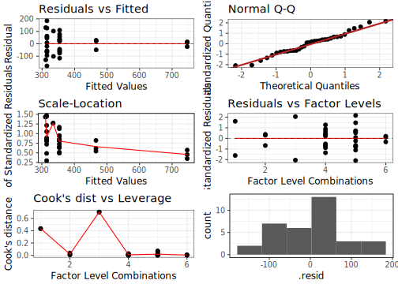<!-- -->

```
##                    Df Sum Sq Mean Sq F value  Pr(>F)    
## Climate             1  54110   54110    6.84   0.014 *  
## Uni.Source          2 370724  185362   23.43 1.1e-06 ***
## Climate:Uni.Source  2  73390   36695    4.64   0.018 *  
## Residuals          28 221546    7912                    
## ---
## Signif. codes:  0 '***' 0.001 '**' 0.01 '*' 0.05 '.' 0.1 ' ' 1
## Tables of means
## Grand mean
##     
## 381 
## 
##  Climate 
##     Arid Hyperarid
##      421       341
## rep   17        17
## 
##  Uni.Source 
##     Rock Dust Loess soil
##      334  323        606
## rep   24    4          6
## 
##  Climate:Uni.Source 
##            Uni.Source
## Climate     Rock Dust Loess soil
##   Arid      354  335  746       
##   rep        12    2    3       
##   Hyperarid 315  311  466       
##   rep        12    2    3
```

```r
TukeyHSD(mod_data)
```

```
##   Tukey multiple comparisons of means
##     95% family-wise confidence level
## 
## Fit: aov(formula = as.formula(paste(response_name, paste(factor_names[1], factor_names[2], sep = " * "), sep = " ~ ")), data = data2test)
## 
## $Climate
##                 diff  lwr   upr p adj
## Hyperarid-Arid -79.8 -142 -17.3 0.014
## 
## $Uni.Source
##                  diff  lwr upr p adj
## Dust-Rock       -11.4 -130 107 0.969
## Loess soil-Rock 272.1  172 373 0.000
## Loess soil-Dust 283.5  141 426 0.000
## 
## $`Climate:Uni.Source`
##                                         diff    lwr   upr p adj
## Hyperarid:Rock-Arid:Rock              -39.04 -150.0  71.9 0.887
## Arid:Dust-Arid:Rock                   -19.13 -226.7 188.5 1.000
## Hyperarid:Dust-Arid:Rock              -42.73 -250.3 164.9 0.988
## Arid:Loess soil-Arid:Rock             392.72  217.3 568.2 0.000
## Hyperarid:Loess soil-Arid:Rock        112.48  -63.0 287.9 0.390
## Arid:Dust-Hyperarid:Rock               19.91 -187.7 227.5 1.000
## Hyperarid:Dust-Hyperarid:Rock          -3.69 -211.3 203.9 1.000
## Arid:Loess soil-Hyperarid:Rock        431.75  256.3 607.2 0.000
## Hyperarid:Loess soil-Hyperarid:Rock   151.52  -23.9 327.0 0.121
## Hyperarid:Dust-Arid:Dust              -23.60 -295.4 248.2 1.000
## Arid:Loess soil-Arid:Dust             411.85  163.7 660.0 0.000
## Hyperarid:Loess soil-Arid:Dust        131.61 -116.5 379.7 0.592
## Arid:Loess soil-Hyperarid:Dust        435.45  187.3 683.6 0.000
## Hyperarid:Loess soil-Hyperarid:Dust   155.21  -92.9 403.4 0.416
## Hyperarid:Loess soil-Arid:Loess soil -280.24 -502.2 -58.3 0.007
```

```r
(ph_ACE <- HSD.test(mod_data, factors2test, group = TRUE, console = TRUE))
```

```
## 
## Study: mod_data ~ factors2test
## 
## HSD Test for Estimate 
## 
## Mean Square Error:  7912 
## 
## Climate:Uni.Source,  means
## 
##                      Estimate   std  r Min Max
## Arid:Dust                 335 143.6  2 233 436
## Arid:Loess soil           746  20.8  3 723 761
## Arid:Rock                 354  68.8 12 238 462
## Hyperarid:Dust            311 182.8  2 182 440
## Hyperarid:Loess soil      466  42.6  3 417 494
## Hyperarid:Rock            315 100.4 12 136 499
## 
## Alpha: 0.05 ; DF Error: 28 
## Critical Value of Studentized Range: 4.32 
## 
## Groups according to probability of means differences and alpha level( 0.05 )
## 
## Treatments with the same letter are not significantly different.
## 
##                      Estimate groups
## Arid:Loess soil           746      a
## Hyperarid:Loess soil      466      b
## Arid:Rock                 354      b
## Arid:Dust                 335      b
## Hyperarid:Rock            315      b
## Hyperarid:Dust            311      b
```

```
## $statistics
##   MSerror Df Mean   CV
##      7912 28  381 23.4
## 
## $parameters
##    test             name.t ntr StudentizedRange alpha
##   Tukey Climate:Uni.Source   6             4.32  0.05
## 
## $means
##                      Estimate   std  r Min Max Q25 Q50 Q75
## Arid:Dust                 335 143.6  2 233 436 284 335 385
## Arid:Loess soil           746  20.8  3 723 761 739 755 758
## Arid:Rock                 354  68.8 12 238 462 297 375 395
## Hyperarid:Dust            311 182.8  2 182 440 246 311 376
## Hyperarid:Loess soil      466  42.6  3 417 494 453 488 491
## Hyperarid:Rock            315 100.4 12 136 499 251 308 372
## 
## $comparison
## NULL
## 
## $groups
##                      Estimate groups
## Arid:Loess soil           746      a
## Hyperarid:Loess soil      466      b
## Arid:Rock                 354      b
## Arid:Dust                 335      b
## Hyperarid:Rock            315      b
## Hyperarid:Dust            311      b
## 
## attr(,"class")
## [1] "group"
```

```r
posthocTGH(y = data2test$Estimate, x = data2test$Climate.Source)
```

```
##                       n means variances
## Arid limestone       12   354      4735
## Arid dust             2   335     20621
## Arid loess soil       3   746       432
## Hyperarid dolomite   12   315     10086
## Hyperarid dust        2   311     33403
## Hyperarid loess soil  3   466      1813
## 
##                                           diff ci.lo ci.hi      t   df    p
## Arid dust-Arid limestone                 -19.1   NaN   NaN  0.185  1.1 <NA>
## Arid loess soil-Arid limestone           392.7   315   471 16.920 11.8 <.01
## Hyperarid dolomite-Arid limestone        -39.0  -150    72  1.111 19.5  .87
## Hyperarid dust-Arid limestone            -42.7   NaN   NaN  0.327  1.0 <NA>
## Hyperarid loess soil-Arid limestone      112.5   -22   247  3.559  5.1  .09
## Arid loess soil-Arid dust                411.8   NaN   NaN  4.028  1.0 <NA>
## Hyperarid dolomite-Arid dust             -19.9   NaN   NaN  0.189  1.2 <NA>
## Hyperarid dust-Arid dust                 -23.6   NaN   NaN  0.144  1.9 <NA>
## Hyperarid loess soil-Arid dust           131.6   NaN   NaN  1.260  1.1 <NA>
## Hyperarid dolomite-Arid loess soil      -431.8  -536  -328 13.759 13.0 <.01
## Hyperarid dust-Arid loess soil          -435.4   NaN   NaN  3.355  1.0 <NA>
## Hyperarid loess soil-Arid loess soil    -280.2  -440  -121 10.243  2.9  .01
## Hyperarid dust-Hyperarid dolomite         -3.7   NaN   NaN  0.028  1.1 <NA>
## Hyperarid loess soil-Hyperarid dolomite  151.5    15   289  3.986  8.5  .03
## Hyperarid loess soil-Hyperarid dust      155.2   NaN   NaN  1.180  1.1 <NA>
```

```r
data2test <- Richness_Diversity_long[Richness_Diversity_long$Metric == "Berger Parker", ] 
mod_data <- TestAlpha(data = data2test, boxcox.trans = TRUE)
```

```
## Levene's Test for Homogeneity of Variance (center = median)
##       Df F value Pr(>F)
## group  5    0.78   0.57
##       28               
## [1] "Performing Box-Cox transformation of the data"
```

<!-- -->

```
## [1] 0.00 0.17
## [1] 0
## Call:
##    aov(formula = as.formula(paste("Estimate.box", paste(factor_names[1], 
##     factor_names[2], sep = " * "), sep = " ~ ")), data = data2test)
## 
## Terms:
##                 Climate Uni.Source Climate:Uni.Source Residuals
## Sum of Squares    0.066      0.523              0.169     0.837
## Deg. of Freedom       1          2                  2        28
## 
## Residual standard error: 0.173
## Estimated effects may be unbalanced
```

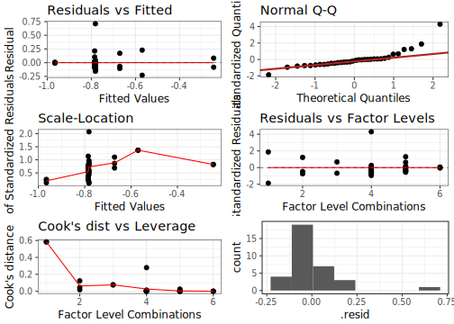<!-- -->

```
##                    Df Sum Sq Mean Sq F value Pr(>F)   
## Climate             1  0.066  0.0657    2.20 0.1494   
## Uni.Source          2  0.523  0.2615    8.75 0.0011 **
## Climate:Uni.Source  2  0.169  0.0847    2.83 0.0757 . 
## Residuals          28  0.837  0.0299                  
## ---
## Signif. codes:  0 '***' 0.001 '**' 0.01 '*' 0.05 '.' 0.1 ' ' 1
## Tables of means
## Grand mean
##        
## -0.745 
## 
##  Climate 
##       Arid Hyperarid
##     -0.789    -0.701
## rep 17.000    17.000
## 
##  Uni.Source 
##       Rock   Dust Loess soil
##     -0.783 -0.408     -0.818
## rep 24.000  4.000      6.000
## 
##  Climate:Uni.Source 
##            Uni.Source
## Climate     Rock  Dust  Loess soil
##   Arid      -0.78 -0.57 -0.97     
##   rep       12.00  2.00  3.00     
##   Hyperarid -0.78 -0.25 -0.67     
##   rep       12.00  2.00  3.00
```

```r
TukeyHSD(mod_data)
```

```
##   Tukey multiple comparisons of means
##     95% family-wise confidence level
## 
## Fit: aov(formula = as.formula(paste("Estimate.box", paste(factor_names[1], factor_names[2], sep = " * "), sep = " ~ ")), data = data2test)
## 
## $Climate
##                  diff     lwr   upr p adj
## Hyperarid-Arid 0.0879 -0.0336 0.209 0.149
## 
## $Uni.Source
##                    diff    lwr    upr p adj
## Dust-Rock        0.3758  0.145  0.607 0.001
## Loess soil-Rock -0.0349 -0.230  0.160 0.898
## Loess soil-Dust -0.4107 -0.687 -0.135 0.003
## 
## $`Climate:Uni.Source`
##                                          diff    lwr     upr p adj
## Hyperarid:Rock-Arid:Rock             -0.00308 -0.219  0.2126 1.000
## Arid:Dust-Arid:Rock                   0.21201 -0.192  0.6155 0.602
## Hyperarid:Dust-Arid:Rock              0.53645  0.133  0.9400 0.004
## Arid:Loess soil-Arid:Rock            -0.18356 -0.525  0.1575 0.577
## Hyperarid:Loess soil-Arid:Rock        0.11058 -0.230  0.4516 0.917
## Arid:Dust-Hyperarid:Rock              0.21510 -0.188  0.6186 0.587
## Hyperarid:Dust-Hyperarid:Rock         0.53953  0.136  0.9431 0.004
## Arid:Loess soil-Hyperarid:Rock       -0.18048 -0.522  0.1606 0.595
## Hyperarid:Loess soil-Hyperarid:Rock   0.11366 -0.227  0.4547 0.908
## Hyperarid:Dust-Arid:Dust              0.32443 -0.204  0.8528 0.437
## Arid:Loess soil-Arid:Dust            -0.39557 -0.878  0.0867 0.156
## Hyperarid:Loess soil-Arid:Dust       -0.10144 -0.584  0.3809 0.987
## Arid:Loess soil-Hyperarid:Dust       -0.72001 -1.202 -0.2377 0.001
## Hyperarid:Loess soil-Hyperarid:Dust  -0.42587 -0.908  0.0564 0.107
## Hyperarid:Loess soil-Arid:Loess soil  0.29414 -0.137  0.7255 0.324
```

```r
(ph_BP <- HSD.test(mod_data, factors2test, group = TRUE, console = TRUE))
```

```
## 
## Study: mod_data ~ factors2test
## 
## HSD Test for Estimate.box 
## 
## Mean Square Error:  0.0299 
## 
## Climate:Uni.Source,  means
## 
##                      Estimate.box    std  r    Min     Max
## Arid:Dust                  -0.570 0.3235  2 -0.799 -0.3411
## Arid:Loess soil            -0.965 0.0079  3 -0.972 -0.9567
## Arid:Rock                  -0.782 0.2319 12 -0.938 -0.0714
## Hyperarid:Dust             -0.245 0.1168  2 -0.328 -0.1629
## Hyperarid:Loess soil       -0.671 0.1500  3 -0.776 -0.4995
## Hyperarid:Rock             -0.785 0.0864 12 -0.877 -0.5707
## 
## Alpha: 0.05 ; DF Error: 28 
## Critical Value of Studentized Range: 4.32 
## 
## Groups according to probability of means differences and alpha level( 0.05 )
## 
## Treatments with the same letter are not significantly different.
## 
##                      Estimate.box groups
## Hyperarid:Dust             -0.245      a
## Arid:Dust                  -0.570     ab
## Hyperarid:Loess soil       -0.671     ab
## Arid:Rock                  -0.782      b
## Hyperarid:Rock             -0.785      b
## Arid:Loess soil            -0.965      b
```

```
## $statistics
##   MSerror Df   Mean    CV
##    0.0299 28 -0.745 -23.2
## 
## $parameters
##    test             name.t ntr StudentizedRange alpha
##   Tukey Climate:Uni.Source   6             4.32  0.05
## 
## $means
##                      Estimate.box    std  r    Min     Max    Q25    Q50    Q75
## Arid:Dust                  -0.570 0.3235  2 -0.799 -0.3411 -0.684 -0.570 -0.455
## Arid:Loess soil            -0.965 0.0079  3 -0.972 -0.9567 -0.970 -0.967 -0.962
## Arid:Rock                  -0.782 0.2319 12 -0.938 -0.0714 -0.887 -0.838 -0.782
## Hyperarid:Dust             -0.245 0.1168  2 -0.328 -0.1629 -0.287 -0.245 -0.204
## Hyperarid:Loess soil       -0.671 0.1500  3 -0.776 -0.4995 -0.757 -0.738 -0.619
## Hyperarid:Rock             -0.785 0.0864 12 -0.877 -0.5707 -0.842 -0.799 -0.770
## 
## $comparison
## NULL
## 
## $groups
##                      Estimate.box groups
## Hyperarid:Dust             -0.245      a
## Arid:Dust                  -0.570     ab
## Hyperarid:Loess soil       -0.671     ab
## Arid:Rock                  -0.782      b
## Hyperarid:Rock             -0.785      b
## Arid:Loess soil            -0.965      b
## 
## attr(,"class")
## [1] "group"
```

```r
posthocTGH(y = data2test$Estimate, x = data2test$Climate.Source)
```

```
##                       n means variances
## Arid limestone       12 0.218   5.4e-02
## Arid dust             2 0.430   1.0e-01
## Arid loess soil       3 0.035   6.2e-05
## Hyperarid dolomite   12 0.215   7.5e-03
## Hyperarid dust        2 0.755   1.4e-02
## Hyperarid loess soil  3 0.329   2.3e-02
## 
##                                            diff  ci.lo ci.hi     t   df    p
## Arid dust-Arid limestone                 0.2120    NaN   NaN 0.889  1.2 <NA>
## Arid loess soil-Arid limestone          -0.1836 -0.412 0.045 2.736 11.1  .14
## Hyperarid dolomite-Arid limestone       -0.0031 -0.237 0.231 0.043 14.0    1
## Hyperarid dust-Arid limestone            0.5364 -0.131 1.204 5.047  2.6  .08
## Hyperarid loess soil-Arid limestone      0.1106 -0.365 0.586 1.010  4.8   .9
## Arid loess soil-Arid dust               -0.3956    NaN   NaN 1.729  1.0 <NA>
## Hyperarid dolomite-Arid dust            -0.2151    NaN   NaN 0.935  1.0 <NA>
## Hyperarid dust-Arid dust                 0.3244    NaN   NaN 1.334  1.3 <NA>
## Hyperarid loess soil-Arid dust          -0.1014    NaN   NaN 0.415  1.3 <NA>
## Hyperarid dolomite-Arid loess soil       0.1805  0.095 0.266 7.116 11.7 <.01
## Hyperarid dust-Arid loess soil           0.7200    NaN   NaN 8.707  1.0 <NA>
## Hyperarid loess soil-Arid loess soil     0.2941 -0.421 1.009 3.391  2.0  .25
## Hyperarid dust-Hyperarid dolomite        0.5395    NaN   NaN 6.255  1.2 <NA>
## Hyperarid loess soil-Hyperarid dolomite  0.1137 -0.518 0.745 1.261  2.3  .79
## Hyperarid loess soil-Hyperarid dust     -0.4259 -1.154 0.302 3.559  2.7  .18
```

#### Plot all alpha diversity metrics together

```r
Richness_Diversity_long[Richness_Diversity_long$Metric != "Chao1" &
                          Richness_Diversity_long$Metric != "Inv. Simpson" &
                          Richness_Diversity_long$Metric != "Berger Parker", ] %>% 
  droplevels() ->
  Richness_Diversity_long2plot

p_alpha <- ggplot(Richness_Diversity_long2plot, aes(
  x = Source,
  y = Estimate
)) +
  geom_violin(aes(colour = Climate, fill = Climate), alpha = 1/3) +
  geom_jitter(aes(colour = Climate, fill = Climate), shape = 16, size = 2, width = 0.2, alpha = 2/3) +
  scale_colour_manual(values = pom4, name = "") +
  scale_fill_manual(values = pom4, name = "") +
  theme_cowplot(font_size = 11, font_family = f_name) +
  # geom_errorbar(alpha = 1 / 2, width = 0.3) +
  xlab("") +
  ylab("") +
  theme(axis.text.x = element_text(
    angle = 45,
    vjust = 0.9,
    hjust = 0.9
  )) +
  facet_grid(Metric ~ Climate, shrink = FALSE, scale = "free") +
  background_grid(major = "y",
                  minor = "none") +
  theme(panel.spacing = unit(2, "lines"))

dat_text <- data.frame(
  label = as.character(fct_c(ph_Sobs$groups$groups, ph_ACE$groups$groups, ph_Shannon$groups$groups)),
  Metric   = rep(levels(Richness_Diversity_long2plot$Metric), each = 6),
  Climate = str_split(rownames(ph_Sobs$groups), ":", simplify = TRUE)[, 1], 
  x = c("Loess soil", "Loess soil", "Limestone", "Dust", "Dolomite", "Dust"),
  # x     = as.factor(levels(Richness_Diversity_long2plot$Climate.Source)),
  y = rep(c(460, 850, 6.5), each = 6)
  # y = rep(c(40, 140, 0.5), each = 6)
)


p_alpha <- p_alpha + geom_text(
  data    = dat_text,
  mapping = aes(x = x, y = y, label = label),
  nudge_x = -0.2,
  nudge_y = -0.1
)

print(p_alpha)
```

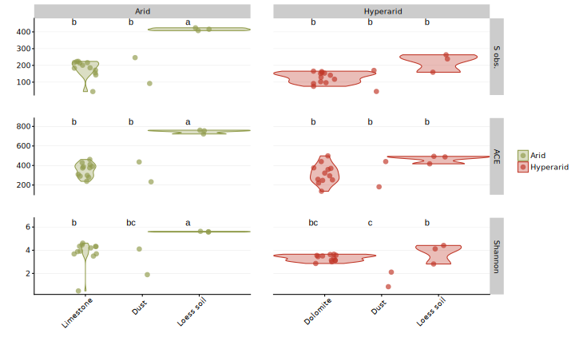<!-- -->

```r
Richness_Diversity_long2plot %>%
  group_by(Metric, Climate.Source) %>%   # the grouping variable
  summarise(mean_PL = mean(Estimate),  # calculates the mean of each group
            sd_PL = sd(Estimate), # calculates the standard deviation of each group
            n_PL = n(),  # calculates the sample size per group
            SE_PL = sd(Estimate)/sqrt(n())) %>% # calculates the standard error of each group
  kable(.) %>%
  kable_styling(bootstrap_options = c("striped", "hover", "condensed", "responsive"), full_width = F)
```

<table class="table table-striped table-hover table-condensed table-responsive" style="width: auto !important; margin-left: auto; margin-right: auto;">
 <thead>
  <tr>
   <th style="text-align:left;"> Metric </th>
   <th style="text-align:left;"> Climate.Source </th>
   <th style="text-align:right;"> mean_PL </th>
   <th style="text-align:right;"> sd_PL </th>
   <th style="text-align:right;"> n_PL </th>
   <th style="text-align:right;"> SE_PL </th>
  </tr>
 </thead>
<tbody>
  <tr>
   <td style="text-align:left;"> S obs. </td>
   <td style="text-align:left;"> Arid limestone </td>
   <td style="text-align:right;"> 181.62 </td>
   <td style="text-align:right;"> 51.168 </td>
   <td style="text-align:right;"> 12 </td>
   <td style="text-align:right;"> 14.771 </td>
  </tr>
  <tr>
   <td style="text-align:left;"> S obs. </td>
   <td style="text-align:left;"> Arid dust </td>
   <td style="text-align:right;"> 169.25 </td>
   <td style="text-align:right;"> 109.015 </td>
   <td style="text-align:right;"> 2 </td>
   <td style="text-align:right;"> 77.085 </td>
  </tr>
  <tr>
   <td style="text-align:left;"> S obs. </td>
   <td style="text-align:left;"> Arid loess soil </td>
   <td style="text-align:right;"> 416.02 </td>
   <td style="text-align:right;"> 8.277 </td>
   <td style="text-align:right;"> 3 </td>
   <td style="text-align:right;"> 4.779 </td>
  </tr>
  <tr>
   <td style="text-align:left;"> S obs. </td>
   <td style="text-align:left;"> Hyperarid dolomite </td>
   <td style="text-align:right;"> 128.76 </td>
   <td style="text-align:right;"> 31.256 </td>
   <td style="text-align:right;"> 12 </td>
   <td style="text-align:right;"> 9.023 </td>
  </tr>
  <tr>
   <td style="text-align:left;"> S obs. </td>
   <td style="text-align:left;"> Hyperarid dust </td>
   <td style="text-align:right;"> 107.26 </td>
   <td style="text-align:right;"> 88.726 </td>
   <td style="text-align:right;"> 2 </td>
   <td style="text-align:right;"> 62.739 </td>
  </tr>
  <tr>
   <td style="text-align:left;"> S obs. </td>
   <td style="text-align:left;"> Hyperarid loess soil </td>
   <td style="text-align:right;"> 220.41 </td>
   <td style="text-align:right;"> 54.399 </td>
   <td style="text-align:right;"> 3 </td>
   <td style="text-align:right;"> 31.407 </td>
  </tr>
  <tr>
   <td style="text-align:left;"> ACE </td>
   <td style="text-align:left;"> Arid limestone </td>
   <td style="text-align:right;"> 353.78 </td>
   <td style="text-align:right;"> 68.810 </td>
   <td style="text-align:right;"> 12 </td>
   <td style="text-align:right;"> 19.864 </td>
  </tr>
  <tr>
   <td style="text-align:left;"> ACE </td>
   <td style="text-align:left;"> Arid dust </td>
   <td style="text-align:right;"> 334.65 </td>
   <td style="text-align:right;"> 143.601 </td>
   <td style="text-align:right;"> 2 </td>
   <td style="text-align:right;"> 101.541 </td>
  </tr>
  <tr>
   <td style="text-align:left;"> ACE </td>
   <td style="text-align:left;"> Arid loess soil </td>
   <td style="text-align:right;"> 746.50 </td>
   <td style="text-align:right;"> 20.794 </td>
   <td style="text-align:right;"> 3 </td>
   <td style="text-align:right;"> 12.005 </td>
  </tr>
  <tr>
   <td style="text-align:left;"> ACE </td>
   <td style="text-align:left;"> Hyperarid dolomite </td>
   <td style="text-align:right;"> 314.74 </td>
   <td style="text-align:right;"> 100.430 </td>
   <td style="text-align:right;"> 12 </td>
   <td style="text-align:right;"> 28.992 </td>
  </tr>
  <tr>
   <td style="text-align:left;"> ACE </td>
   <td style="text-align:left;"> Hyperarid dust </td>
   <td style="text-align:right;"> 311.05 </td>
   <td style="text-align:right;"> 182.765 </td>
   <td style="text-align:right;"> 2 </td>
   <td style="text-align:right;"> 129.234 </td>
  </tr>
  <tr>
   <td style="text-align:left;"> ACE </td>
   <td style="text-align:left;"> Hyperarid loess soil </td>
   <td style="text-align:right;"> 466.26 </td>
   <td style="text-align:right;"> 42.579 </td>
   <td style="text-align:right;"> 3 </td>
   <td style="text-align:right;"> 24.583 </td>
  </tr>
  <tr>
   <td style="text-align:left;"> Shannon </td>
   <td style="text-align:left;"> Arid limestone </td>
   <td style="text-align:right;"> 3.78 </td>
   <td style="text-align:right;"> 1.094 </td>
   <td style="text-align:right;"> 12 </td>
   <td style="text-align:right;"> 0.316 </td>
  </tr>
  <tr>
   <td style="text-align:left;"> Shannon </td>
   <td style="text-align:left;"> Arid dust </td>
   <td style="text-align:right;"> 3.00 </td>
   <td style="text-align:right;"> 1.563 </td>
   <td style="text-align:right;"> 2 </td>
   <td style="text-align:right;"> 1.106 </td>
  </tr>
  <tr>
   <td style="text-align:left;"> Shannon </td>
   <td style="text-align:left;"> Arid loess soil </td>
   <td style="text-align:right;"> 5.59 </td>
   <td style="text-align:right;"> 0.032 </td>
   <td style="text-align:right;"> 3 </td>
   <td style="text-align:right;"> 0.018 </td>
  </tr>
  <tr>
   <td style="text-align:left;"> Shannon </td>
   <td style="text-align:left;"> Hyperarid dolomite </td>
   <td style="text-align:right;"> 3.33 </td>
   <td style="text-align:right;"> 0.268 </td>
   <td style="text-align:right;"> 12 </td>
   <td style="text-align:right;"> 0.077 </td>
  </tr>
  <tr>
   <td style="text-align:left;"> Shannon </td>
   <td style="text-align:left;"> Hyperarid dust </td>
   <td style="text-align:right;"> 1.48 </td>
   <td style="text-align:right;"> 0.889 </td>
   <td style="text-align:right;"> 2 </td>
   <td style="text-align:right;"> 0.629 </td>
  </tr>
  <tr>
   <td style="text-align:left;"> Shannon </td>
   <td style="text-align:left;"> Hyperarid loess soil </td>
   <td style="text-align:right;"> 3.78 </td>
   <td style="text-align:right;"> 0.851 </td>
   <td style="text-align:right;"> 3 </td>
   <td style="text-align:right;"> 0.492 </td>
  </tr>
</tbody>
</table>

### Beta diversity
Calculate and plot beta diversity mertrics. 

#### 1. Possible changes in biofilm arid vs hyper arid
Is there a difference between the two sites. However, since we know that that samples are of different nature we'll have to control for rock type, source and location:


```r
(mod1 <-  adonis(
  otu_table(Rock_weathering_filt3_GMPR) ~ Climate * Source * Location,
  data = as(sample_data(Rock_weathering_filt3_GMPR), "data.frame"),
  method = "horn",
  permutations = 9999
))
```

```
## 
## Call:
## adonis(formula = otu_table(Rock_weathering_filt3_GMPR) ~ Climate *      Source * Location, data = as(sample_data(Rock_weathering_filt3_GMPR),      "data.frame"), permutations = 9999, method = "horn") 
## 
## Permutation: free
## Number of permutations: 9999
## 
## Terms added sequentially (first to last)
## 
##                  Df SumsOfSqs MeanSqs F.Model      R2 Pr(>F)    
## Climate           1    2.5299 2.52988 21.3820 0.21632 0.0001 ***
## Source            3    4.7060 1.56865 13.2579 0.40238 0.0001 ***
## Location          1    0.4870 0.48696  4.1157 0.04164 0.0042 ** 
## Climate:Source    1    0.4397 0.43972  3.7164 0.03760 0.0039 ** 
## Climate:Location  1    0.4605 0.46052  3.8922 0.03938 0.0042 ** 
## Source:Location   1    0.1142 0.11421  0.9653 0.00977 0.4902    
## Residuals        25    2.9580 0.11832         0.25292           
## Total            33   11.6952                 1.00000           
## ---
## Signif. codes:  0 '***' 0.001 '**' 0.01 '*' 0.05 '.' 0.1 ' ' 1
```
According to this model we see that indeed there's an effect of site (climate) on the community (p = 0.001), and that effect accounts for about 22% of the variance. Also, considering that Location is only borderline significant and explains very little of the data, we could probably take it out of the model to make a minimal adequate model.


```r
(mod4 <-  adonis(
  otu_table(Rock_weathering_filt3_GMPR) ~ Climate * Source,
  data = as(sample_data(Rock_weathering_filt3_GMPR), "data.frame"),
  method = "horn",
  permutations = 9999
))
```

```
## 
## Call:
## adonis(formula = otu_table(Rock_weathering_filt3_GMPR) ~ Climate *      Source, data = as(sample_data(Rock_weathering_filt3_GMPR),      "data.frame"), permutations = 9999, method = "horn") 
## 
## Permutation: free
## Number of permutations: 9999
## 
## Terms added sequentially (first to last)
## 
##                Df SumsOfSqs MeanSqs F.Model    R2 Pr(>F)    
## Climate         1      2.53   2.530   17.65 0.216 0.0001 ***
## Source          3      4.71   1.569   10.94 0.402 0.0001 ***
## Climate:Source  1      0.45   0.445    3.11 0.038 0.0086 ** 
## Residuals      28      4.01   0.143         0.343           
## Total          33     11.70                 1.000           
## ---
## Signif. codes:  0 '***' 0.001 '**' 0.01 '*' 0.05 '.' 0.1 ' ' 1
```

```r
(mod5 <-  adonis(
  otu_table(Rock_weathering_filt3_GMPR_Arid) ~ Source,
  data = as(sample_data(Rock_weathering_filt3_GMPR_Arid), "data.frame"),
  method = "horn",
  permutations = 9999
))
```

```
## 
## Call:
## adonis(formula = otu_table(Rock_weathering_filt3_GMPR_Arid) ~      Source, data = as(sample_data(Rock_weathering_filt3_GMPR_Arid),      "data.frame"), permutations = 9999, method = "horn") 
## 
## Permutation: free
## Number of permutations: 9999
## 
## Terms added sequentially (first to last)
## 
##           Df SumsOfSqs MeanSqs F.Model    R2 Pr(>F)    
## Source     2      2.31   1.153    6.43 0.479  2e-04 ***
## Residuals 14      2.51   0.179         0.521           
## Total     16      4.82                 1.000           
## ---
## Signif. codes:  0 '***' 0.001 '**' 0.01 '*' 0.05 '.' 0.1 ' ' 1
```

```r
(mod6 <-  adonis(
  otu_table(Rock_weathering_filt3_GMPR_Hyperarid) ~ Source,
  data = as(sample_data(Rock_weathering_filt3_GMPR_Hyperarid), "data.frame"),
  method = "horn",
  permutations = 9999
))
```

```
## 
## Call:
## adonis(formula = otu_table(Rock_weathering_filt3_GMPR_Hyperarid) ~      Source, data = as(sample_data(Rock_weathering_filt3_GMPR_Hyperarid),      "data.frame"), permutations = 9999, method = "horn") 
## 
## Permutation: free
## Number of permutations: 9999
## 
## Terms added sequentially (first to last)
## 
##           Df SumsOfSqs MeanSqs F.Model    R2 Pr(>F)    
## Source     2      2.85   1.423    13.2 0.654  1e-04 ***
## Residuals 14      1.50   0.107         0.346           
## Total     16      4.35                 1.000           
## ---
## Signif. codes:  0 '***' 0.001 '**' 0.01 '*' 0.05 '.' 0.1 ' ' 1
```

Final model

```r
print(mod4)
```

```
## 
## Call:
## adonis(formula = otu_table(Rock_weathering_filt3_GMPR) ~ Climate *      Source, data = as(sample_data(Rock_weathering_filt3_GMPR),      "data.frame"), permutations = 9999, method = "horn") 
## 
## Permutation: free
## Number of permutations: 9999
## 
## Terms added sequentially (first to last)
## 
##                Df SumsOfSqs MeanSqs F.Model    R2 Pr(>F)    
## Climate         1      2.53   2.530   17.65 0.216 0.0001 ***
## Source          3      4.71   1.569   10.94 0.402 0.0001 ***
## Climate:Source  1      0.45   0.445    3.11 0.038 0.0086 ** 
## Residuals      28      4.01   0.143         0.343           
## Total          33     11.70                 1.000           
## ---
## Signif. codes:  0 '***' 0.001 '**' 0.01 '*' 0.05 '.' 0.1 ' ' 1
```

```r
mod4_pairwise <- PairwiseAdonis(
  otu_table(Rock_weathering_filt3_GMPR),
  sample_data(Rock_weathering_filt3_GMPR)$Climate.Source,
  sim.function = "vegdist",
  sim.method = "horn",
  p.adjust.m = "BH"
)
print(mod4_pairwise)
```

```
##                                         pairs total.DF F.Model    R2 p.value p.adjusted
## 1           Arid dust vs Hyperarid loess soil        4    4.80 0.616  0.1000     0.1154
## 2                 Arid dust vs Hyperarid dust        3    2.99 0.599  0.3333     0.3333
## 3                 Arid dust vs Arid limestone       13    4.61 0.277  0.0094     0.0223
## 4             Arid dust vs Hyperarid dolomite       13    6.59 0.355  0.0119     0.0223
## 5                Arid dust vs Arid loess soil        4    5.36 0.641  0.1000     0.1154
## 6      Hyperarid loess soil vs Hyperarid dust        4   10.87 0.784  0.2000     0.2143
## 7      Hyperarid loess soil vs Arid limestone       14    5.59 0.301  0.0078     0.0223
## 8  Hyperarid loess soil vs Hyperarid dolomite       14   16.02 0.552  0.0028     0.0105
## 9     Hyperarid loess soil vs Arid loess soil        5   95.51 0.960  0.1000     0.1154
## 10           Hyperarid dust vs Arid limestone       13    5.34 0.308  0.0327     0.0545
## 11       Hyperarid dust vs Hyperarid dolomite       13   11.62 0.492  0.0118     0.0223
## 12          Hyperarid dust vs Arid loess soil        4  205.85 0.986  0.1000     0.1154
## 13       Arid limestone vs Hyperarid dolomite       23   21.90 0.499  0.0001     0.0015
## 14          Arid limestone vs Arid loess soil       14    9.11 0.412  0.0018     0.0090
## 15      Hyperarid dolomite vs Arid loess soil       14   16.84 0.564  0.0017     0.0090
##    sig
## 1     
## 2     
## 3    .
## 4    .
## 5     
## 6     
## 7    .
## 8    .
## 9     
## 10    
## 11   .
## 12    
## 13   *
## 14   *
## 15   *
```

```r
sig_pairs <- as.character(mod4_pairwise$pairs[mod4_pairwise$p.adjusted < 0.05])
  
simper(otu_table(Rock_weathering_filt3_GMPR), sample_data(Rock_weathering_filt3_GMPR)$Climate.Source, parallel = 4)
```

```
## cumulative contributions of most influential species:
## 
## $`Arid dust_Hyperarid loess soil`
##    OTU6   OTU65  OTU838   OTU90  OTU596   OTU11  OTU187   OTU93  OTU746  OTU167  OTU711 
##   0.222   0.368   0.406   0.430   0.453   0.469   0.484   0.496   0.509   0.521   0.532 
##  OTU121  OTU144   OTU99  OTU194  OTU105  OTU356  OTU340  OTU115  OTU640   OTU55  OTU298 
##   0.543   0.553   0.562   0.571   0.579   0.586   0.593   0.599   0.606   0.612   0.619 
##  OTU715   OTU88  OTU197   OTU48  OTU221  OTU301 OTU1047  OTU322   OTU16  OTU586   OTU46 
##   0.625   0.631   0.638   0.643   0.649   0.654   0.659   0.665   0.669   0.674   0.678 
##  OTU172  OTU386   OTU67  OTU333  OTU854  OTU883 
##   0.683   0.687   0.691   0.695   0.698   0.702 
## 
## $`Arid dust_Hyperarid dust`
##   OTU6  OTU65 OTU838  OTU55 
##  0.492  0.652  0.697  0.730 
## 
## $`Arid dust_Arid limestone`
##    OTU6   OTU65   OTU20   OTU40  OTU838  OTU225  OTU422  OTU596   OTU73   OTU46   OTU11 
##   0.112   0.222   0.292   0.357   0.385   0.402   0.419   0.435   0.451   0.464   0.477 
##  OTU388  OTU119   OTU29   OTU18   OTU34  OTU746  OTU711   OTU16  OTU235  OTU854  OTU174 
##   0.488   0.499   0.509   0.519   0.529   0.538   0.547   0.556   0.564   0.573   0.581 
##  OTU299  OTU194   OTU68  OTU545   OTU37  OTU925   OTU41  OTU115  OTU140  OTU356   OTU60 
##   0.589   0.596   0.603   0.609   0.616   0.623   0.629   0.635   0.640   0.646   0.651 
##  OTU137  OTU197  OTU166  OTU605   OTU69   OTU55 OTU1089   OTU27  OTU218   OTU48   OTU45 
##   0.656   0.661   0.666   0.671   0.676   0.681   0.685   0.690   0.694   0.698   0.702 
## 
## $`Arid dust_Hyperarid dolomite`
##   OTU1   OTU2   OTU3   OTU7   OTU5  OTU65   OTU9  OTU18   OTU8  OTU17  OTU41  OTU16 
##  0.153  0.236  0.317  0.382  0.415  0.445  0.470  0.495  0.517  0.538  0.559  0.576 
##  OTU11 OTU936  OTU20  OTU28  OTU12  OTU10   OTU6  OTU15  OTU33  OTU14 
##  0.593  0.609  0.624  0.638  0.653  0.666  0.677  0.687  0.696  0.706 
## 
## $`Arid dust_Arid loess soil`
##   OTU65   OTU25   OTU88   OTU62   OTU11  OTU838   OTU68  OTU596  OTU177   OTU78  OTU133 
##  0.0760  0.0986  0.1205  0.1406  0.1597  0.1783  0.1907  0.2015  0.2119  0.2224  0.2320 
##  OTU144   OTU46  OTU115   OTU67   OTU16  OTU156  OTU388  OTU116  OTU137  OTU197  OTU100 
##  0.2412  0.2501  0.2587  0.2669  0.2742  0.2815  0.2885  0.2950  0.3013  0.3076  0.3139 
##   OTU91  OTU687  OTU746  OTU711   OTU73  OTU412  OTU194  OTU422  OTU160  OTU218  OTU152 
##  0.3198  0.3256  0.3312  0.3367  0.3423  0.3473  0.3521  0.3569  0.3615  0.3661  0.3705 
##   OTU53  OTU131  OTU135  OTU356  OTU125  OTU163   OTU37  OTU556  OTU311  OTU130  OTU214 
##  0.3749  0.3789  0.3827  0.3866  0.3904  0.3940  0.3975  0.4011  0.4046  0.4081  0.4116 
##  OTU227  OTU240  OTU341  OTU233  OTU854  OTU648  OTU101   OTU92   OTU55  OTU716  OTU220 
##  0.4150  0.4184  0.4217  0.4250  0.4283  0.4315  0.4348  0.4380  0.4412  0.4443  0.4474 
##  OTU139  OTU140  OTU278   OTU20  OTU103   OTU60  OTU253  OTU171 OTU1235  OTU107  OTU365 
##  0.4505  0.4536  0.4565  0.4594  0.4623  0.4651  0.4679  0.4706  0.4733  0.4760  0.4787 
##  OTU294  OTU301  OTU647  OTU206  OTU136  OTU231  OTU479 OTU1050 OTU1288   OTU82  OTU248 
##  0.4813  0.4839  0.4864  0.4890  0.4916  0.4941  0.4966  0.4991  0.5015  0.5039  0.5064 
##  OTU360  OTU181  OTU434  OTU945  OTU638 OTU1102  OTU315 OTU1184  OTU457   OTU44  OTU491 
##  0.5087  0.5111  0.5134  0.5157  0.5180  0.5203  0.5226  0.5249  0.5271  0.5294  0.5316 
##  OTU472  OTU938  OTU184  OTU471  OTU182  OTU538  OTU352  OTU169  OTU586  OTU191  OTU190 
##  0.5338  0.5360  0.5382  0.5404  0.5425  0.5446  0.5467  0.5488  0.5509  0.5530  0.5551 
##  OTU751  OTU304  OTU251  OTU164  OTU667   OTU69  OTU619  OTU170  OTU154  OTU992 OTU1013 
##  0.5571  0.5592  0.5612  0.5632  0.5652  0.5672  0.5692  0.5712  0.5731  0.5751  0.5771 
##  OTU707  OTU302  OTU725  OTU430 OTU1116  OTU132  OTU466  OTU364  OTU489  OTU166   OTU33 
##  0.5790  0.5809  0.5828  0.5847  0.5866  0.5885  0.5904  0.5922  0.5941  0.5959  0.5978 
## OTU1218  OTU421 OTU1319  OTU545  OTU309  OTU456  OTU562  OTU635  OTU468  OTU610  OTU347 
##  0.5996  0.6015  0.6033  0.6051  0.6068  0.6086  0.6103  0.6121  0.6138  0.6155  0.6171 
##  OTU833  OTU582   OTU41  OTU333    OTU6   OTU27   OTU86  OTU451  OTU162  OTU561  OTU439 
##  0.6188  0.6205  0.6222  0.6238  0.6255  0.6271  0.6287  0.6302  0.6318  0.6334  0.6349 
##  OTU579  OTU255  OTU653  OTU279  OTU368  OTU783   OTU93  OTU298  OTU323 OTU1024 OTU1005 
##  0.6364  0.6380  0.6395  0.6410  0.6425  0.6440  0.6455  0.6470  0.6484  0.6499  0.6513 
##  OTU389  OTU799  OTU348  OTU543  OTU524  OTU258  OTU953  OTU929  OTU174 OTU1100  OTU999 
##  0.6528  0.6542  0.6556  0.6570  0.6584  0.6598  0.6612  0.6625  0.6639  0.6652  0.6665 
##  OTU705  OTU199 OTU1049 OTU1242  OTU449  OTU303  OTU232  OTU765  OTU499   OTU10 OTU1011 
##  0.6678  0.6691  0.6704  0.6717  0.6730  0.6742  0.6754  0.6767  0.6779  0.6791  0.6803 
##  OTU595  OTU697  OTU548  OTU353  OTU310   OTU28 OTU1170  OTU404  OTU141  OTU277  OTU469 
##  0.6815  0.6827  0.6839  0.6851  0.6863  0.6875  0.6887  0.6898  0.6910  0.6922  0.6933 
##  OTU883  OTU557   OTU95   OTU29 OTU1108  OTU641 
##  0.6944  0.6956  0.6967  0.6978  0.6990  0.7001 
## 
## $`Hyperarid loess soil_Hyperarid dust`
##    OTU6   OTU55   OTU90   OTU11   OTU94  OTU187   OTU93  OTU167  OTU121   OTU99  OTU144 
##   0.455   0.493   0.518   0.536   0.551   0.565   0.578   0.589   0.600   0.610   0.619 
##    OTU9  OTU105  OTU340  OTU298  OTU115  OTU640  OTU715   OTU88  OTU197  OTU221  OTU322 
##   0.627   0.634   0.641   0.648   0.654   0.661   0.667   0.674   0.680   0.685   0.690 
## OTU1047   OTU16  OTU484 
##   0.695   0.700   0.704 
## 
## $`Hyperarid loess soil_Arid limestone`
##    OTU6   OTU20   OTU40   OTU90  OTU225   OTU11   OTU73  OTU422  OTU119   OTU29  OTU187 
##   0.207   0.274   0.338   0.356   0.373   0.389   0.403   0.418   0.429   0.439   0.449 
##   OTU46  OTU388   OTU18  OTU167   OTU34   OTU93  OTU299  OTU235  OTU121  OTU174   OTU99 
##   0.459   0.469   0.478   0.487   0.495   0.504   0.512   0.520   0.527   0.535   0.541 
##  OTU925  OTU854  OTU545  OTU144   OTU37  OTU197  OTU140   OTU68   OTU16  OTU340  OTU298 
##   0.548   0.554   0.560   0.566   0.572   0.578   0.584   0.589   0.594   0.599   0.604 
##  OTU605  OTU640   OTU69  OTU715  OTU105   OTU41  OTU137   OTU88   OTU27 OTU1089   OTU60 
##   0.609   0.614   0.618   0.623   0.628   0.632   0.637   0.641   0.645   0.649   0.653 
##   OTU45  OTU221  OTU166  OTU218  OTU261  OTU163   OTU81  OTU115  OTU322  OTU259 OTU1047 
##   0.658   0.662   0.665   0.669   0.673   0.677   0.680   0.684   0.687   0.690   0.693 
##  OTU172  OTU939   OTU67 
##   0.696   0.699   0.702 
## 
## $`Hyperarid loess soil_Hyperarid dolomite`
##   OTU1   OTU2   OTU3   OTU7   OTU6   OTU5   OTU9  OTU18   OTU8  OTU17  OTU41  OTU16 
##  0.150  0.232  0.312  0.374  0.421  0.454  0.478  0.501  0.523  0.544  0.564  0.580 
## OTU936  OTU11  OTU28  OTU12  OTU20  OTU10  OTU15  OTU14  OTU13  OTU45 
##  0.595  0.610  0.625  0.639  0.653  0.666  0.676  0.686  0.694  0.703 
## 
## $`Hyperarid loess soil_Arid loess soil`
##    OTU6   OTU25   OTU62   OTU88   OTU90   OTU11   OTU68  OTU177   OTU78  OTU133  OTU156 
##   0.117   0.141   0.161   0.180   0.192   0.204   0.216   0.226   0.237   0.247   0.254 
##  OTU187   OTU46  OTU116   OTU67  OTU137  OTU100  OTU687  OTU388  OTU115  OTU121   OTU73 
##   0.262   0.269   0.275   0.281   0.287   0.293   0.299   0.305   0.311   0.316   0.321 
##  OTU412   OTU91  OTU167   OTU93   OTU16   OTU99  OTU160  OTU218  OTU144  OTU131  OTU135 
##   0.327   0.332   0.337   0.342   0.347   0.352   0.357   0.361   0.366   0.370   0.374 
##   OTU53  OTU556  OTU152  OTU130  OTU125  OTU227  OTU340  OTU214  OTU233  OTU640  OTU341 
##   0.378   0.381   0.385   0.389   0.392   0.396   0.399   0.403   0.406   0.410   0.413 
##  OTU311  OTU648  OTU422  OTU716  OTU105  OTU197  OTU163  OTU140   OTU44   OTU37   OTU92 
##   0.416   0.420   0.423   0.426   0.430   0.433   0.436   0.439   0.442   0.445   0.448 
##  OTU240  OTU715  OTU139  OTU253  OTU221  OTU298  OTU101  OTU171 OTU1235  OTU107  OTU365 
##   0.451   0.454   0.457   0.460   0.463   0.466   0.469   0.472   0.474   0.477   0.480 
##  OTU491  OTU103  OTU647  OTU479 OTU1047 OTU1288  OTU278  OTU322  OTU136 OTU1102 OTU1050 
##   0.482   0.485   0.488   0.490   0.493   0.495   0.498   0.500   0.503   0.506   0.508 
##  OTU206  OTU360  OTU220  OTU248  OTU231   OTU48  OTU638  OTU945  OTU315  OTU294  OTU181 
##   0.510   0.513   0.515   0.518   0.520   0.522   0.525   0.527   0.529   0.531   0.534 
##  OTU190  OTU471  OTU172  OTU169  OTU457   OTU82  OTU191 OTU1013  OTU472  OTU182  OTU251 
##   0.536   0.538   0.540   0.542   0.545   0.547   0.549   0.551   0.553   0.555   0.557 
##  OTU619  OTU184  OTU352  OTU938  OTU154  OTU707  OTU304  OTU538  OTU386 OTU1116  OTU582 
##   0.559   0.561   0.564   0.566   0.568   0.570   0.572   0.574   0.576   0.578   0.580 
##  OTU751  OTU434   OTU20 OTU1319 OTU1218  OTU992  OTU309  OTU456  OTU364  OTU302   OTU69 
##   0.582   0.583   0.585   0.587   0.589   0.591   0.593   0.595   0.597   0.598   0.600 
##  OTU468  OTU725   OTU86  OTU466  OTU562 OTU1184  OTU347  OTU430  OTU164   OTU60  OTU451 
##   0.602   0.604   0.605   0.607   0.609   0.611   0.612   0.614   0.616   0.617   0.619 
##  OTU635  OTU489  OTU854  OTU610  OTU132  OTU439  OTU255 OTU1046  OTU421  OTU170  OTU543 
##   0.621   0.622   0.624   0.625   0.627   0.629   0.630   0.632   0.633   0.635   0.636 
##  OTU579 OTU1024   OTU27  OTU323  OTU929  OTU368  OTU953  OTU799  OTU545  OTU258 OTU1282 
##   0.638   0.639   0.641   0.642   0.644   0.645   0.647   0.648   0.650   0.651   0.652 
##  OTU267   OTU28 OTU1100  OTU277  OTU279  OTU667  OTU199  OTU705  OTU999  OTU232   OTU95 
##   0.654   0.655   0.657   0.658   0.659   0.661   0.662   0.663   0.665   0.666   0.667 
##  OTU303  OTU836 OTU1242  OTU653    OTU3  OTU141  OTU697  OTU273  OTU499   OTU29 OTU1011 
##   0.669   0.670   0.671   0.672   0.674   0.675   0.676   0.677   0.679   0.680   0.681 
##  OTU389  OTU162 OTU1108  OTU166  OTU595  OTU524  OTU185  OTU765   OTU41  OTU404  OTU641 
##   0.682   0.683   0.685   0.686   0.687   0.688   0.689   0.691   0.692   0.693   0.694 
##  OTU557 OTU1005 OTU1049   OTU10 OTU1101  OTU449 
##   0.695   0.696   0.698   0.699   0.700   0.701 
## 
## $`Hyperarid dust_Arid limestone`
##   OTU6  OTU20  OTU40  OTU55 OTU225 OTU422  OTU73  OTU11  OTU46  OTU94 OTU388  OTU29 
##  0.383  0.442  0.497  0.524  0.539  0.553  0.566  0.578  0.589  0.600  0.609  0.618 
## OTU119  OTU18  OTU34 OTU235  OTU16 OTU854 OTU174 OTU299  OTU68 OTU545   OTU9  OTU37 
##  0.627  0.636  0.644  0.651  0.659  0.666  0.673  0.680  0.685  0.691  0.697  0.702 
## 
## $`Hyperarid dust_Hyperarid dolomite`
##   OTU6   OTU1   OTU2   OTU3   OTU7   OTU5  OTU18   OTU9   OTU8  OTU17  OTU41  OTU11 
##  0.144  0.281  0.357  0.430  0.487  0.517  0.538  0.559  0.579  0.598  0.617  0.633 
##  OTU16 OTU936  OTU28  OTU20  OTU12 
##  0.648  0.662  0.676  0.689  0.701 
## 
## $`Hyperarid dust_Arid loess soil`
##    OTU6   OTU55   OTU25   OTU88   OTU11   OTU62   OTU68  OTU177   OTU78   OTU94  OTU133 
##   0.272   0.292   0.310   0.327   0.343   0.359   0.369   0.377   0.385   0.393   0.401 
##  OTU144   OTU46  OTU115   OTU67  OTU156   OTU16  OTU388  OTU116  OTU137  OTU197  OTU100 
##   0.408   0.415   0.422   0.428   0.434   0.440   0.445   0.450   0.455   0.460   0.465 
##  OTU687   OTU91   OTU73  OTU412  OTU218    OTU9  OTU422  OTU160   OTU53  OTU152  OTU125 
##   0.470   0.474   0.479   0.482   0.486   0.490   0.494   0.497   0.501   0.504   0.508 
##  OTU135  OTU131  OTU311  OTU556  OTU163  OTU130  OTU484  OTU214  OTU227  OTU240   OTU37 
##   0.511   0.514   0.517   0.520   0.523   0.526   0.528   0.531   0.534   0.536   0.539 
##  OTU341  OTU233  OTU854  OTU101  OTU648  OTU140  OTU716   OTU92  OTU220  OTU139   OTU44 
##   0.542   0.544   0.547   0.549   0.552   0.554   0.557   0.559   0.562   0.564   0.567 
##  OTU491   OTU20  OTU278  OTU103  OTU253   OTU60 OTU1235  OTU206  OTU171  OTU107  OTU365 
##   0.569   0.571   0.574   0.576   0.578   0.580   0.582   0.584   0.587   0.589   0.591 
##  OTU294  OTU647  OTU136  OTU231 OTU1050 OTU1102  OTU479 OTU1288   OTU82  OTU248  OTU434 
##   0.593   0.595   0.597   0.599   0.601   0.603   0.605   0.607   0.609   0.610   0.612 
##  OTU638  OTU360  OTU945  OTU181  OTU457  OTU472  OTU938 OTU1184  OTU184  OTU315   OTU33 
##   0.614   0.616   0.618   0.619   0.621   0.623   0.625   0.626   0.628   0.630   0.632 
##  OTU667  OTU471  OTU190 OTU1013  OTU182  OTU538  OTU352  OTU191   OTU86  OTU169  OTU586 
##   0.633   0.635   0.637   0.638   0.640   0.642   0.643   0.645   0.647   0.648   0.650 
##  OTU304  OTU251  OTU164  OTU619  OTU170  OTU751 OTU1116  OTU707  OTU582  OTU302  OTU154 
##   0.651   0.653   0.655   0.656   0.658   0.659   0.661   0.662   0.664   0.665   0.667 
##   OTU69  OTU466  OTU725  OTU430  OTU132  OTU545  OTU489  OTU166   OTU48  OTU992  OTU421 
##   0.668   0.670   0.671   0.673   0.674   0.676   0.677   0.679   0.680   0.682   0.683 
## OTU1218 OTU1319  OTU456  OTU309  OTU364  OTU635  OTU437  OTU610  OTU562  OTU298  OTU468 
##   0.685   0.686   0.687   0.689   0.690   0.692   0.693   0.694   0.696   0.697   0.698 
##  OTU347  OTU333 
##   0.700   0.701 
## 
## $`Arid limestone_Hyperarid dolomite`
##   OTU1   OTU2   OTU3   OTU6   OTU7   OTU5   OTU9   OTU8  OTU18  OTU17  OTU41  OTU40 
##  0.144  0.224  0.302  0.361  0.419  0.451  0.474  0.496  0.516  0.537  0.554  0.570 
##  OTU11 OTU936  OTU16  OTU28  OTU12  OTU20  OTU10  OTU15  OTU14  OTU13  OTU33 
##  0.585  0.600  0.615  0.629  0.642  0.656  0.669  0.679  0.688  0.696  0.705 
## 
## $`Arid limestone_Arid loess soil`
##    OTU6   OTU40   OTU20   OTU25   OTU88   OTU62   OTU11  OTU225  OTU177   OTU78  OTU133 
##  0.0976  0.1375  0.1768  0.1973  0.2164  0.2334  0.2485  0.2580  0.2674  0.2765  0.2848 
##   OTU73   OTU68  OTU119  OTU144   OTU67  OTU156  OTU422   OTU18   OTU29   OTU34  OTU100 
##  0.2931  0.3001  0.3071  0.3139  0.3207  0.3273  0.3334  0.3394  0.3450  0.3506  0.3560 
##  OTU116   OTU91  OTU687   OTU46  OTU299  OTU388  OTU235  OTU197  OTU115  OTU218  OTU412 
##  0.3613  0.3664  0.3714  0.3762  0.3810  0.3858  0.3906  0.3952  0.3995  0.4039  0.4082 
##  OTU160  OTU174   OTU53  OTU152  OTU925  OTU135  OTU137   OTU37  OTU854  OTU545  OTU163 
##  0.4123  0.4163  0.4202  0.4242  0.4281  0.4317  0.4353  0.4386  0.4420  0.4452  0.4484 
##  OTU125  OTU130  OTU131  OTU556  OTU605  OTU311   OTU69  OTU140  OTU341  OTU214   OTU27 
##  0.4516  0.4547  0.4578  0.4609  0.4639  0.4670  0.4700  0.4729  0.4758  0.4788  0.4817 
##  OTU233  OTU648  OTU240   OTU16   OTU92   OTU44  OTU491  OTU139  OTU220  OTU227  OTU278 
##  0.4846  0.4874  0.4903  0.4931  0.4959  0.4987  0.5014  0.5041  0.5068  0.5094  0.5121 
##  OTU101 OTU1089  OTU103  OTU171   OTU45  OTU253  OTU107  OTU261  OTU365  OTU206  OTU231 
##  0.5147  0.5172  0.5198  0.5222  0.5246  0.5270  0.5294  0.5317  0.5341  0.5363  0.5386 
## OTU1235   OTU41  OTU479 OTU1288 OTU1102   OTU81 OTU1050  OTU294  OTU181   OTU60  OTU945 
##  0.5409  0.5431  0.5453  0.5475  0.5497  0.5519  0.5540  0.5561  0.5581  0.5602  0.5622 
##   OTU82   OTU48  OTU360  OTU472  OTU471  OTU136  OTU169  OTU248  OTU315  OTU184  OTU638 
##  0.5642  0.5661  0.5681  0.5701  0.5721  0.5740  0.5759  0.5779  0.5798  0.5817  0.5836 
##  OTU182  OTU352  OTU716  OTU647  OTU191  OTU349  OTU457  OTU938 OTU1013  OTU751  OTU619 
##  0.5855  0.5874  0.5892  0.5911  0.5930  0.5948  0.5966  0.5984  0.6002  0.6020  0.6038 
##  OTU164  OTU166  OTU251  OTU190  OTU154  OTU434  OTU707 OTU1116 OTU1218  OTU302  OTU489 
##  0.6055  0.6073  0.6090  0.6107  0.6124  0.6141  0.6157  0.6174  0.6190  0.6207  0.6223 
##  OTU421  OTU582  OTU286    OTU7  OTU259  OTU667  OTU364  OTU456 OTU1319  OTU298  OTU992 
##  0.6240  0.6256  0.6272  0.6288  0.6304  0.6320  0.6336  0.6351  0.6367  0.6383  0.6398 
##  OTU562  OTU304  OTU468  OTU610  OTU170  OTU347  OTU939   OTU86  OTU430  OTU246  OTU239 
##  0.6413  0.6428  0.6443  0.6458  0.6473  0.6488  0.6503  0.6517  0.6531  0.6545  0.6558 
##  OTU949  OTU255  OTU439  OTU466  OTU132  OTU530  OTU579  OTU368  OTU362   OTU28  OTU451 
##  0.6572  0.6586  0.6599  0.6613  0.6626  0.6639  0.6652  0.6665  0.6678  0.6691  0.6704 
##  OTU653 OTU1299  OTU309  OTU333  OTU399  OTU323  OTU953  OTU348  OTU162 OTU1024  OTU389 
##  0.6717  0.6730  0.6743  0.6755  0.6768  0.6781  0.6793  0.6806  0.6818  0.6830  0.6842 
## OTU1005  OTU929  OTU524 OTU1100  OTU586   OTU95  OTU279  OTU799   OTU87 OTU1101  OTU232 
##  0.6854  0.6866  0.6878  0.6890  0.6901  0.6913  0.6924  0.6936  0.6947  0.6959  0.6970 
##  OTU725  OTU303  OTU999 
##  0.6981  0.6993  0.7004 
## 
## $`Hyperarid dolomite_Arid loess soil`
##   OTU1   OTU2   OTU3   OTU7   OTU5   OTU9  OTU18   OTU8  OTU17  OTU41 OTU936  OTU28 
##  0.132  0.206  0.279  0.331  0.360  0.382  0.402  0.421  0.440  0.457  0.471  0.484 
##  OTU12  OTU16  OTU10  OTU11  OTU20   OTU6  OTU15  OTU14  OTU13  OTU24  OTU33  OTU45 
##  0.497  0.509  0.521  0.533  0.543  0.553  0.562  0.571  0.579  0.586  0.593  0.601 
##  OTU88  OTU25  OTU54  OTU62  OTU34  OTU39  OTU47  OTU19  OTU22  OTU35  OTU68  OTU32 
##  0.608  0.615  0.622  0.628  0.634  0.640  0.646  0.651  0.656  0.660  0.664  0.668 
##  OTU29 OTU756  OTU23  OTU37  OTU78  OTU26 OTU177  OTU30 OTU133  OTU46 
##  0.671  0.675  0.678  0.682  0.685  0.689  0.692  0.695  0.698  0.702
```

```r
GMPR_ord <- ordinate(Rock_weathering_filt3_GMPR, "CAP", "horn", formula = Rock_weathering_filt3_GMPR ~ Climate * Source)
explained <- eigenvals(GMPR_ord)/sum( eigenvals(GMPR_ord)) * 100
explained <- as.numeric(format(round(explained, 1), nsmall = 1))
data2plot <- cbind(scores(GMPR_ord, display = "sites"), sample_data(Rock_weathering_filt3_GMPR))
p_ord <- ggplot(data2plot) +
  geom_point(aes(x = CAP1, y = CAP2, colour = Source, shape = Climate), size = 3, alpha = 2/3 ) +
  scale_colour_manual(values = pom4) +
  stat_ellipse(aes(x = CAP1, y = CAP2, group = Climate), color = "black", alpha = 0.5, type = "norm", level = 0.95, linetype = 2) +
  xlab(label = paste0("CAP1", " (", explained[1],"%)")) + 
  ylab(label = paste0("CAP2", " (", explained[2],"%)")) +
  coord_fixed(sqrt(explained[2] / explained[1])) 
  
print(p_ord)
```

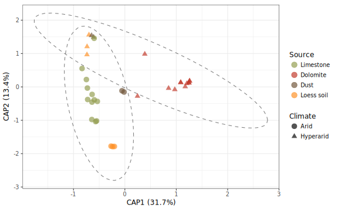<!-- -->

### Taxonomic features
Explore and plot the taxonomic distribution of the sequences


```r
Rock_weathering_filt3_GMPR_rel <- transform_sample_counts(Rock_weathering_filt3_GMPR, function(x) x / sum(x) )

Rock_weathering_filt3_GMPR_rel %>% 
  sample_data() %>% 
  arrange(Climate, Source) %>% 
  .$sample_names ->
  Sample_order

Rock_weathering_filt3_100 <-
  prune_taxa(names(sort(taxa_sums(Rock_weathering_filt3_GMPR_rel), TRUE)[1:100]), Rock_weathering_filt3_GMPR_rel)
plot_heatmap(
  Rock_weathering_filt3_100,
  method = NULL,
  distance = NULL,
  sample.label = "sample_title",
  taxa.label = "Order",
  sample_order = Sample_order,
  low = "#000033",
  high = "#FF3300"
) #+ theme_bw(base_size = 20) + theme(axis.text.x = element_text(hjust = 0, angle = -90.0))
```

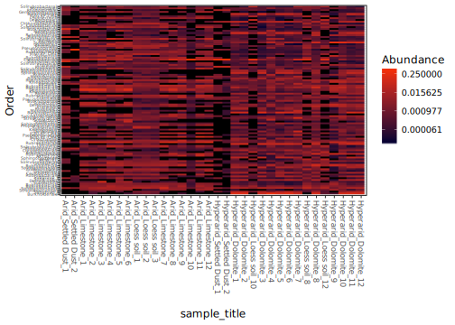<!-- -->

Let's look at the agglomerated taxa


```r
Rock_weathering_filt3_glom <- tax_glom(Rock_weathering_filt3_GMPR, 
                             "Phylum", 
                             NArm = TRUE)
Rock_weathering_filt3_glom_rel <- transform_sample_counts(Rock_weathering_filt3_glom, function(x) x / sum(x)) 
Rock_weathering_filt3_glom_rel_DF <- psmelt(Rock_weathering_filt3_glom_rel)
Rock_weathering_filt3_glom_rel_DF$Phylum %<>% as.character()

# group dataframe by Phylum, calculate median rel. abundance
Rock_weathering_filt3_glom_rel_DF %>%
  group_by(Phylum) %>%
  summarise(median = median(Abundance)) ->
  medians

# find Phyla whose rel. abund. is less than 0.5%
Rare_phyla <- medians[medians$median <= 0.005, ]$Phylum

# change their name to "Rare"
Rock_weathering_filt3_glom_rel_DF[Rock_weathering_filt3_glom_rel_DF$Phylum %in% Rare_phyla, ]$Phylum <- 'Rare'
# re-group
Rock_weathering_filt3_glom_rel_DF %>%
  group_by(Sample, Climate, Phylum, Rock.type, Source) %>%
  summarise(Abundance = sum(Abundance)) ->
  Rock_weathering_filt3_glom_rel_DF_2plot

# ab.taxonomy$Freq <- sqrt(ab.taxonomy$Freq)
Rock_weathering_filt3_glom_rel_DF_2plot$Phylum %<>% sub("unclassified", "Unclassified", .)
Rock_weathering_filt3_glom_rel_DF_2plot$Phylum %<>% sub("uncultured", "Unclassified", .)

Rock_weathering_filt3_glom_rel_DF_2plot %>% 
  group_by(Sample) %>% 
  filter(Phylum == "Rare") %>% 
  summarise(`Rares (%)` = sum(Abundance * 100)) -> 
  Rares

sample_order <- match(Rares$Sample, row.names(sample_data(Rock_weathering_filt3_glom)))
Rares %<>% arrange(., sample_order)

Rares %>% 
  cbind(., sample_data(Rock_weathering_filt3_glom)) %>% 
  group_by(Climate.Source) %>% 
  summarise(`Rares (%)` = mean(`Rares (%)`)) -> 
  Rares_merged

# Percentage of reads classified as rare 
Rares %>% 
  kable(., digits = 2, caption = "Percentage of reads per sample type classified as rare:") %>%
  kable_styling(bootstrap_options = c("striped", "hover", "condensed", "responsive"), full_width = F)
```

<table class="table table-striped table-hover table-condensed table-responsive" style="width: auto !important; margin-left: auto; margin-right: auto;">
<caption>Percentage of reads per sample type classified as rare:</caption>
 <thead>
  <tr>
   <th style="text-align:left;"> Sample </th>
   <th style="text-align:right;"> Rares (%) </th>
  </tr>
 </thead>
<tbody>
  <tr>
   <td style="text-align:left;"> SbDust1S14 </td>
   <td style="text-align:right;"> 2.05 </td>
  </tr>
  <tr>
   <td style="text-align:left;"> UvWad2CS23 </td>
   <td style="text-align:right;"> 2.17 </td>
  </tr>
  <tr>
   <td style="text-align:left;"> UvSlp3CS25 </td>
   <td style="text-align:right;"> 0.77 </td>
  </tr>
  <tr>
   <td style="text-align:left;"> UvWad3CS27 </td>
   <td style="text-align:right;"> 2.96 </td>
  </tr>
  <tr>
   <td style="text-align:left;"> SbDust2S31 </td>
   <td style="text-align:right;"> 0.43 </td>
  </tr>
  <tr>
   <td style="text-align:left;"> UvDust1S32 </td>
   <td style="text-align:right;"> 1.60 </td>
  </tr>
  <tr>
   <td style="text-align:left;"> UvDust2S33 </td>
   <td style="text-align:right;"> 0.12 </td>
  </tr>
  <tr>
   <td style="text-align:left;"> SbSlp1SNW49 </td>
   <td style="text-align:right;"> 0.82 </td>
  </tr>
  <tr>
   <td style="text-align:left;"> SbSlp2SNW50 </td>
   <td style="text-align:right;"> 0.91 </td>
  </tr>
  <tr>
   <td style="text-align:left;"> SbSlp3SNW51 </td>
   <td style="text-align:right;"> 0.85 </td>
  </tr>
  <tr>
   <td style="text-align:left;"> SbSlp4SNW52 </td>
   <td style="text-align:right;"> 1.99 </td>
  </tr>
  <tr>
   <td style="text-align:left;"> SbSlp5SNW53 </td>
   <td style="text-align:right;"> 0.72 </td>
  </tr>
  <tr>
   <td style="text-align:left;"> SbSlp6SNW54 </td>
   <td style="text-align:right;"> 1.59 </td>
  </tr>
  <tr>
   <td style="text-align:left;"> SbWad1SNW55 </td>
   <td style="text-align:right;"> 2.90 </td>
  </tr>
  <tr>
   <td style="text-align:left;"> SbWad2SNW56 </td>
   <td style="text-align:right;"> 0.48 </td>
  </tr>
  <tr>
   <td style="text-align:left;"> SbWad3SNW57 </td>
   <td style="text-align:right;"> 0.42 </td>
  </tr>
  <tr>
   <td style="text-align:left;"> SbWad4SNW58 </td>
   <td style="text-align:right;"> 0.20 </td>
  </tr>
  <tr>
   <td style="text-align:left;"> SbWad5SNW59 </td>
   <td style="text-align:right;"> 0.47 </td>
  </tr>
  <tr>
   <td style="text-align:left;"> SbWad6SNW60 </td>
   <td style="text-align:right;"> 1.47 </td>
  </tr>
  <tr>
   <td style="text-align:left;"> UvSlp1GS70 </td>
   <td style="text-align:right;"> 1.09 </td>
  </tr>
  <tr>
   <td style="text-align:left;"> UvSlp2GS71 </td>
   <td style="text-align:right;"> 0.42 </td>
  </tr>
  <tr>
   <td style="text-align:left;"> UvSlp3GS72 </td>
   <td style="text-align:right;"> 0.85 </td>
  </tr>
  <tr>
   <td style="text-align:left;"> UvSlp4GS73 </td>
   <td style="text-align:right;"> 0.64 </td>
  </tr>
  <tr>
   <td style="text-align:left;"> UvSlp5GS74 </td>
   <td style="text-align:right;"> 0.72 </td>
  </tr>
  <tr>
   <td style="text-align:left;"> UvSlp6GS75 </td>
   <td style="text-align:right;"> 0.34 </td>
  </tr>
  <tr>
   <td style="text-align:left;"> UvWad1GS76 </td>
   <td style="text-align:right;"> 9.37 </td>
  </tr>
  <tr>
   <td style="text-align:left;"> UvWad2GS77 </td>
   <td style="text-align:right;"> 0.75 </td>
  </tr>
  <tr>
   <td style="text-align:left;"> UvWad3GS78 </td>
   <td style="text-align:right;"> 0.16 </td>
  </tr>
  <tr>
   <td style="text-align:left;"> UvWad4GS79 </td>
   <td style="text-align:right;"> 0.77 </td>
  </tr>
  <tr>
   <td style="text-align:left;"> UvWad5GS80 </td>
   <td style="text-align:right;"> 0.30 </td>
  </tr>
  <tr>
   <td style="text-align:left;"> UvWad6GS81 </td>
   <td style="text-align:right;"> 0.38 </td>
  </tr>
  <tr>
   <td style="text-align:left;"> SbSoil1SA10 </td>
   <td style="text-align:right;"> 9.80 </td>
  </tr>
  <tr>
   <td style="text-align:left;"> SbSoil2SA11 </td>
   <td style="text-align:right;"> 10.41 </td>
  </tr>
  <tr>
   <td style="text-align:left;"> SbSoil3SA12 </td>
   <td style="text-align:right;"> 9.62 </td>
  </tr>
</tbody>
</table>

```r
Rock_weathering_filt3_glom_rel_DF_2plot %>% 
  group_by(Phylum) %>% 
  summarise(sum.Taxa = sum(Abundance)) %>% 
  arrange(desc(sum.Taxa)) -> Taxa_rank
Rock_weathering_filt3_glom_rel_DF_2plot$Phylum %<>% 
  factor(., levels = Taxa_rank$Phylum) %>% 
  fct_relevel(., "Rare", after = Inf)
  
p_taxa_box <-
  ggplot(Rock_weathering_filt3_glom_rel_DF_2plot, aes(x = Phylum, y = (Abundance * 100))) +
  geom_boxplot(aes(group = interaction(Phylum, Source)), position = position_dodge(width = 0.9), fatten = 1) +
  geom_point(
    aes(colour = Source),
    position = position_jitterdodge(dodge.width = 1),
    alpha = 1 / 2,
    stroke = 0,
    size = 2
  ) +
  scale_colour_manual(values = pom4, name = "") +
  theme_cowplot(font_size = 11, font_family = f_name) +
  labs(x = NULL, y = "Relative abundance (%)") +
  guides(colour = guide_legend(override.aes = list(size = 5))) +
  facet_grid(Climate ~ .) +
  background_grid(major = "xy",
                  minor = "none") +
  theme(axis.text.x = element_text(
    angle = 45,
    vjust = 0.9,
    hjust = 0.9
  ))
print(p_taxa_box)
```

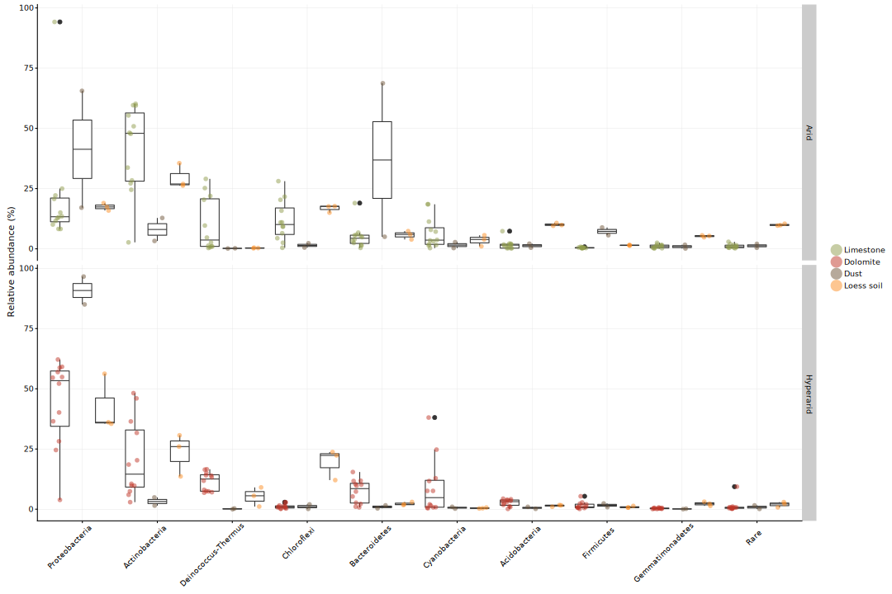<!-- -->

#### Test differences between samples on the phylum level

```r
Taxa_tests_phylum <- STAMPR(Rock_weathering_filt3_GMPR, "Phylum", sig_pairs)
```

```
## Taxonomy Table:     [1 taxa by 1 taxonomic ranks]:
##      Phylum          
## OTU1 "Proteobacteria"
## 
## DV:  Abundance 
## Observations:  34 
## D:  1 
## MS total:  99.2 
## 
##                Df Sum Sq     H p.value
## Climate         1   1118 11.28   0.001
## Source          3    412  4.16   0.245
## Climate:Source  1      2  0.02   0.876
## Residuals      28   1740              
## 
## 	Wilcoxon rank sum test with continuity correction
## 
## data:  Abundance by Climate.Source
## W = 5, p-value = 0.2
## alternative hypothesis: true location shift is not equal to 0
## 95 percent confidence interval:
##  -57.3  77.1
## sample estimates:
## difference in location 
##                  -8.84 
## 
## 
## 	Wilcoxon rank sum test with continuity correction
## 
## data:  Abundance by Climate.Source
## W = 10, p-value = 0.9
## alternative hypothesis: true location shift is not equal to 0
## 95 percent confidence interval:
##  -45.1  61.7
## sample estimates:
## difference in location 
##                   3.71 
## 
## 
## 	Wilcoxon rank sum test with continuity correction
## 
## data:  Abundance by Climate.Source
## W = 3, p-value = 0.04
## alternative hypothesis: true location shift is not equal to 0
## 95 percent confidence interval:
##  -44.6 -10.5
## sample estimates:
## difference in location 
##                  -24.3 
## 
## 
## 	Wilcoxon rank sum test with continuity correction
## 
## data:  Abundance by Climate.Source
## W = 20, p-value = 0.6
## alternative hypothesis: true location shift is not equal to 0
## 95 percent confidence interval:
##  -31.6  23.3
## sample estimates:
## difference in location 
##                   2.73 
## 
## 
## 	Wilcoxon rank sum test with continuity correction
## 
## data:  Abundance by Climate.Source
## W = 0, p-value = 0.04
## alternative hypothesis: true location shift is not equal to 0
## 95 percent confidence interval:
##  -92.7 -22.9
## sample estimates:
## difference in location 
##                  -41.8 
## 
## 
## 	Wilcoxon rank sum test with continuity correction
## 
## data:  Abundance by Climate.Source
## W = 20, p-value = 0.006
## alternative hypothesis: true location shift is not equal to 0
## 95 percent confidence interval:
##  -43.7 -14.5
## sample estimates:
## difference in location 
##                  -31.9 
## 
## 
## 	Wilcoxon rank sum test with continuity correction
## 
## data:  Abundance by Climate.Source
## W = 10, p-value = 0.4
## alternative hypothesis: true location shift is not equal to 0
## 95 percent confidence interval:
##  -9.15  9.09
## sample estimates:
## difference in location 
##                  -3.91 
## 
## 
## 	Wilcoxon rank sum test with continuity correction
## 
## data:  Abundance by Climate.Source
## W = 3, p-value = 0.04
## alternative hypothesis: true location shift is not equal to 0
## 95 percent confidence interval:
##  -43.18  -5.63
## sample estimates:
## difference in location 
##                  -35.8 
## 
## Taxonomy Table:     [1 taxa by 1 taxonomic ranks]:
##      Phylum               
## OTU2 "Deinococcus-Thermus"
## 
## DV:  Abundance 
## Observations:  34 
## D:  1 
## MS total:  99.2 
## 
##                Df Sum Sq     H p.value
## Climate         1    213  2.14   0.143
## Source          3   1475 14.87   0.002
## Climate:Source  1     73  0.73   0.392
## Residuals      28   1513              
## 
## 	Wilcoxon rank sum test with continuity correction
## 
## data:  Abundance by Climate.Source
## W = 20, p-value = 0.04
## alternative hypothesis: true location shift is not equal to 0
## 95 percent confidence interval:
##   0.116 28.897
## sample estimates:
## difference in location 
##                   3.76 
## 
## 
## 	Wilcoxon rank sum test with continuity correction
## 
## data:  Abundance by Climate.Source
## W = 0, p-value = 0.04
## alternative hypothesis: true location shift is not equal to 0
## 95 percent confidence interval:
##  -16.47  -6.63
## sample estimates:
## difference in location 
##                  -12.4 
## 
## 
## 	Wilcoxon rank sum test with continuity correction
## 
## data:  Abundance by Climate.Source
## W = 20, p-value = 1
## alternative hypothesis: true location shift is not equal to 0
## 95 percent confidence interval:
##  -8.04 20.82
## sample estimates:
## difference in location 
##                  0.132 
## 
## 
## 	Wilcoxon rank sum test with continuity correction
## 
## data:  Abundance by Climate.Source
## W = 30, p-value = 0.07
## alternative hypothesis: true location shift is not equal to 0
## 95 percent confidence interval:
##  -1.56 12.95
## sample estimates:
## difference in location 
##                   6.28 
## 
## 
## 	Wilcoxon rank sum test with continuity correction
## 
## data:  Abundance by Climate.Source
## W = 20, p-value = 0.04
## alternative hypothesis: true location shift is not equal to 0
## 95 percent confidence interval:
##   6.55 16.59
## sample estimates:
## difference in location 
##                     12 
## 
## 
## 	Wilcoxon rank sum test with continuity correction
## 
## data:  Abundance by Climate.Source
## W = 50, p-value = 0.3
## alternative hypothesis: true location shift is not equal to 0
## 95 percent confidence interval:
##  -11.37   7.95
## sample estimates:
## difference in location 
##                  -5.99 
## 
## 
## 	Wilcoxon rank sum test with continuity correction
## 
## data:  Abundance by Climate.Source
## W = 40, p-value = 0.02
## alternative hypothesis: true location shift is not equal to 0
## 95 percent confidence interval:
##   0.173 24.992
## sample estimates:
## difference in location 
##                   2.55 
## 
## 
## 	Wilcoxon rank sum test with continuity correction
## 
## data:  Abundance by Climate.Source
## W = 0, p-value = 0.01
## alternative hypothesis: true location shift is not equal to 0
## 95 percent confidence interval:
##  -16.14  -6.64
## sample estimates:
## difference in location 
##                    -12 
## 
## Taxonomy Table:     [1 taxa by 1 taxonomic ranks]:
##      Phylum         
## OTU5 "Bacteroidetes"
## 
## DV:  Abundance 
## Observations:  34 
## D:  1 
## MS total:  99.2 
## 
##                Df Sum Sq    H p.value
## Climate         1     13 0.13   0.718
## Source          3    822 8.29   0.040
## Climate:Source  1     75 0.75   0.385
## Residuals      28   2363             
## 
## 	Wilcoxon rank sum test with continuity correction
## 
## data:  Abundance by Climate.Source
## W = 5, p-value = 0.2
## alternative hypothesis: true location shift is not equal to 0
## 95 percent confidence interval:
##  -68.3  14.0
## sample estimates:
## difference in location 
##                  -27.2 
## 
## 
## 	Wilcoxon rank sum test with continuity correction
## 
## data:  Abundance by Climate.Source
## W = 20, p-value = 0.5
## alternative hypothesis: true location shift is not equal to 0
## 95 percent confidence interval:
##  -10.4  67.9
## sample estimates:
## difference in location 
##                   29.6 
## 
## 
## 	Wilcoxon rank sum test with continuity correction
## 
## data:  Abundance by Climate.Source
## W = 30, p-value = 0.3
## alternative hypothesis: true location shift is not equal to 0
## 95 percent confidence interval:
##  -1.35  4.99
## sample estimates:
## difference in location 
##                   2.07 
## 
## 
## 	Wilcoxon rank sum test with continuity correction
## 
## data:  Abundance by Climate.Source
## W = 30, p-value = 0.2
## alternative hypothesis: true location shift is not equal to 0
## 95 percent confidence interval:
##  -0.995 10.098
## sample estimates:
## difference in location 
##                   5.63 
## 
## 
## 	Wilcoxon rank sum test with continuity correction
## 
## data:  Abundance by Climate.Source
## W = 20, p-value = 0.08
## alternative hypothesis: true location shift is not equal to 0
## 95 percent confidence interval:
##  -0.822 15.087
## sample estimates:
## difference in location 
##                   7.65 
## 
## 
## 	Wilcoxon rank sum test with continuity correction
## 
## data:  Abundance by Climate.Source
## W = 50, p-value = 0.2
## alternative hypothesis: true location shift is not equal to 0
## 95 percent confidence interval:
##  -6.95  1.65
## sample estimates:
## difference in location 
##                  -3.57 
## 
## 
## 	Wilcoxon rank sum test with continuity correction
## 
## data:  Abundance by Climate.Source
## W = 10, p-value = 0.3
## alternative hypothesis: true location shift is not equal to 0
## 95 percent confidence interval:
##  -5.57  2.83
## sample estimates:
## difference in location 
##                  -1.64 
## 
## 
## 	Wilcoxon rank sum test with continuity correction
## 
## data:  Abundance by Climate.Source
## W = 20, p-value = 0.7
## alternative hypothesis: true location shift is not equal to 0
## 95 percent confidence interval:
##  -7.94  5.14
## sample estimates:
## difference in location 
##                  -2.62 
## 
## Taxonomy Table:     [1 taxa by 1 taxonomic ranks]:
##      Phylum         
## OTU7 "Cyanobacteria"
## 
## DV:  Abundance 
## Observations:  34 
## D:  1 
## MS total:  99.2 
## 
##                Df Sum Sq    H p.value
## Climate         1     96 0.96   0.326
## Source          3    853 8.61   0.035
## Climate:Source  1     45 0.45   0.500
## Residuals      28   2278             
## 
## 	Wilcoxon rank sum test with continuity correction
## 
## data:  Abundance by Climate.Source
## W = 20, p-value = 0.2
## alternative hypothesis: true location shift is not equal to 0
## 95 percent confidence interval:
##  -2.46 18.18
## sample estimates:
## difference in location 
##                   2.96 
## 
## 
## 	Wilcoxon rank sum test with continuity correction
## 
## data:  Abundance by Climate.Source
## W = 6, p-value = 0.3
## alternative hypothesis: true location shift is not equal to 0
## 95 percent confidence interval:
##  -37.74   2.34
## sample estimates:
## difference in location 
##                  -3.32 
## 
## 
## 	Wilcoxon rank sum test with continuity correction
## 
## data:  Abundance by Climate.Source
## W = 30, p-value = 0.04
## alternative hypothesis: true location shift is not equal to 0
## 95 percent confidence interval:
##   0.671 18.087
## sample estimates:
## difference in location 
##                   3.08 
## 
## 
## 	Wilcoxon rank sum test with continuity correction
## 
## data:  Abundance by Climate.Source
## W = 30, p-value = 0.03
## alternative hypothesis: true location shift is not equal to 0
## 95 percent confidence interval:
##   0.0686 24.4378
## sample estimates:
## difference in location 
##                   5.27 
## 
## 
## 	Wilcoxon rank sum test with continuity correction
## 
## data:  Abundance by Climate.Source
## W = 20, p-value = 0.2
## alternative hypothesis: true location shift is not equal to 0
## 95 percent confidence interval:
##  -0.591 37.801
## sample estimates:
## difference in location 
##                   4.21 
## 
## 
## 	Wilcoxon rank sum test with continuity correction
## 
## data:  Abundance by Climate.Source
## W = 70, p-value = 1
## alternative hypothesis: true location shift is not equal to 0
## 95 percent confidence interval:
##  -7.31  5.10
## sample estimates:
## difference in location 
##                  0.263 
## 
## 
## 	Wilcoxon rank sum test with continuity correction
## 
## data:  Abundance by Climate.Source
## W = 20, p-value = 0.7
## alternative hypothesis: true location shift is not equal to 0
## 95 percent confidence interval:
##  -3.69 14.61
## sample estimates:
## difference in location 
##                   1.13 
## 
## 
## 	Wilcoxon rank sum test with continuity correction
## 
## data:  Abundance by Climate.Source
## W = 20, p-value = 0.8
## alternative hypothesis: true location shift is not equal to 0
## 95 percent confidence interval:
##  -23.70   4.78
## sample estimates:
## difference in location 
##                  -1.64 
## 
## Taxonomy Table:     [1 taxa by 1 taxonomic ranks]:
##       Phylum         
## OTU10 "Acidobacteria"
## 
## DV:  Abundance 
## Observations:  34 
## D:  1 
## MS total:  99.2 
## 
##                Df Sum Sq     H p.value
## Climate         1      2  0.02   0.877
## Source          3   1299 13.10   0.004
## Climate:Source  1     70  0.71   0.399
## Residuals      28   1900              
## 
## 	Wilcoxon rank sum test with continuity correction
## 
## data:  Abundance by Climate.Source
## W = 10, p-value = 0.8
## alternative hypothesis: true location shift is not equal to 0
## 95 percent confidence interval:
##  -1.88  6.84
## sample estimates:
## difference in location 
##                   -0.2 
## 
## 
## 	Wilcoxon rank sum test with continuity correction
## 
## data:  Abundance by Climate.Source
## W = 5, p-value = 0.2
## alternative hypothesis: true location shift is not equal to 0
## 95 percent confidence interval:
##  -3.89  1.99
## sample estimates:
## difference in location 
##                  -1.61 
## 
## 
## 	Wilcoxon rank sum test with continuity correction
## 
## data:  Abundance by Climate.Source
## W = 20, p-value = 1
## alternative hypothesis: true location shift is not equal to 0
## 95 percent confidence interval:
##  -1.44  1.14
## sample estimates:
## difference in location 
##               -0.00745 
## 
## 
## 	Wilcoxon rank sum test with continuity correction
## 
## data:  Abundance by Climate.Source
## W = 30, p-value = 0.2
## alternative hypothesis: true location shift is not equal to 0
## 95 percent confidence interval:
##  -0.80  2.81
## sample estimates:
## difference in location 
##                   1.67 
## 
## 
## 	Wilcoxon rank sum test with continuity correction
## 
## data:  Abundance by Climate.Source
## W = 20, p-value = 0.1
## alternative hypothesis: true location shift is not equal to 0
## 95 percent confidence interval:
##  -0.874  4.205
## sample estimates:
## difference in location 
##                   2.41 
## 
## 
## 	Wilcoxon rank sum test with continuity correction
## 
## data:  Abundance by Climate.Source
## W = 40, p-value = 0.07
## alternative hypothesis: true location shift is not equal to 0
## 95 percent confidence interval:
##  -2.538  0.111
## sample estimates:
## difference in location 
##                  -1.54 
## 
## 
## 	Wilcoxon rank sum test with continuity correction
## 
## data:  Abundance by Climate.Source
## W = 0, p-value = 0.01
## alternative hypothesis: true location shift is not equal to 0
## 95 percent confidence interval:
##  -10.42  -7.39
## sample estimates:
## difference in location 
##                   -8.6 
## 
## 
## 	Wilcoxon rank sum test with continuity correction
## 
## data:  Abundance by Climate.Source
## W = 40, p-value = 0.01
## alternative hypothesis: true location shift is not equal to 0
## 95 percent confidence interval:
##  5.71 9.48
## sample estimates:
## difference in location 
##                   7.04 
## 
## Taxonomy Table:     [1 taxa by 1 taxonomic ranks]:
##       Phylum          
## OTU20 "Actinobacteria"
## 
## DV:  Abundance 
## Observations:  34 
## D:  1 
## MS total:  99.2 
## 
##                Df Sum Sq    H p.value
## Climate         1    585 5.90   0.015
## Source          3    761 7.68   0.053
## Climate:Source  1      1 0.01   0.928
## Residuals      28   1926             
## 
## 	Wilcoxon rank sum test with continuity correction
## 
## data:  Abundance by Climate.Source
## W = 20, p-value = 0.08
## alternative hypothesis: true location shift is not equal to 0
## 95 percent confidence interval:
##  -10.1  56.9
## sample estimates:
## difference in location 
##                   36.9 
## 
## 
## 	Wilcoxon rank sum test with continuity correction
## 
## data:  Abundance by Climate.Source
## W = 7, p-value = 0.4
## alternative hypothesis: true location shift is not equal to 0
## 95 percent confidence interval:
##  -44.93   9.86
## sample estimates:
## difference in location 
##                  -6.64 
## 
## 
## 	Wilcoxon rank sum test with continuity correction
## 
## data:  Abundance by Climate.Source
## W = 30, p-value = 0.1
## alternative hypothesis: true location shift is not equal to 0
## 95 percent confidence interval:
##  -6.17 41.74
## sample estimates:
## difference in location 
##                   20.6 
## 
## 
## 	Wilcoxon rank sum test with continuity correction
## 
## data:  Abundance by Climate.Source
## W = 10, p-value = 0.6
## alternative hypothesis: true location shift is not equal to 0
## 95 percent confidence interval:
##  -23.1  22.2
## sample estimates:
## difference in location 
##                  -6.06 
## 
## 
## 	Wilcoxon rank sum test with continuity correction
## 
## data:  Abundance by Climate.Source
## W = 20, p-value = 0.06
## alternative hypothesis: true location shift is not equal to 0
## 95 percent confidence interval:
##  -1.95 46.69
## sample estimates:
## difference in location 
##                   12.8 
## 
## 
## 	Wilcoxon rank sum test with continuity correction
## 
## data:  Abundance by Climate.Source
## W = 100, p-value = 0.01
## alternative hypothesis: true location shift is not equal to 0
## 95 percent confidence interval:
##   7.17 40.31
## sample estimates:
## difference in location 
##                   21.9 
## 
## 
## 	Wilcoxon rank sum test with continuity correction
## 
## data:  Abundance by Climate.Source
## W = 30, p-value = 0.2
## alternative hypothesis: true location shift is not equal to 0
## 95 percent confidence interval:
##  -11.0  33.2
## sample estimates:
## difference in location 
##                   17.1 
## 
## 
## 	Wilcoxon rank sum test with continuity correction
## 
## data:  Abundance by Climate.Source
## W = 20, p-value = 0.3
## alternative hypothesis: true location shift is not equal to 0
## 95 percent confidence interval:
##  -19.1  25.8
## sample estimates:
## difference in location 
##                   15.9 
## 
## Taxonomy Table:     [1 taxa by 1 taxonomic ranks]:
##       Phylum      
## OTU44 "Firmicutes"
## 
## DV:  Abundance 
## Observations:  34 
## D:  1 
## MS total:  99.2 
## 
##                Df Sum Sq     H p.value
## Climate         1    362  3.65   0.056
## Source          3   1570 15.83   0.001
## Climate:Source  1      1  0.01   0.917
## Residuals      28   1339              
## 
## 	Wilcoxon rank sum test with continuity correction
## 
## data:  Abundance by Climate.Source
## W = 0, p-value = 0.04
## alternative hypothesis: true location shift is not equal to 0
## 95 percent confidence interval:
##  -8.62 -4.81
## sample estimates:
## difference in location 
##                  -6.67 
## 
## 
## 	Wilcoxon rank sum test with continuity correction
## 
## data:  Abundance by Climate.Source
## W = 20, p-value = 0.04
## alternative hypothesis: true location shift is not equal to 0
## 95 percent confidence interval:
##  0.255 8.721
## sample estimates:
## difference in location 
##                   5.34 
## 
## 
## 	Wilcoxon rank sum test with continuity correction
## 
## data:  Abundance by Climate.Source
## W = 2, p-value = 0.03
## alternative hypothesis: true location shift is not equal to 0
## 95 percent confidence interval:
##  -1.0126 -0.0336
## sample estimates:
## difference in location 
##                 -0.346 
## 
## 
## 	Wilcoxon rank sum test with continuity correction
## 
## data:  Abundance by Climate.Source
## W = 20, p-value = 0.5
## alternative hypothesis: true location shift is not equal to 0
## 95 percent confidence interval:
##  -0.667  2.129
## sample estimates:
## difference in location 
##                  0.128 
## 
## 
## 	Wilcoxon rank sum test with continuity correction
## 
## data:  Abundance by Climate.Source
## W = 8, p-value = 0.5
## alternative hypothesis: true location shift is not equal to 0
## 95 percent confidence interval:
##  -2.27  4.52
## sample estimates:
## difference in location 
##                 -0.205 
## 
## 
## 	Wilcoxon rank sum test with continuity correction
## 
## data:  Abundance by Climate.Source
## W = 20, p-value = 0.003
## alternative hypothesis: true location shift is not equal to 0
## 95 percent confidence interval:
##  -1.661 -0.204
## sample estimates:
## difference in location 
##                 -0.533 
## 
## 
## 	Wilcoxon rank sum test with continuity correction
## 
## data:  Abundance by Climate.Source
## W = 0, p-value = 0.01
## alternative hypothesis: true location shift is not equal to 0
## 95 percent confidence interval:
##  -1.267 -0.788
## sample estimates:
## difference in location 
##                 -0.998 
## 
## 
## 	Wilcoxon rank sum test with continuity correction
## 
## data:  Abundance by Climate.Source
## W = 20, p-value = 0.6
## alternative hypothesis: true location shift is not equal to 0
## 95 percent confidence interval:
##  -1.51  1.12
## sample estimates:
## difference in location 
##                  0.522 
## 
## Taxonomy Table:     [1 taxa by 1 taxonomic ranks]:
##        Phylum            
## OTU116 "Gemmatimonadetes"
## 
## DV:  Abundance 
## Observations:  34 
## D:  1 
## MS total:  99.2 
## 
##                Df Sum Sq     H p.value
## Climate         1    536  5.41   0.020
## Source          3   1335 13.46   0.004
## Climate:Source  1     29  0.30   0.586
## Residuals      28   1372              
## 
## 	Wilcoxon rank sum test with continuity correction
## 
## data:  Abundance by Climate.Source
## W = 10, p-value = 0.9
## alternative hypothesis: true location shift is not equal to 0
## 95 percent confidence interval:
##  -1.56  2.37
## sample estimates:
## difference in location 
##                   0.11 
## 
## 
## 	Wilcoxon rank sum test with continuity correction
## 
## data:  Abundance by Climate.Source
## W = 10, p-value = 0.8
## alternative hypothesis: true location shift is not equal to 0
## 95 percent confidence interval:
##  -0.594  1.579
## sample estimates:
## difference in location 
##                  0.493 
## 
## 
## 	Wilcoxon rank sum test with continuity correction
## 
## data:  Abundance by Climate.Source
## W = 5, p-value = 0.07
## alternative hypothesis: true location shift is not equal to 0
## 95 percent confidence interval:
##  -2.630  0.147
## sample estimates:
## difference in location 
##                  -1.28 
## 
## 
## 	Wilcoxon rank sum test with continuity correction
## 
## data:  Abundance by Climate.Source
## W = 0, p-value = 0.01
## alternative hypothesis: true location shift is not equal to 0
## 95 percent confidence interval:
##  -2.865 -0.966
## sample estimates:
## difference in location 
##                  -1.92 
## 
## 
## 	Wilcoxon rank sum test with continuity correction
## 
## data:  Abundance by Climate.Source
## W = 20, p-value = 0.1
## alternative hypothesis: true location shift is not equal to 0
## 95 percent confidence interval:
##  -0.115  0.699
## sample estimates:
## difference in location 
##                  0.226 
## 
## 
## 	Wilcoxon rank sum test with continuity correction
## 
## data:  Abundance by Climate.Source
## W = 100, p-value = 0.01
## alternative hypothesis: true location shift is not equal to 0
## 95 percent confidence interval:
##  0.068 1.125
## sample estimates:
## difference in location 
##                  0.575 
## 
## 
## 	Wilcoxon rank sum test with continuity correction
## 
## data:  Abundance by Climate.Source
## W = 0, p-value = 0.01
## alternative hypothesis: true location shift is not equal to 0
## 95 percent confidence interval:
##  -5.20 -3.07
## sample estimates:
## difference in location 
##                  -4.26 
## 
## 
## 	Wilcoxon rank sum test with continuity correction
## 
## data:  Abundance by Climate.Source
## W = 40, p-value = 0.01
## alternative hypothesis: true location shift is not equal to 0
## 95 percent confidence interval:
##  4.37 5.33
## sample estimates:
## difference in location 
##                   4.96 
## 
## Taxonomy Table:     [1 taxa by 1 taxonomic ranks]:
##        Phylum       
## OTU225 "Chloroflexi"
## 
## DV:  Abundance 
## Observations:  34 
## D:  1 
## MS total:  99.2 
## 
##                Df Sum Sq     H p.value
## Climate         1    725  7.31   0.007
## Source          3   1423 14.35   0.002
## Climate:Source  1     17  0.17   0.678
## Residuals      28   1107              
## 
## 	Wilcoxon rank sum test with continuity correction
## 
## data:  Abundance by Climate.Source
## W = 20, p-value = 0.08
## alternative hypothesis: true location shift is not equal to 0
## 95 percent confidence interval:
##  -1.89 27.56
## sample estimates:
## difference in location 
##                   8.69 
## 
## 
## 	Wilcoxon rank sum test with continuity correction
## 
## data:  Abundance by Climate.Source
## W = 10, p-value = 0.9
## alternative hypothesis: true location shift is not equal to 0
## 95 percent confidence interval:
##  -2.39  2.13
## sample estimates:
## difference in location 
##                  0.262 
## 
## 
## 	Wilcoxon rank sum test with continuity correction
## 
## data:  Abundance by Climate.Source
## W = 6, p-value = 0.1
## alternative hypothesis: true location shift is not equal to 0
## 95 percent confidence interval:
##  -19.84   5.73
## sample estimates:
## difference in location 
##                   -8.4 
## 
## 
## 	Wilcoxon rank sum test with continuity correction
## 
## data:  Abundance by Climate.Source
## W = 0, p-value = 0.01
## alternative hypothesis: true location shift is not equal to 0
## 95 percent confidence interval:
##  -23.2 -10.8
## sample estimates:
## difference in location 
##                  -21.1 
## 
## 
## 	Wilcoxon rank sum test with continuity correction
## 
## data:  Abundance by Climate.Source
## W = 10, p-value = 0.8
## alternative hypothesis: true location shift is not equal to 0
## 95 percent confidence interval:
##  -1.82  2.77
## sample estimates:
## difference in location 
##                  0.134 
## 
## 
## 	Wilcoxon rank sum test with continuity correction
## 
## data:  Abundance by Climate.Source
## W = 100, p-value = 5e-04
## alternative hypothesis: true location shift is not equal to 0
## 95 percent confidence interval:
##   4.22 15.57
## sample estimates:
## difference in location 
##                   8.96 
## 
## 
## 	Wilcoxon rank sum test with continuity correction
## 
## data:  Abundance by Climate.Source
## W = 10, p-value = 0.3
## alternative hypothesis: true location shift is not equal to 0
## 95 percent confidence interval:
##  -15.09   6.63
## sample estimates:
## difference in location 
##                  -6.71 
## 
## 
## 	Wilcoxon rank sum test with continuity correction
## 
## data:  Abundance by Climate.Source
## W = 40, p-value = 0.01
## alternative hypothesis: true location shift is not equal to 0
## 95 percent confidence interval:
##  13.7 17.4
## sample estimates:
## difference in location 
##                   16.2
```

```r
Taxa_tests_order <- STAMPR(Rock_weathering_filt3_GMPR, "Order", sig_pairs)
```

```
## Taxonomy Table:     [1 taxa by 1 taxonomic ranks]:
##      Order            
## OTU1 "Burkholderiales"
## 
## DV:  Abundance 
## Observations:  34 
## D:  1 
## MS total:  99.2 
## 
##                Df Sum Sq     H p.value
## Climate         1    901  9.08   0.003
## Source          3   1292 13.03   0.005
## Climate:Source  1     79  0.80   0.371
## Residuals      28   1000              
## 
## 	Wilcoxon rank sum test with continuity correction
## 
## data:  Abundance by Climate.Source
## W = 0, p-value = 0.04
## alternative hypothesis: true location shift is not equal to 0
## 95 percent confidence interval:
##  -41.19  -3.36
## sample estimates:
## difference in location 
##                  -22.3 
## 
## 
## 	Wilcoxon rank sum test with continuity correction
## 
## data:  Abundance by Climate.Source
## W = 10, p-value = 1
## alternative hypothesis: true location shift is not equal to 0
## 95 percent confidence interval:
##  -40.2  41.2
## sample estimates:
## difference in location 
##                 -0.356 
## 
## 
## 	Wilcoxon rank sum test with continuity correction
## 
## data:  Abundance by Climate.Source
## W = 2, p-value = 0.03
## alternative hypothesis: true location shift is not equal to 0
## 95 percent confidence interval:
##  -0.455 -0.126
## sample estimates:
## difference in location 
##                 -0.297 
## 
## 
## 	Wilcoxon rank sum test with continuity correction
## 
## data:  Abundance by Climate.Source
## W = 30, p-value = 0.04
## alternative hypothesis: true location shift is not equal to 0
## 95 percent confidence interval:
##  12.7 40.8
## sample estimates:
## difference in location 
##                   34.2 
## 
## 
## 	Wilcoxon rank sum test with continuity correction
## 
## data:  Abundance by Climate.Source
## W = 20, p-value = 0.08
## alternative hypothesis: true location shift is not equal to 0
## 95 percent confidence interval:
##  -0.325 43.909
## sample estimates:
## difference in location 
##                   34.8 
## 
## 
## 	Wilcoxon rank sum test with continuity correction
## 
## data:  Abundance by Climate.Source
## W = 9, p-value = 3e-04
## alternative hypothesis: true location shift is not equal to 0
## 95 percent confidence interval:
##  -36.5 -15.3
## sample estimates:
## difference in location 
##                  -34.7 
## 
## 
## 	Wilcoxon rank sum test with continuity correction
## 
## data:  Abundance by Climate.Source
## W = 0, p-value = 0.01
## alternative hypothesis: true location shift is not equal to 0
## 95 percent confidence interval:
##  -1.134 -0.393
## sample estimates:
## difference in location 
##                 -0.743 
## 
## 
## 	Wilcoxon rank sum test with continuity correction
## 
## data:  Abundance by Climate.Source
## W = 3, p-value = 0.04
## alternative hypothesis: true location shift is not equal to 0
## 95 percent confidence interval:
##  -40.5 -12.0
## sample estimates:
## difference in location 
##                  -33.8 
## 
## Taxonomy Table:     [1 taxa by 1 taxonomic ranks]:
##      Order               
## OTU5 "Sphingobacteriales"
## 
## DV:  Abundance 
## Observations:  34 
## D:  1 
## MS total:  99.2 
## 
##                Df Sum Sq     H p.value
## Climate         1    184  1.85   0.174
## Source          3   1245 12.56   0.006
## Climate:Source  1     11  0.11   0.736
## Residuals      28   1833              
## 
## 	Wilcoxon rank sum test with continuity correction
## 
## data:  Abundance by Climate.Source
## W = 8, p-value = 0.5
## alternative hypothesis: true location shift is not equal to 0
## 95 percent confidence interval:
##  -1.110  0.842
## sample estimates:
## difference in location 
##                 -0.309 
## 
## 
## 	Wilcoxon rank sum test with continuity correction
## 
## data:  Abundance by Climate.Source
## W = 5, p-value = 0.2
## alternative hypothesis: true location shift is not equal to 0
## 95 percent confidence interval:
##  -13.08   1.13
## sample estimates:
## difference in location 
##                  -6.12 
## 
## 
## 	Wilcoxon rank sum test with continuity correction
## 
## data:  Abundance by Climate.Source
## W = 20, p-value = 0.7
## alternative hypothesis: true location shift is not equal to 0
## 95 percent confidence interval:
##  -0.664  0.764
## sample estimates:
## difference in location 
##                 0.0192 
## 
## 
## 	Wilcoxon rank sum test with continuity correction
## 
## data:  Abundance by Climate.Source
## W = 30, p-value = 0.1
## alternative hypothesis: true location shift is not equal to 0
## 95 percent confidence interval:
##  -0.51 10.25
## sample estimates:
## difference in location 
##                   6.49 
## 
## 
## 	Wilcoxon rank sum test with continuity correction
## 
## data:  Abundance by Climate.Source
## W = 20, p-value = 0.1
## alternative hypothesis: true location shift is not equal to 0
## 95 percent confidence interval:
##  -0.478 13.695
## sample estimates:
## difference in location 
##                   6.46 
## 
## 
## 	Wilcoxon rank sum test with continuity correction
## 
## data:  Abundance by Climate.Source
## W = 20, p-value = 0.005
## alternative hypothesis: true location shift is not equal to 0
## 95 percent confidence interval:
##  -8.517 -0.853
## sample estimates:
## difference in location 
##                  -6.14 
## 
## 
## 	Wilcoxon rank sum test with continuity correction
## 
## data:  Abundance by Climate.Source
## W = 0, p-value = 0.01
## alternative hypothesis: true location shift is not equal to 0
## 95 percent confidence interval:
##  -4.33 -1.61
## sample estimates:
## difference in location 
##                     -3 
## 
## 
## 	Wilcoxon rank sum test with continuity correction
## 
## data:  Abundance by Climate.Source
## W = 10, p-value = 0.6
## alternative hypothesis: true location shift is not equal to 0
## 95 percent confidence interval:
##  -8.04  3.57
## sample estimates:
## difference in location 
##                  -3.72 
## 
## Taxonomy Table:     [1 taxa by 1 taxonomic ranks]:
##      Order              
## OTU6 "Enterobacteriales"
## 
## DV:  Abundance 
## Observations:  34 
## D:  1 
## MS total:  99.2 
## 
##                Df Sum Sq     H p.value
## Climate         1     71  0.71   0.399
## Source          3   2314 23.34   0.000
## Climate:Source  1     64  0.65   0.422
## Residuals      28    824              
## 
## 	Wilcoxon rank sum test with continuity correction
## 
## data:  Abundance by Climate.Source
## W = 20, p-value = 0.2
## alternative hypothesis: true location shift is not equal to 0
## 95 percent confidence interval:
##  -0.571 91.132
## sample estimates:
## difference in location 
##                   3.55 
## 
## 
## 	Wilcoxon rank sum test with continuity correction
## 
## data:  Abundance by Climate.Source
## W = 20, p-value = 0.08
## alternative hypothesis: true location shift is not equal to 0
## 95 percent confidence interval:
##  -10.44   1.91
## sample estimates:
## difference in location 
##                   1.69 
## 
## 
## 	Wilcoxon rank sum test with continuity correction
## 
## data:  Abundance by Climate.Source
## W = 3, p-value = 0.04
## alternative hypothesis: true location shift is not equal to 0
## 95 percent confidence interval:
##  -49.50  -5.47
## sample estimates:
## difference in location 
##                  -21.5 
## 
## 
## 	Wilcoxon rank sum test with continuity correction
## 
## data:  Abundance by Climate.Source
## W = 0, p-value = 0.01
## alternative hypothesis: true location shift is not equal to 0
## 95 percent confidence interval:
##  -51.7 -22.4
## sample estimates:
## difference in location 
##                  -26.6 
## 
## 
## 	Wilcoxon rank sum test with continuity correction
## 
## data:  Abundance by Climate.Source
## W = 0, p-value = 0.04
## alternative hypothesis: true location shift is not equal to 0
## 95 percent confidence interval:
##  -84.2 -55.6
## sample estimates:
## difference in location 
##                  -69.9 
## 
## 
## 	Wilcoxon rank sum test with continuity correction
## 
## data:  Abundance by Climate.Source
## W = 100, p-value = 4e-04
## alternative hypothesis: true location shift is not equal to 0
## 95 percent confidence interval:
##  1.93 8.06
## sample estimates:
## difference in location 
##                   5.11 
## 
## 
## 	Wilcoxon rank sum test with continuity correction
## 
## data:  Abundance by Climate.Source
## W = 40, p-value = 0.01
## alternative hypothesis: true location shift is not equal to 0
## 95 percent confidence interval:
##   1.3 17.4
## sample estimates:
## difference in location 
##                   5.33 
## 
## 
## 	Wilcoxon rank sum test with continuity correction
## 
## data:  Abundance by Climate.Source
## W = 8, p-value = 0.2
## alternative hypothesis: true location shift is not equal to 0
## 95 percent confidence interval:
##  -0.5844  0.0654
## sample estimates:
## difference in location 
##                 -0.103 
## 
## Taxonomy Table:     [1 taxa by 1 taxonomic ranks]:
##      Order         
## OTU7 "SubsectionII"
## 
## DV:  Abundance 
## Observations:  34 
## D:  1 
## MS total:  99.2 
## 
##                Df Sum Sq    H p.value
## Climate         1    174 1.76   0.185
## Source          3    717 7.23   0.065
## Climate:Source  1      2 0.02   0.876
## Residuals      28   2379             
## 
## 	Wilcoxon rank sum test with continuity correction
## 
## data:  Abundance by Climate.Source
## W = 10, p-value = 0.8
## alternative hypothesis: true location shift is not equal to 0
## 95 percent confidence interval:
##  -1.05 14.87
## sample estimates:
## difference in location 
##                  0.195 
## 
## 
## 	Wilcoxon rank sum test with continuity correction
## 
## data:  Abundance by Climate.Source
## W = 4, p-value = 0.2
## alternative hypothesis: true location shift is not equal to 0
## 95 percent confidence interval:
##  -33.557   0.854
## sample estimates:
## difference in location 
##                  -3.54 
## 
## 
## 	Wilcoxon rank sum test with continuity correction
## 
## data:  Abundance by Climate.Source
## W = 20, p-value = 0.6
## alternative hypothesis: true location shift is not equal to 0
## 95 percent confidence interval:
##  -0.27  9.15
## sample estimates:
## difference in location 
##                  0.518 
## 
## 
## 	Wilcoxon rank sum test with continuity correction
## 
## data:  Abundance by Climate.Source
## W = 30, p-value = 0.03
## alternative hypothesis: true location shift is not equal to 0
## 95 percent confidence interval:
##   0.158 23.911
## sample estimates:
## difference in location 
##                   4.18 
## 
## 
## 	Wilcoxon rank sum test with continuity correction
## 
## data:  Abundance by Climate.Source
## W = 20, p-value = 0.1
## alternative hypothesis: true location shift is not equal to 0
## 95 percent confidence interval:
##  -0.365 33.663
## sample estimates:
## difference in location 
##                   4.55 
## 
## 
## 	Wilcoxon rank sum test with continuity correction
## 
## data:  Abundance by Climate.Source
## W = 40, p-value = 0.08
## alternative hypothesis: true location shift is not equal to 0
## 95 percent confidence interval:
##  -8.94  1.06
## sample estimates:
## difference in location 
##                  -1.22 
## 
## 
## 	Wilcoxon rank sum test with continuity correction
## 
## data:  Abundance by Climate.Source
## W = 20, p-value = 0.8
## alternative hypothesis: true location shift is not equal to 0
## 95 percent confidence interval:
##  -0.578  9.034
## sample estimates:
## difference in location 
##                  0.213 
## 
## 
## 	Wilcoxon rank sum test with continuity correction
## 
## data:  Abundance by Climate.Source
## W = 5, p-value = 0.07
## alternative hypothesis: true location shift is not equal to 0
## 95 percent confidence interval:
##  -23.792   0.123
## sample estimates:
## difference in location 
##                  -3.89 
## 
## Taxonomy Table:     [1 taxa by 1 taxonomic ranks]:
##      Order        
## OTU9 "Rhizobiales"
## 
## DV:  Abundance 
## Observations:  34 
## D:  1 
## MS total:  99.2 
## 
##                Df Sum Sq    H p.value
## Climate         1    880 8.88  0.0029
## Source          3    547 5.51  0.1378
## Climate:Source  1    400 4.04  0.0445
## Residuals      28   1445             
## 
## 	Wilcoxon rank sum test with continuity correction
## 
## data:  Abundance by Climate.Source
## W = 9, p-value = 0.6
## alternative hypothesis: true location shift is not equal to 0
## 95 percent confidence interval:
##  -5.88  2.95
## sample estimates:
## difference in location 
##                  -1.47 
## 
## 
## 	Wilcoxon rank sum test with continuity correction
## 
## data:  Abundance by Climate.Source
## W = 6, p-value = 0.3
## alternative hypothesis: true location shift is not equal to 0
## 95 percent confidence interval:
##  -11.7   5.9
## sample estimates:
## difference in location 
##                  -3.36 
## 
## 
## 	Wilcoxon rank sum test with continuity correction
## 
## data:  Abundance by Climate.Source
## W = 20, p-value = 0.8
## alternative hypothesis: true location shift is not equal to 0
## 95 percent confidence interval:
##  -1.99  1.21
## sample estimates:
## difference in location 
##                 -0.501 
## 
## 
## 	Wilcoxon rank sum test with continuity correction
## 
## data:  Abundance by Climate.Source
## W = 30, p-value = 0.04
## alternative hypothesis: true location shift is not equal to 0
## 95 percent confidence interval:
##   0.976 10.129
## sample estimates:
## difference in location 
##                   4.44 
## 
## 
## 	Wilcoxon rank sum test with continuity correction
## 
## data:  Abundance by Climate.Source
## W = 8, p-value = 0.5
## alternative hypothesis: true location shift is not equal to 0
## 95 percent confidence interval:
##  -7.85  4.60
## sample estimates:
## difference in location 
##                   -1.2 
## 
## 
## 	Wilcoxon rank sum test with continuity correction
## 
## data:  Abundance by Climate.Source
## W = 10, p-value = 6e-04
## alternative hypothesis: true location shift is not equal to 0
## 95 percent confidence interval:
##  -7.32 -2.45
## sample estimates:
## difference in location 
##                  -4.61 
## 
## 
## 	Wilcoxon rank sum test with continuity correction
## 
## data:  Abundance by Climate.Source
## W = 0, p-value = 0.01
## alternative hypothesis: true location shift is not equal to 0
## 95 percent confidence interval:
##  -4.59 -2.23
## sample estimates:
## difference in location 
##                  -2.96 
## 
## 
## 	Wilcoxon rank sum test with continuity correction
## 
## data:  Abundance by Climate.Source
## W = 10, p-value = 0.4
## alternative hypothesis: true location shift is not equal to 0
## 95 percent confidence interval:
##  -7.27  1.28
## sample estimates:
## difference in location 
##                  -1.61 
## 
## Taxonomy Table:     [1 taxa by 1 taxonomic ranks]:
##       Order       
## OTU10 "Subgroup_4"
## 
## DV:  Abundance 
## Observations:  34 
## D:  1 
## MS total:  99.2 
## 
##                Df Sum Sq     H p.value
## Climate         1     49  0.50   0.480
## Source          3   1315 13.26   0.004
## Climate:Source  1     73  0.73   0.392
## Residuals      28   1836              
## 
## 	Wilcoxon rank sum test with continuity correction
## 
## data:  Abundance by Climate.Source
## W = 10, p-value = 0.8
## alternative hypothesis: true location shift is not equal to 0
## 95 percent confidence interval:
##  -1.36  6.53
## sample estimates:
## difference in location 
##                 -0.113 
## 
## 
## 	Wilcoxon rank sum test with continuity correction
## 
## data:  Abundance by Climate.Source
## W = 4, p-value = 0.2
## alternative hypothesis: true location shift is not equal to 0
## 95 percent confidence interval:
##  -4.08  1.32
## sample estimates:
## difference in location 
##                  -1.91 
## 
## 
## 	Wilcoxon rank sum test with continuity correction
## 
## data:  Abundance by Climate.Source
## W = 10, p-value = 0.6
## alternative hypothesis: true location shift is not equal to 0
## 95 percent confidence interval:
##  -0.940  0.823
## sample estimates:
## difference in location 
##                 -0.265 
## 
## 
## 	Wilcoxon rank sum test with continuity correction
## 
## data:  Abundance by Climate.Source
## W = 30, p-value = 0.1
## alternative hypothesis: true location shift is not equal to 0
## 95 percent confidence interval:
##  -0.556  3.246
## sample estimates:
## difference in location 
##                   1.83 
## 
## 
## 	Wilcoxon rank sum test with continuity correction
## 
## data:  Abundance by Climate.Source
## W = 20, p-value = 0.08
## alternative hypothesis: true location shift is not equal to 0
## 95 percent confidence interval:
##  -0.612  4.277
## sample estimates:
## difference in location 
##                    2.4 
## 
## 
## 	Wilcoxon rank sum test with continuity correction
## 
## data:  Abundance by Climate.Source
## W = 30, p-value = 0.02
## alternative hypothesis: true location shift is not equal to 0
## 95 percent confidence interval:
##  -2.847 -0.324
## sample estimates:
## difference in location 
##                  -1.97 
## 
## 
## 	Wilcoxon rank sum test with continuity correction
## 
## data:  Abundance by Climate.Source
## W = 3, p-value = 0.04
## alternative hypothesis: true location shift is not equal to 0
## 95 percent confidence interval:
##  -6.17 -4.03
## sample estimates:
## difference in location 
##                   -5.3 
## 
## 
## 	Wilcoxon rank sum test with continuity correction
## 
## data:  Abundance by Climate.Source
## W = 40, p-value = 0.01
## alternative hypothesis: true location shift is not equal to 0
## 95 percent confidence interval:
##  1.72 5.44
## sample estimates:
## difference in location 
##                   3.04 
## 
## Taxonomy Table:     [1 taxa by 1 taxonomic ranks]:
##       Order             
## OTU11 "Sphingomonadales"
## 
## DV:  Abundance 
## Observations:  34 
## D:  1 
## MS total:  99.2 
## 
##                Df Sum Sq    H p.value
## Climate         1      5 0.05   0.823
## Source          3    596 6.01   0.111
## Climate:Source  1     66 0.67   0.414
## Residuals      28   2605             
## 
## 	Wilcoxon rank sum test with continuity correction
## 
## data:  Abundance by Climate.Source
## W = 10, p-value = 0.9
## alternative hypothesis: true location shift is not equal to 0
## 95 percent confidence interval:
##  -5.9 12.8
## sample estimates:
## difference in location 
##                   0.14 
## 
## 
## 	Wilcoxon rank sum test with continuity correction
## 
## data:  Abundance by Climate.Source
## W = 9, p-value = 0.6
## alternative hypothesis: true location shift is not equal to 0
## 95 percent confidence interval:
##  -8.33  4.10
## sample estimates:
## difference in location 
##                  -0.71 
## 
## 
## 	Wilcoxon rank sum test with continuity correction
## 
## data:  Abundance by Climate.Source
## W = 20, p-value = 0.8
## alternative hypothesis: true location shift is not equal to 0
## 95 percent confidence interval:
##  -4.13  5.96
## sample estimates:
## difference in location 
##                  0.326 
## 
## 
## 	Wilcoxon rank sum test with continuity correction
## 
## data:  Abundance by Climate.Source
## W = 20, p-value = 0.6
## alternative hypothesis: true location shift is not equal to 0
## 95 percent confidence interval:
##  -3.23  5.51
## sample estimates:
## difference in location 
##                   1.48 
## 
## 
## 	Wilcoxon rank sum test with continuity correction
## 
## data:  Abundance by Climate.Source
## W = 20, p-value = 0.04
## alternative hypothesis: true location shift is not equal to 0
## 95 percent confidence interval:
##  1.38 9.58
## sample estimates:
## difference in location 
##                   5.12 
## 
## 
## 	Wilcoxon rank sum test with continuity correction
## 
## data:  Abundance by Climate.Source
## W = 50, p-value = 0.3
## alternative hypothesis: true location shift is not equal to 0
## 95 percent confidence interval:
##  -3.50  1.09
## sample estimates:
## difference in location 
##                   -1.2 
## 
## 
## 	Wilcoxon rank sum test with continuity correction
## 
## data:  Abundance by Climate.Source
## W = 10, p-value = 0.4
## alternative hypothesis: true location shift is not equal to 0
## 95 percent confidence interval:
##  -4.00  3.07
## sample estimates:
## difference in location 
##                  -1.06 
## 
## 
## 	Wilcoxon rank sum test with continuity correction
## 
## data:  Abundance by Climate.Source
## W = 20, p-value = 0.7
## alternative hypothesis: true location shift is not equal to 0
## 95 percent confidence interval:
##  -2.89  2.81
## sample estimates:
## difference in location 
##                 -0.536 
## 
## Taxonomy Table:     [1 taxa by 1 taxonomic ranks]:
##       Order            
## OTU14 "Caulobacterales"
## 
## DV:  Abundance 
## Observations:  34 
## D:  1 
## MS total:  99.2 
## 
##                Df Sum Sq     H p.value
## Climate         1    431  4.34   0.037
## Source          3   1248 12.58   0.006
## Climate:Source  1     40  0.40   0.525
## Residuals      28   1554              
## 
## 	Wilcoxon rank sum test with continuity correction
## 
## data:  Abundance by Climate.Source
## W = 9, p-value = 0.6
## alternative hypothesis: true location shift is not equal to 0
## 95 percent confidence interval:
##  -1.070  0.948
## sample estimates:
## difference in location 
##                -0.0385 
## 
## 
## 	Wilcoxon rank sum test with continuity correction
## 
## data:  Abundance by Climate.Source
## W = 5, p-value = 0.2
## alternative hypothesis: true location shift is not equal to 0
## 95 percent confidence interval:
##  -2.937  0.523
## sample estimates:
## difference in location 
##                 -0.849 
## 
## 
## 	Wilcoxon rank sum test with continuity correction
## 
## data:  Abundance by Climate.Source
## W = 20, p-value = 0.4
## alternative hypothesis: true location shift is not equal to 0
## 95 percent confidence interval:
##  -0.431  0.773
## sample estimates:
## difference in location 
##                  0.218 
## 
## 
## 	Wilcoxon rank sum test with continuity correction
## 
## data:  Abundance by Climate.Source
## W = 40, p-value = 0.02
## alternative hypothesis: true location shift is not equal to 0
## 95 percent confidence interval:
##  0.281 2.461
## sample estimates:
## difference in location 
##                    1.1 
## 
## 
## 	Wilcoxon rank sum test with continuity correction
## 
## data:  Abundance by Climate.Source
## W = 20, p-value = 0.04
## alternative hypothesis: true location shift is not equal to 0
## 95 percent confidence interval:
##  0.365 3.036
## sample estimates:
## difference in location 
##                   1.29 
## 
## 
## 	Wilcoxon rank sum test with continuity correction
## 
## data:  Abundance by Climate.Source
## W = 20, p-value = 0.002
## alternative hypothesis: true location shift is not equal to 0
## 95 percent confidence interval:
##  -1.680 -0.436
## sample estimates:
## difference in location 
##                 -0.921 
## 
## 
## 	Wilcoxon rank sum test with continuity correction
## 
## data:  Abundance by Climate.Source
## W = 20, p-value = 1
## alternative hypothesis: true location shift is not equal to 0
## 95 percent confidence interval:
##  -0.432  0.364
## sample estimates:
## difference in location 
##                 0.0155 
## 
## 
## 	Wilcoxon rank sum test with continuity correction
## 
## data:  Abundance by Climate.Source
## W = 0, p-value = 0.01
## alternative hypothesis: true location shift is not equal to 0
## 95 percent confidence interval:
##  -2.0437 -0.0965
## sample estimates:
## difference in location 
##                 -0.961 
## 
## Taxonomy Table:     [1 taxa by 1 taxonomic ranks]:
##       Order            
## OTU20 "Rubrobacterales"
## 
## DV:  Abundance 
## Observations:  34 
## D:  1 
## MS total:  99.2 
## 
##                Df Sum Sq     H p.value
## Climate         1    362  3.65   0.056
## Source          3   1284 12.94   0.005
## Climate:Source  1      7  0.07   0.785
## Residuals      28   1619              
## 
## 	Wilcoxon rank sum test with continuity correction
## 
## data:  Abundance by Climate.Source
## W = 20, p-value = 0.04
## alternative hypothesis: true location shift is not equal to 0
## 95 percent confidence interval:
##   1.34 35.28
## sample estimates:
## difference in location 
##                   23.1 
## 
## 
## 	Wilcoxon rank sum test with continuity correction
## 
## data:  Abundance by Climate.Source
## W = 0, p-value = 0.04
## alternative hypothesis: true location shift is not equal to 0
## 95 percent confidence interval:
##  -34.3941  -0.0705
## sample estimates:
## difference in location 
##                   -4.2 
## 
## 
## 	Wilcoxon rank sum test with continuity correction
## 
## data:  Abundance by Climate.Source
## W = 30, p-value = 0.04
## alternative hypothesis: true location shift is not equal to 0
## 95 percent confidence interval:
##   5.21 27.55
## sample estimates:
## difference in location 
##                   17.1 
## 
## 
## 	Wilcoxon rank sum test with continuity correction
## 
## data:  Abundance by Climate.Source
## W = 20, p-value = 0.9
## alternative hypothesis: true location shift is not equal to 0
## 95 percent confidence interval:
##  -6.01 27.58
## sample estimates:
## difference in location 
##                  0.306 
## 
## 
## 	Wilcoxon rank sum test with continuity correction
## 
## data:  Abundance by Climate.Source
## W = 20, p-value = 0.06
## alternative hypothesis: true location shift is not equal to 0
## 95 percent confidence interval:
##  -0.173 34.359
## sample estimates:
## difference in location 
##                   4.64 
## 
## 
## 	Wilcoxon rank sum test with continuity correction
## 
## data:  Abundance by Climate.Source
## W = 100, p-value = 0.03
## alternative hypothesis: true location shift is not equal to 0
## 95 percent confidence interval:
##   1.01 21.60
## sample estimates:
## difference in location 
##                   13.5 
## 
## 
## 	Wilcoxon rank sum test with continuity correction
## 
## data:  Abundance by Climate.Source
## W = 30, p-value = 0.04
## alternative hypothesis: true location shift is not equal to 0
## 95 percent confidence interval:
##   5.38 24.82
## sample estimates:
## difference in location 
##                   16.8 
## 
## 
## 	Wilcoxon rank sum test with continuity correction
## 
## data:  Abundance by Climate.Source
## W = 20, p-value = 0.8
## alternative hypothesis: true location shift is not equal to 0
## 95 percent confidence interval:
##  -26.41   5.86
## sample estimates:
## difference in location 
##                    1.7 
## 
## Taxonomy Table:     [1 taxa by 1 taxonomic ranks]:
##       Order         
## OTU22 "Cytophagales"
## 
## DV:  Abundance 
## Observations:  34 
## D:  1 
## MS total:  99.2 
## 
##                Df Sum Sq     H p.value
## Climate         1   1165 11.75   0.001
## Source          3     45  0.45   0.929
## Climate:Source  1    282  2.84   0.092
## Residuals      28   1781              
## 
## 	Wilcoxon rank sum test with continuity correction
## 
## data:  Abundance by Climate.Source
## W = 7, p-value = 0.4
## alternative hypothesis: true location shift is not equal to 0
## 95 percent confidence interval:
##  -67.5  13.8
## sample estimates:
## difference in location 
##                  -27.7 
## 
## 
## 	Wilcoxon rank sum test with continuity correction
## 
## data:  Abundance by Climate.Source
## W = 20, p-value = 0.04
## alternative hypothesis: true location shift is not equal to 0
## 95 percent confidence interval:
##   1.0 67.3
## sample estimates:
## difference in location 
##                   34.9 
## 
## 
## 	Wilcoxon rank sum test with continuity correction
## 
## data:  Abundance by Climate.Source
## W = 30, p-value = 0.3
## alternative hypothesis: true location shift is not equal to 0
## 95 percent confidence interval:
##  -1.07  5.47
## sample estimates:
## difference in location 
##                   1.34 
## 
## 
## 	Wilcoxon rank sum test with continuity correction
## 
## data:  Abundance by Climate.Source
## W = 10, p-value = 0.3
## alternative hypothesis: true location shift is not equal to 0
## 95 percent confidence interval:
##  -1.839  0.353
## sample estimates:
## difference in location 
##                 -0.279 
## 
## 
## 	Wilcoxon rank sum test with continuity correction
## 
## data:  Abundance by Climate.Source
## W = 20, p-value = 0.06
## alternative hypothesis: true location shift is not equal to 0
## 95 percent confidence interval:
##  -0.195  1.887
## sample estimates:
## difference in location 
##                  0.542 
## 
## 
## 	Wilcoxon rank sum test with continuity correction
## 
## data:  Abundance by Climate.Source
## W = 100, p-value = 0.01
## alternative hypothesis: true location shift is not equal to 0
## 95 percent confidence interval:
##  0.416 3.920
## sample estimates:
## difference in location 
##                   2.37 
## 
## 
## 	Wilcoxon rank sum test with continuity correction
## 
## data:  Abundance by Climate.Source
## W = 20, p-value = 0.5
## alternative hypothesis: true location shift is not equal to 0
## 95 percent confidence interval:
##  -1.87  5.15
## sample estimates:
## difference in location 
##                   1.17 
## 
## 
## 	Wilcoxon rank sum test with continuity correction
## 
## data:  Abundance by Climate.Source
## W = 30, p-value = 0.03
## alternative hypothesis: true location shift is not equal to 0
## 95 percent confidence interval:
##  0.155 1.863
## sample estimates:
## difference in location 
##                   1.16 
## 
## Taxonomy Table:     [1 taxa by 1 taxonomic ranks]:
##       Order          
## OTU30 "Micrococcales"
## 
## DV:  Abundance 
## Observations:  34 
## D:  1 
## MS total:  99.2 
## 
##                Df Sum Sq    H p.value
## Climate         1    265 2.68   0.102
## Source          3    750 7.56   0.056
## Climate:Source  1     34 0.34   0.560
## Residuals      28   2223             
## 
## 	Wilcoxon rank sum test with continuity correction
## 
## data:  Abundance by Climate.Source
## W = 2, p-value = 0.08
## alternative hypothesis: true location shift is not equal to 0
## 95 percent confidence interval:
##  -5.21  4.63
## sample estimates:
## difference in location 
##                  -2.18 
## 
## 
## 	Wilcoxon rank sum test with continuity correction
## 
## data:  Abundance by Climate.Source
## W = 20, p-value = 0.08
## alternative hypothesis: true location shift is not equal to 0
## 95 percent confidence interval:
##  -3.83  5.11
## sample estimates:
## difference in location 
##                   2.14 
## 
## 
## 	Wilcoxon rank sum test with continuity correction
## 
## data:  Abundance by Climate.Source
## W = 20, p-value = 0.3
## alternative hypothesis: true location shift is not equal to 0
## 95 percent confidence interval:
##  -0.532  1.477
## sample estimates:
## difference in location 
##                  0.271 
## 
## 
## 	Wilcoxon rank sum test with continuity correction
## 
## data:  Abundance by Climate.Source
## W = 30, p-value = 0.3
## alternative hypothesis: true location shift is not equal to 0
## 95 percent confidence interval:
##  -0.512  0.787
## sample estimates:
## difference in location 
##                  0.203 
## 
## 
## 	Wilcoxon rank sum test with continuity correction
## 
## data:  Abundance by Climate.Source
## W = 7, p-value = 0.4
## alternative hypothesis: true location shift is not equal to 0
## 95 percent confidence interval:
##  -0.50  5.57
## sample estimates:
## difference in location 
##                 -0.228 
## 
## 
## 	Wilcoxon rank sum test with continuity correction
## 
## data:  Abundance by Climate.Source
## W = 80, p-value = 0.7
## alternative hypothesis: true location shift is not equal to 0
## 95 percent confidence interval:
##  -0.220  0.369
## sample estimates:
## difference in location 
##                 0.0729 
## 
## 
## 	Wilcoxon rank sum test with continuity correction
## 
## data:  Abundance by Climate.Source
## W = 4, p-value = 0.05
## alternative hypothesis: true location shift is not equal to 0
## 95 percent confidence interval:
##  -1.526  0.268
## sample estimates:
## difference in location 
##                  -1.07 
## 
## 
## 	Wilcoxon rank sum test with continuity correction
## 
## data:  Abundance by Climate.Source
## W = 30, p-value = 0.04
## alternative hypothesis: true location shift is not equal to 0
## 95 percent confidence interval:
##  0.422 1.495
## sample estimates:
## difference in location 
##                    1.1 
## 
## Taxonomy Table:     [1 taxa by 1 taxonomic ranks]:
##       Order       
## OTU33 "Frankiales"
## 
## DV:  Abundance 
## Observations:  34 
## D:  1 
## MS total:  99.2 
## 
##                Df Sum Sq     H p.value
## Climate         1     65 0.655   0.418
## Source          3    263 2.649   0.449
## Climate:Source  1     10 0.097   0.756
## Residuals      28   2935              
## 
## 	Wilcoxon rank sum test with continuity correction
## 
## data:  Abundance by Climate.Source
## W = 20, p-value = 0.5
## alternative hypothesis: true location shift is not equal to 0
## 95 percent confidence interval:
##  -2.72 10.23
## sample estimates:
## difference in location 
##                   1.11 
## 
## 
## 	Wilcoxon rank sum test with continuity correction
## 
## data:  Abundance by Climate.Source
## W = 8, p-value = 0.5
## alternative hypothesis: true location shift is not equal to 0
## 95 percent confidence interval:
##  -6.78  2.83
## sample estimates:
## difference in location 
##                 -0.485 
## 
## 
## 	Wilcoxon rank sum test with continuity correction
## 
## data:  Abundance by Climate.Source
## W = 20, p-value = 0.9
## alternative hypothesis: true location shift is not equal to 0
## 95 percent confidence interval:
##  -1.57  4.26
## sample estimates:
## difference in location 
##                  0.298 
## 
## 
## 	Wilcoxon rank sum test with continuity correction
## 
## data:  Abundance by Climate.Source
## W = 20, p-value = 0.8
## alternative hypothesis: true location shift is not equal to 0
## 95 percent confidence interval:
##  -2.58  4.27
## sample estimates:
## difference in location 
##                 -0.159 
## 
## 
## 	Wilcoxon rank sum test with continuity correction
## 
## data:  Abundance by Climate.Source
## W = 20, p-value = 0.3
## alternative hypothesis: true location shift is not equal to 0
## 95 percent confidence interval:
##  -0.786  6.561
## sample estimates:
## difference in location 
##                   1.09 
## 
## 
## 	Wilcoxon rank sum test with continuity correction
## 
## data:  Abundance by Climate.Source
## W = 80, p-value = 0.6
## alternative hypothesis: true location shift is not equal to 0
## 95 percent confidence interval:
##  -1.37  1.65
## sample estimates:
## difference in location 
##                  0.569 
## 
## 
## 	Wilcoxon rank sum test with continuity correction
## 
## data:  Abundance by Climate.Source
## W = 20, p-value = 0.9
## alternative hypothesis: true location shift is not equal to 0
## 95 percent confidence interval:
##  -1.02  2.98
## sample estimates:
## difference in location 
##                 -0.136 
## 
## 
## 	Wilcoxon rank sum test with continuity correction
## 
## data:  Abundance by Climate.Source
## W = 20, p-value = 0.7
## alternative hypothesis: true location shift is not equal to 0
## 95 percent confidence interval:
##  -4.11  1.80
## sample estimates:
## difference in location 
##                  0.471 
## 
## Taxonomy Table:     [1 taxa by 1 taxonomic ranks]:
##       Order          
## OTU40 "Deinococcales"
## 
## DV:  Abundance 
## Observations:  34 
## D:  1 
## MS total:  99.2 
## 
##                Df Sum Sq     H p.value
## Climate         1     25  0.25   0.617
## Source          3   1445 14.57   0.002
## Climate:Source  1    191  1.92   0.165
## Residuals      28   1612              
## 
## 	Wilcoxon rank sum test with continuity correction
## 
## data:  Abundance by Climate.Source
## W = 20, p-value = 0.04
## alternative hypothesis: true location shift is not equal to 0
## 95 percent confidence interval:
##   0.116 28.897
## sample estimates:
## difference in location 
##                   3.76 
## 
## 
## 	Wilcoxon rank sum test with continuity correction
## 
## data:  Abundance by Climate.Source
## W = 0, p-value = 0.04
## alternative hypothesis: true location shift is not equal to 0
## 95 percent confidence interval:
##  -7.347 -0.588
## sample estimates:
## difference in location 
##                   -2.5 
## 
## 
## 	Wilcoxon rank sum test with continuity correction
## 
## data:  Abundance by Climate.Source
## W = 20, p-value = 1
## alternative hypothesis: true location shift is not equal to 0
## 95 percent confidence interval:
##  -8.04 20.82
## sample estimates:
## difference in location 
##                  0.132 
## 
## 
## 	Wilcoxon rank sum test with continuity correction
## 
## data:  Abundance by Climate.Source
## W = 10, p-value = 0.3
## alternative hypothesis: true location shift is not equal to 0
## 95 percent confidence interval:
##  -7.13  2.03
## sample estimates:
## difference in location 
##                  -2.58 
## 
## 
## 	Wilcoxon rank sum test with continuity correction
## 
## data:  Abundance by Climate.Source
## W = 20, p-value = 0.04
## alternative hypothesis: true location shift is not equal to 0
## 95 percent confidence interval:
##  0.514 7.469
## sample estimates:
## difference in location 
##                   2.25 
## 
## 
## 	Wilcoxon rank sum test with continuity correction
## 
## data:  Abundance by Climate.Source
## W = 80, p-value = 0.6
## alternative hypothesis: true location shift is not equal to 0
## 95 percent confidence interval:
##  -1.34 18.29
## sample estimates:
## difference in location 
##                  0.952 
## 
## 
## 	Wilcoxon rank sum test with continuity correction
## 
## data:  Abundance by Climate.Source
## W = 40, p-value = 0.01
## alternative hypothesis: true location shift is not equal to 0
## 95 percent confidence interval:
##   0.324 25.016
## sample estimates:
## difference in location 
##                   2.69 
## 
## 
## 	Wilcoxon rank sum test with continuity correction
## 
## data:  Abundance by Climate.Source
## W = 0, p-value = 0.01
## alternative hypothesis: true location shift is not equal to 0
## 95 percent confidence interval:
##  -4.205 -0.685
## sample estimates:
## difference in location 
##                  -2.53 
## 
## Taxonomy Table:     [1 taxa by 1 taxonomic ranks]:
##       Order                
## OTU73 "Solirubrobacterales"
## 
## DV:  Abundance 
## Observations:  34 
## D:  1 
## MS total:  99.2 
## 
##                Df Sum Sq     H p.value
## Climate         1    671  6.76   0.009
## Source          3   1220 12.31   0.006
## Climate:Source  1      4  0.04   0.846
## Residuals      28   1378              
## 
## 	Wilcoxon rank sum test with continuity correction
## 
## data:  Abundance by Climate.Source
## W = 20, p-value = 0.08
## alternative hypothesis: true location shift is not equal to 0
## 95 percent confidence interval:
##  -0.235 27.641
## sample estimates:
## difference in location 
##                   4.61 
## 
## 
## 	Wilcoxon rank sum test with continuity correction
## 
## data:  Abundance by Climate.Source
## W = 5, p-value = 0.2
## alternative hypothesis: true location shift is not equal to 0
## 95 percent confidence interval:
##  -2.935  0.261
## sample estimates:
## difference in location 
##                 -0.496 
## 
## 
## 	Wilcoxon rank sum test with continuity correction
## 
## data:  Abundance by Climate.Source
## W = 20, p-value = 1
## alternative hypothesis: true location shift is not equal to 0
## 95 percent confidence interval:
##  -4.21  9.96
## sample estimates:
## difference in location 
##                 -0.109 
## 
## 
## 	Wilcoxon rank sum test with continuity correction
## 
## data:  Abundance by Climate.Source
## W = 0, p-value = 0.01
## alternative hypothesis: true location shift is not equal to 0
## 95 percent confidence interval:
##  -5.29 -2.54
## sample estimates:
## difference in location 
##                  -4.22 
## 
## 
## 	Wilcoxon rank sum test with continuity correction
## 
## data:  Abundance by Climate.Source
## W = 20, p-value = 0.1
## alternative hypothesis: true location shift is not equal to 0
## 95 percent confidence interval:
##  -0.176  3.066
## sample estimates:
## difference in location 
##                  0.575 
## 
## 
## 	Wilcoxon rank sum test with continuity correction
## 
## data:  Abundance by Climate.Source
## W = 100, p-value = 0.002
## alternative hypothesis: true location shift is not equal to 0
## 95 percent confidence interval:
##   1.2 11.8
## sample estimates:
## difference in location 
##                   3.69 
## 
## 
## 	Wilcoxon rank sum test with continuity correction
## 
## data:  Abundance by Climate.Source
## W = 20, p-value = 0.9
## alternative hypothesis: true location shift is not equal to 0
## 95 percent confidence interval:
##  -4.31 10.07
## sample estimates:
## difference in location 
##                  -0.42 
## 
## 
## 	Wilcoxon rank sum test with continuity correction
## 
## data:  Abundance by Climate.Source
## W = 40, p-value = 0.01
## alternative hypothesis: true location shift is not equal to 0
## 95 percent confidence interval:
##  2.04 5.95
## sample estimates:
## difference in location 
##                   3.96 
## 
## Taxonomy Table:     [1 taxa by 1 taxonomic ranks]:
##        Order             
## OTU144 "Acidimicrobiales"
## 
## DV:  Abundance 
## Observations:  34 
## D:  1 
## MS total:  99.2 
## 
##                Df Sum Sq     H p.value
## Climate         1    403  4.06   0.044
## Source          3   1958 19.75   0.000
## Climate:Source  1     37  0.37   0.542
## Residuals      28    875              
## 
## 	Wilcoxon rank sum test with continuity correction
## 
## data:  Abundance by Climate.Source
## W = 20, p-value = 0.08
## alternative hypothesis: true location shift is not equal to 0
## 95 percent confidence interval:
##  -0.277  1.875
## sample estimates:
## difference in location 
##                  0.947 
## 
## 
## 	Wilcoxon rank sum test with continuity correction
## 
## data:  Abundance by Climate.Source
## W = 8, p-value = 0.5
## alternative hypothesis: true location shift is not equal to 0
## 95 percent confidence interval:
##  -0.695  0.294
## sample estimates:
## difference in location 
##                -0.0769 
## 
## 
## 	Wilcoxon rank sum test with continuity correction
## 
## data:  Abundance by Climate.Source
## W = 0, p-value = 0.01
## alternative hypothesis: true location shift is not equal to 0
## 95 percent confidence interval:
##  -8.06 -2.73
## sample estimates:
## difference in location 
##                  -4.38 
## 
## 
## 	Wilcoxon rank sum test with continuity correction
## 
## data:  Abundance by Climate.Source
## W = 0, p-value = 0.01
## alternative hypothesis: true location shift is not equal to 0
## 95 percent confidence interval:
##  -8.81 -3.72
## sample estimates:
## difference in location 
##                  -5.31 
## 
## 
## 	Wilcoxon rank sum test with continuity correction
## 
## data:  Abundance by Climate.Source
## W = 20, p-value = 0.06
## alternative hypothesis: true location shift is not equal to 0
## 95 percent confidence interval:
##  -0.00973  0.70729
## sample estimates:
## difference in location 
##                  0.204 
## 
## 
## 	Wilcoxon rank sum test with continuity correction
## 
## data:  Abundance by Climate.Source
## W = 100, p-value = 0.002
## alternative hypothesis: true location shift is not equal to 0
## 95 percent confidence interval:
##  0.352 1.165
## sample estimates:
## difference in location 
##                  0.871 
## 
## 
## 	Wilcoxon rank sum test with continuity correction
## 
## data:  Abundance by Climate.Source
## W = 0, p-value = 0.01
## alternative hypothesis: true location shift is not equal to 0
## 95 percent confidence interval:
##  -3.35 -1.70
## sample estimates:
## difference in location 
##                  -2.35 
## 
## 
## 	Wilcoxon rank sum test with continuity correction
## 
## data:  Abundance by Climate.Source
## W = 40, p-value = 0.01
## alternative hypothesis: true location shift is not equal to 0
## 95 percent confidence interval:
##  2.65 4.11
## sample estimates:
## difference in location 
##                   3.12 
## 
## Taxonomy Table:     [1 taxa by 1 taxonomic ranks]:
##        Order         
## OTU225 "JG30-KF-CM45"
## 
## DV:  Abundance 
## Observations:  34 
## D:  1 
## MS total:  99.2 
## 
##                Df Sum Sq     H p.value
## Climate         1   1051 10.59   0.001
## Source          3   1026 10.34   0.016
## Climate:Source  1     20  0.21   0.650
## Residuals      28   1176              
## 
## 	Wilcoxon rank sum test with continuity correction
## 
## data:  Abundance by Climate.Source
## W = 20, p-value = 0.08
## alternative hypothesis: true location shift is not equal to 0
## 95 percent confidence interval:
##  -0.335 20.313
## sample estimates:
## difference in location 
##                   4.14 
## 
## 
## 	Wilcoxon rank sum test with continuity correction
## 
## data:  Abundance by Climate.Source
## W = 10, p-value = 0.8
## alternative hypothesis: true location shift is not equal to 0
## 95 percent confidence interval:
##  -0.407  0.404
## sample estimates:
## difference in location 
##                0.00744 
## 
## 
## 	Wilcoxon rank sum test with continuity correction
## 
## data:  Abundance by Climate.Source
## W = 20, p-value = 0.9
## alternative hypothesis: true location shift is not equal to 0
## 95 percent confidence interval:
##  -3.84 11.81
## sample estimates:
## difference in location 
##                  0.601 
## 
## 
## 	Wilcoxon rank sum test with continuity correction
## 
## data:  Abundance by Climate.Source
## W = 0, p-value = 0.01
## alternative hypothesis: true location shift is not equal to 0
## 95 percent confidence interval:
##  -4.80 -2.22
## sample estimates:
## difference in location 
##                  -4.48 
## 
## 
## 	Wilcoxon rank sum test with continuity correction
## 
## data:  Abundance by Climate.Source
## W = 20, p-value = 0.3
## alternative hypothesis: true location shift is not equal to 0
## 95 percent confidence interval:
##  -0.155  0.514
## sample estimates:
## difference in location 
##                  0.116 
## 
## 
## 	Wilcoxon rank sum test with continuity correction
## 
## data:  Abundance by Climate.Source
## W = 100, p-value = 3e-04
## alternative hypothesis: true location shift is not equal to 0
## 95 percent confidence interval:
##  2.58 6.32
## sample estimates:
## difference in location 
##                   4.24 
## 
## 
## 	Wilcoxon rank sum test with continuity correction
## 
## data:  Abundance by Climate.Source
## W = 20, p-value = 0.9
## alternative hypothesis: true location shift is not equal to 0
## 95 percent confidence interval:
##  -3.81 10.33
## sample estimates:
## difference in location 
##                 -0.209 
## 
## 
## 	Wilcoxon rank sum test with continuity correction
## 
## data:  Abundance by Climate.Source
## W = 40, p-value = 0.01
## alternative hypothesis: true location shift is not equal to 0
## 95 percent confidence interval:
##  3.70 4.57
## sample estimates:
## difference in location 
##                    4.3
```

#### Ternary plots
For the arid samples

```r
Rock_weathering_filt3_GMPR_Arid_rel <- transform_sample_counts(Rock_weathering_filt3_GMPR_Arid, function(x) x / sum(x) ) # rel abundance
Rock_weathering_filt3_GMPR_Arid_merged <- merge_samples(Rock_weathering_filt3_GMPR_Arid_rel, "Source", fun = mean) # merge by source
Rock_weathering_filt3_GMPR_Arid_merged_rel <- transform_sample_counts(Rock_weathering_filt3_GMPR_Arid_merged, function(x) x / sum(x) ) # rel abundance per source
meandf <- as(otu_table(Rock_weathering_filt3_GMPR_Arid_merged_rel), "matrix")
if (!taxa_are_rows(Rock_weathering_filt3_GMPR_Arid_merged_rel)) { meandf <- t(meandf) }
abundance <- rowSums(meandf) / sum(meandf) * 100

Arid4Ternary <- data.frame(
  meandf,
  Abundance = abundance,
  Phylum = tax_table(Rock_weathering_filt3_GMPR_Arid_merged_rel)[, "Phylum"]
)
# Arid4Ternary <- dplyr::rename(Arid4Ternary, Loess_soil = Loess.soil)

Arid4Ternary$Phylum <-
  factor(Arid4Ternary$Phylum, levels = c(levels(Arid4Ternary$Phylum), 'Rare'))
Arid4Ternary$Phylum[Arid4Ternary$Phylum %in% Rare_phyla]  <- "Rare"
Arid4Ternary$Phylum %<>% 
  factor(., levels = Taxa_rank$Phylum) %>% 
  fct_relevel(., "Rare", after = Inf)

p_ternary_arid <-
  ggtern(data = Arid4Ternary,
         aes(
           x = Loess.soil,
           y = Dust,
           z = Limestone,
           size = Abundance,
           colour = Phylum
         )) +
  geom_point(alpha = 1 / 2) +
  scale_size(
    range = c(1, 5),
    name = "Abundance (%)"
  ) +
  theme_arrownormal() +
    scale_color_manual(values = pal("d3js")) +
  guides(colour = guide_legend(override.aes = list(size = 3))) +
  labs(x = "Loess soil") + 
  theme(axis.title = element_blank())
print(p_ternary_arid)
```

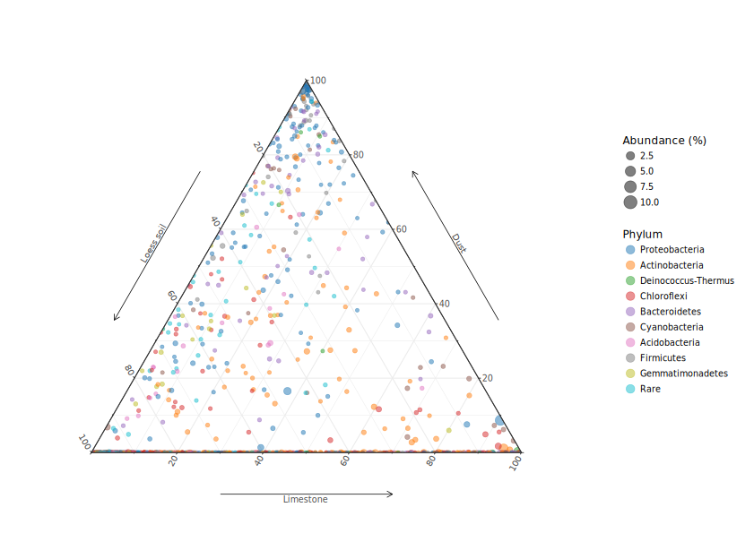<!-- -->

For the hyperarid samples

```r
Rock_weathering_filt3_GMPR_Hyperarid_rel <- transform_sample_counts(Rock_weathering_filt3_GMPR_Hyperarid, function(x) x / sum(x) ) # rel abundance
Rock_weathering_filt3_GMPR_Hyperarid_merged <- merge_samples(Rock_weathering_filt3_GMPR_Hyperarid_rel, "Source", fun = mean) # merge by source
Rock_weathering_filt3_GMPR_Hyperarid_merged_rel <- transform_sample_counts(Rock_weathering_filt3_GMPR_Hyperarid_merged, function(x) x / sum(x) ) # rel abundance per source
meandf <- as(otu_table(Rock_weathering_filt3_GMPR_Hyperarid_merged_rel), "matrix")
if (!taxa_are_rows(Rock_weathering_filt3_GMPR_Hyperarid_merged_rel)) { meandf <- t(meandf) }
abundance <- rowSums(meandf) / sum(meandf) * 100

Hyperarid4Ternary <- data.frame(
  meandf,
  Abundance = abundance,
  Phylum = tax_table(Rock_weathering_filt3_GMPR_Hyperarid_merged_rel)[, "Phylum"]
)

Hyperarid4Ternary$Phylum <-
  factor(Hyperarid4Ternary$Phylum, levels = c(levels(Hyperarid4Ternary$Phylum), 'Rare'))
Hyperarid4Ternary$Phylum[Hyperarid4Ternary$Phylum %in% Rare_phyla]  <- "Rare"
Hyperarid4Ternary$Phylum %<>% 
  factor(., levels = Taxa_rank$Phylum) %>% 
  fct_relevel(., "Rare", after = Inf)

p_ternary_hyperarid <-
  ggtern(data = Hyperarid4Ternary,
         aes(
           x = Loess.soil,
           y = Dust,
           z = Dolomite,
           size = Abundance,
           colour = Phylum
         )) +
  geom_point(alpha = 1 / 2) +
  scale_size(
    range = c(1, 5),
    name = "Abundance (%)"
  ) +
  theme_arrownormal() +
  scale_color_manual(values = pal("d3js")) +
  guides(colour = guide_legend(override.aes = list(size = 3))) +
  labs(x = "Loess soil") + 
  theme(axis.title = element_blank())
print(p_ternary_hyperarid)
```

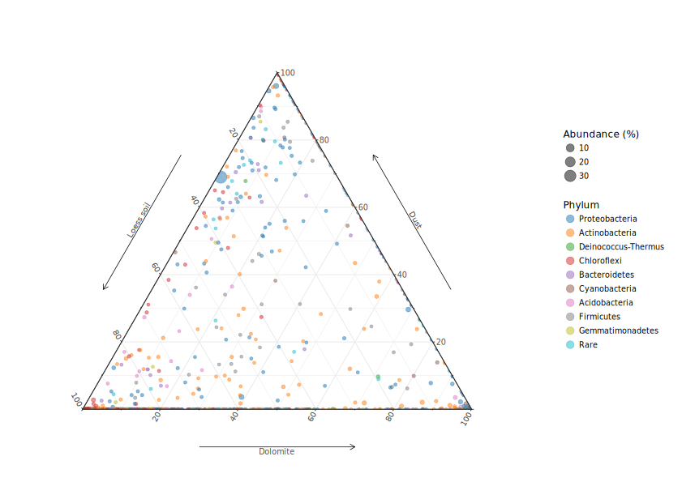<!-- -->

#### Combine plots
Combine all sequence analysis plots to make Fig. 3

```r
ternary_legend <-
  get_legend(p_ternary_arid)# + theme(legend.direction = "horizontal"))
ord_legend <- get_legend(p_ord)
top_row <-
  plot_grid(
    p_alpha + theme(
      legend.position = "none",
      panel.spacing = unit(0.5, "lines")
    ),
    p_ord + theme(axis.title.y = element_text(vjust = -3)) ,
    labels = c('A', 'B'),
    label_size = 12,
    align = 'v',
    axis = "tl",
    nrow = 1,
    ncol = 2
  )
bottom_l <-
  plot_grid(
    p_taxa_box + theme(legend.position = "none"),
    labels = c('C'),
    label_size = 12,
    ncol = 1
  )
bottom_r <-
  plot_grid(
    p_ternary_arid + 
      theme(legend.position = "none", 
            plot.margin = unit(c(-0.1, -0.1, -0.1, -0.1), "cm"),
            axis.title = element_blank()),
    p_ternary_hyperarid + 
      theme(legend.position = "none", 
            plot.margin = unit(c(-0.1, -0.1, -0.1, -0.1), "cm"),
            axis.title = element_blank()),
    labels = c('D'),
    label_size = 12,
    align = 'hv',
    axis = "t",
    # rel_widths = c(1, 1, 0.1),
    scale = c(1.2, 1.2),
    nrow = 2,
    ncol = 1
  )

bottom_rows <- plot_grid(bottom_l, 
                         bottom_r,
                         ternary_legend,
                         align = 'h',
                         axis = "l",
                         scale = c(1, 1, 0.08),
                         rel_widths = c(0.5, 0.35, 0.15),
                         nrow = 1, 
                         ncol = 3)
p_all <- plot_grid(top_row, bottom_rows, align = 'v', axis = 'l', nrow = 2, rel_heights = c(0.43, 0.6)) # aligning vertically along the left axis
print(p_all)
```

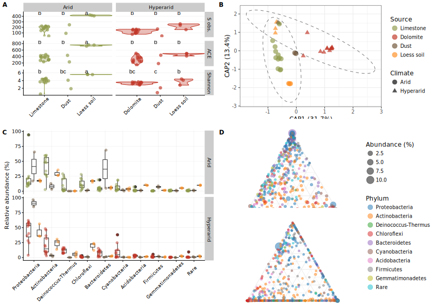<!-- -->

### Differential abundance models
Detect differentially abundant OTUs using ALDEx2 [@fernandes_anova-like_2013]

```r
# Rock_weathering_filt3_s <- prune_taxa(names(sort(taxa_sums(Rock_weathering_filt3), TRUE))[1:100], Rock_weathering_filt3)

# run full model 
data2test <- t(otu_table(Rock_weathering_filt3))
comparison <- as.character(unlist(sample_data(Rock_weathering_filt3)[, "Climate.Source"]))
ALDEx_full <- aldex.clr(data2test, comparison, mc.samples = 128, denom = "iqlr", verbose = TRUE, useMC = TRUE) # iqlr for slight assymetry in composition
```

```
## [1] "multicore environment is is OK -- using the BiocParallel package"
## [1] "removed rows with sums equal to zero"
## [1] "computing iqlr centering"
## [1] "data format is OK"
## [1] "dirichlet samples complete"
## [1] "clr transformation complete"
```

```r
ALDEx_full_glm <- aldex.glm(ALDEx_full, comparison, useMC = TRUE) # for more than two conditions
```

```
## [1] "multicore environment is OK -- using the BiocParallel package"
## [1] "running tests for each MC instance:"
## |------------(25%)----------(50%)----------(75%)----------|
```

```r
sig_taxa <- rownames(ALDEx_full_glm)[ALDEx_full_glm$glm.eBH < 0.05] # save names of taxa that are significant under the full model

# Pairwise comparisons
# 
# dolomite - limestone
Rock_weathering_filt3_Rocks <- subset_samples(Rock_weathering_filt3, Uni.Source == "Rock")
ALDEx2plot_Rocks <- CalcALDEx(Rock_weathering_filt3_Rocks, sig_level = 0.1, LFC = 0)
```

```
## [1] "multicore environment is is OK -- using the BiocParallel package"
## [1] "removed rows with sums equal to zero"
## [1] "computing iqlr centering"
## [1] "data format is OK"
## [1] "dirichlet samples complete"
## [1] "clr transformation complete"
## [1] "running tests for each MC instance:"
## |------------(25%)----------(50%)----------(75%)----------|
## [1] "multicore environment is OK -- using the BiocParallel package"
## [1] "sanity check complete"
## [1] "rab.all  complete"
## [1] "rab.win  complete"
## [1] "rab of samples complete"
## [1] "within sample difference calculated"
## [1] "between group difference calculated"
## [1] "group summaries calculated"
## [1] "effect size calculated"
## [1] "summarizing output"
```

```r
GGPlotALDExTax(ALDEx2plot_Rocks) + 
  ggtitle("Hyperarid dolomite vs. Arid limestone")
```

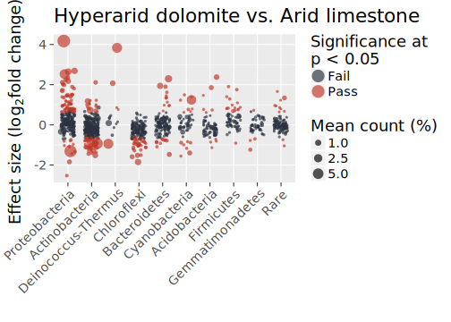<!-- -->

```r
# dolomite - soil
Rock_weathering_filt3_DolSoil <- subset_samples(Rock_weathering_filt3, Climate == "Hyperarid" & Source != "Dust")
ALDEx2plot_DolSoil <- CalcALDEx(Rock_weathering_filt3_DolSoil, sig_level = 0.1, LFC = 0)
```

```
## [1] "multicore environment is is OK -- using the BiocParallel package"
## [1] "removed rows with sums equal to zero"
## [1] "computing iqlr centering"
## [1] "data format is OK"
## [1] "dirichlet samples complete"
## [1] "clr transformation complete"
## [1] "running tests for each MC instance:"
## |------------(25%)----------(50%)----------(75%)----------|
## [1] "multicore environment is OK -- using the BiocParallel package"
## [1] "sanity check complete"
## [1] "rab.all  complete"
## [1] "rab.win  complete"
## [1] "rab of samples complete"
## [1] "within sample difference calculated"
## [1] "between group difference calculated"
## [1] "group summaries calculated"
## [1] "effect size calculated"
## [1] "summarizing output"
```

```r
GGPlotALDExTax(ALDEx2plot_DolSoil) + 
  ggtitle("Hyperarid dolomite vs. Hyperarid soil")
```

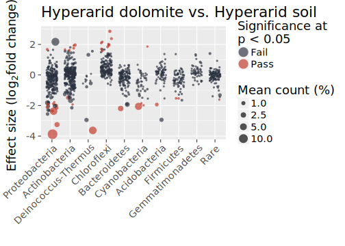<!-- -->

```r
# dolomite - dust
Rock_weathering_filt3_DolDust <- subset_samples(Rock_weathering_filt3, Climate == "Hyperarid" & Source != "Loess soil")
ALDEx2plot_DolDust <- CalcALDEx(Rock_weathering_filt3_DolDust, sig_level = 0.3, LFC = 0)
```

```
## [1] "multicore environment is is OK -- using the BiocParallel package"
## [1] "removed rows with sums equal to zero"
## [1] "computing iqlr centering"
## [1] "data format is OK"
## [1] "dirichlet samples complete"
## [1] "clr transformation complete"
## [1] "running tests for each MC instance:"
## |------------(25%)----------(50%)----------(75%)----------|
## [1] "multicore environment is OK -- using the BiocParallel package"
## [1] "sanity check complete"
## [1] "rab.all  complete"
## [1] "rab.win  complete"
## [1] "rab of samples complete"
## [1] "within sample difference calculated"
## [1] "between group difference calculated"
## [1] "group summaries calculated"
## [1] "effect size calculated"
## [1] "summarizing output"
```

```r
GGPlotALDExTax(ALDEx2plot_DolDust) + 
  ggtitle("Hyperarid dolomite vs. Hyperarid dust")
```

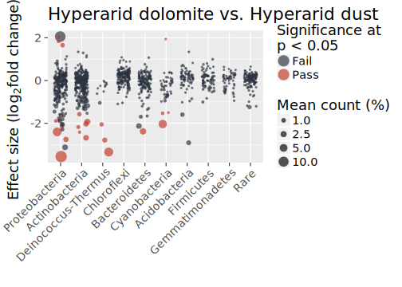<!-- -->

```r
# limestone - soil
Rock_weathering_filt3_LimeSoil <- subset_samples(Rock_weathering_filt3, Climate == "Arid" & Source != "Dust")
ALDEx2plot_LimeSoil <- CalcALDEx(Rock_weathering_filt3_LimeSoil, sig_level = 0.1, LFC = 0)
```

```
## [1] "multicore environment is is OK -- using the BiocParallel package"
## [1] "removed rows with sums equal to zero"
## [1] "computing iqlr centering"
## [1] "data format is OK"
## [1] "dirichlet samples complete"
## [1] "clr transformation complete"
## [1] "running tests for each MC instance:"
## |------------(25%)----------(50%)----------(75%)----------|
## [1] "multicore environment is OK -- using the BiocParallel package"
## [1] "sanity check complete"
## [1] "rab.all  complete"
## [1] "rab.win  complete"
## [1] "rab of samples complete"
## [1] "within sample difference calculated"
## [1] "between group difference calculated"
## [1] "group summaries calculated"
## [1] "effect size calculated"
## [1] "summarizing output"
```

```r
GGPlotALDExTax(ALDEx2plot_LimeSoil) + 
  ggtitle("Arid limestone vs. Arid soil")
```

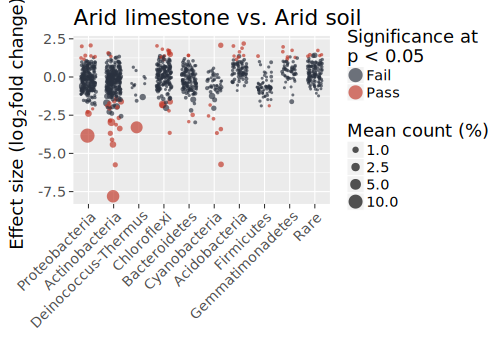<!-- -->

```r
# limestone - dust
Rock_weathering_filt3_LimeDust <- subset_samples(Rock_weathering_filt3, Climate == "Arid" & Source != "Loess soil")
ALDEx2plot_LimeDust <- CalcALDEx(Rock_weathering_filt3_LimeDust, sig_level = 0.3, LFC = 0)
```

```
## [1] "multicore environment is is OK -- using the BiocParallel package"
## [1] "removed rows with sums equal to zero"
## [1] "computing iqlr centering"
## [1] "data format is OK"
## [1] "dirichlet samples complete"
## [1] "clr transformation complete"
## [1] "running tests for each MC instance:"
## |------------(25%)----------(50%)----------(75%)----------|
## [1] "multicore environment is OK -- using the BiocParallel package"
## [1] "sanity check complete"
## [1] "rab.all  complete"
## [1] "rab.win  complete"
## [1] "rab of samples complete"
## [1] "within sample difference calculated"
## [1] "between group difference calculated"
## [1] "group summaries calculated"
## [1] "effect size calculated"
## [1] "summarizing output"
```

```r
GGPlotALDExTax(ALDEx2plot_LimeDust) + 
  ggtitle("Arid limestone vs. Arid dust")
```

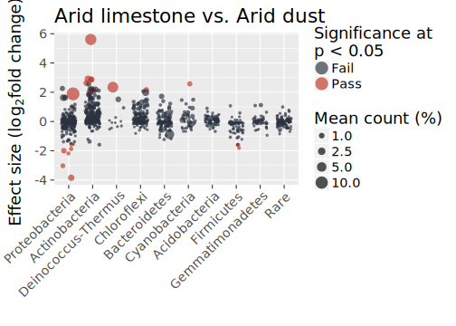<!-- -->

```r
ALDEx2plot_Rocks %<>% cbind(., Var1 = "Dolomite", Var2 = "Limestone")
ALDEx2plot_DolSoil %<>% cbind(., Var1 = "Dolomite", Var2 = "Loess soil")
ALDEx2plot_DolDust %<>% cbind(., Var1 = "Dolomite", Var2 = "Dust")
ALDEx2plot_LimeSoil %<>% cbind(., Var1 = "Limestone", Var2 = "Loess soil")
ALDEx2plot_LimeDust %<>% cbind(., Var1 = "Limestone", Var2 = "Dust")

ALDEx2plot_all <- bind_rows(ALDEx2plot_Rocks, ALDEx2plot_DolSoil, ALDEx2plot_DolDust, ALDEx2plot_LimeSoil, ALDEx2plot_LimeDust)
ALDEx2plot_all$Var2 %<>%
    factor() %>%  # Taxa_rank is calcuted for the taxa box plots
    fct_relevel(., "Limestone")

# paste0(percent(sum(ALDEx2plot_Rocks$effect > 0 & ALDEx2plot_Rocks$Significance == "Pass")/nrow(ALDEx2plot_Rocks)), "/", percent(sum(ALDEx2plot_Rocks$effect < 0 & ALDEx2plot_Rocks$Significance == "Pass")/nrow(ALDEx2plot_Rocks)))

Labels <- c(
  paste0("⬆", sum(ALDEx2plot_Rocks$effect > 0 & ALDEx2plot_Rocks$Significance == "Pass"), " ⬇", sum(ALDEx2plot_Rocks$effect < 0 & ALDEx2plot_Rocks$Significance == "Pass"), " (", nrow(ALDEx2plot_Rocks), ")"),
  paste0("⬆", sum(ALDEx2plot_DolSoil$effect > 0 & ALDEx2plot_DolSoil$Significance == "Pass"), " ⬇", sum(ALDEx2plot_DolSoil$effect < 0 & ALDEx2plot_DolSoil$Significance == "Pass"), " (", nrow(ALDEx2plot_DolSoil), ")"),
  paste0("⬆", sum(ALDEx2plot_DolDust$effect > 0 & ALDEx2plot_DolDust$Significance == "Pass"), " ⬇", sum(ALDEx2plot_DolDust$effect < 0 & ALDEx2plot_DolDust$Significance == "Pass"), " (", nrow(ALDEx2plot_DolDust), ")"),
  paste0("⬆", sum(ALDEx2plot_LimeSoil$effect > 0 & ALDEx2plot_LimeSoil$Significance == "Pass"), " ⬇", sum(ALDEx2plot_LimeSoil$effect < 0 & ALDEx2plot_LimeSoil$Significance == "Pass"), " (", nrow(ALDEx2plot_LimeSoil), ")"),
  paste0("⬆", sum(ALDEx2plot_LimeDust$effect > 0 & ALDEx2plot_LimeDust$Significance == "Pass"), " ⬇", sum(ALDEx2plot_LimeDust$effect < 0 & ALDEx2plot_LimeDust$Significance == "Pass"), " (", nrow(ALDEx2plot_LimeDust), ")")
)
Label_text <- bind_cols(
  unique(ALDEx2plot_all[c("Var1", "Var2")]),
  Label = Labels
  )
```

```r
p_aldex2_all <- GGPlotALDExTax(ALDEx2plot_all) +
  facet_grid(Var2 ~ Var1, scales = "free_y") +
  # theme(strip.background = element_blank(), strip.placement = "outside") +
  geom_text(
    data    = Label_text,
    mapping = aes(x = Inf, y = Inf, label = Label),
    hjust   = 1.1,
    vjust   = 1.6
  ) 
print(p_aldex2_all)
```

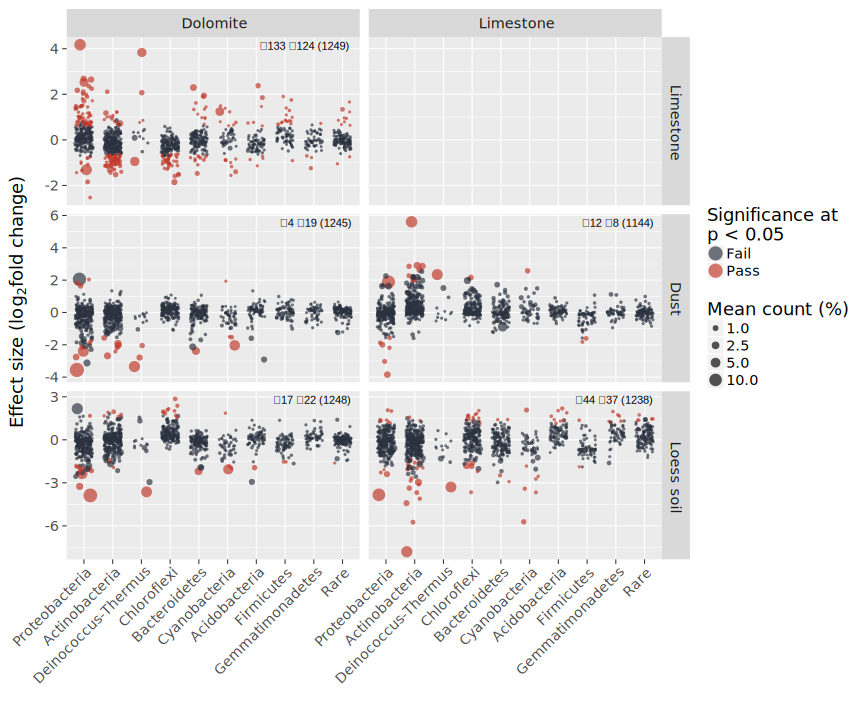<!-- -->

## Other plots
Other plots in the paper which are not based on sequence data
### Isotopes profile

```r
Isotopes <-
  read_csv(
    "Data/Isotopes_data.csv"
  )

Isotopes %<>% 
  mutate(Mean.Arid = (`Limestone Shivta Fm. NWSH1` + `Limestone Shivta Fm. NWSH2`) / 2)
Isotopes %<>% 
  mutate(Mean.Hyperarid = (`Dolomite Gerofit Fm.UVSL5` + `Dolomite Gerofit Fm.UVSL6` ) / 2)

Isotopes2plot <- data.frame(
  Rock = factor(c(rep("Limestone", 10), rep("Dolomite", 10)), 
                levels = c("Limestone", "Dolomite")),
  Depth = rep(Isotopes$`Depth (mm)`, 2),
  Isotope = rep(Isotopes$Isotope, 2),
  min = c(
    pmin(
      Isotopes$`Limestone Shivta Fm. NWSH1`,
      Isotopes$`Limestone Shivta Fm. NWSH2`
    ),
    pmin(
      Isotopes$`Dolomite Gerofit Fm.UVSL5`,
      Isotopes$`Dolomite Gerofit Fm.UVSL6`
    )
  ),
  max = c(
    pmax(
      Isotopes$`Limestone Shivta Fm. NWSH1`,
      Isotopes$`Limestone Shivta Fm. NWSH2`
    ),
    pmax(
      Isotopes$`Dolomite Gerofit Fm.UVSL5`,
      Isotopes$`Dolomite Gerofit Fm.UVSL6`
    )
  ),
  mean = c(Isotopes$Mean.Arid, Isotopes$Mean.Hyperarid)
)

p_isotopes <-
  ggplot(Isotopes2plot, aes(y = mean, x = Depth, colour = Isotope)) +
  geom_point(size = 4, alpha = 1 / 2) +
  geom_errorbar(aes(ymin = min, ymax = max), alpha = 1/2, width = 0.2) +
  geom_line(alpha = 1 / 2) +
  coord_flip() +
  theme_cowplot(font_size = 18, font_family = f_name) +
  background_grid(major = "xy",
                  minor = "none") +
  scale_x_reverse(limits = c(4.1, -0.1), expand = c(0.01, 0.01)) +
  # scale_x_continuous(limits = c(0, 50), expand = c(0.01, 0.01)) +
  facet_grid(Rock ~ . , scales = "free_x", labeller = label_parsed) +
  scale_color_manual(values =  pom4[c(2,1)],
                     labels = c(expression(paste(delta ^ {13}, "C")),
                                expression(paste(delta ^ {18}, "O")))) +
  ylab(expression(paste(delta ^ {13}, "C / ",
                        delta ^ {18}, "O", " (", "\u2030", ")"
  )))

p_isotopes <- plot_grid(p_isotopes, labels = "b", label_size = 20)
print(p_isotopes)
```

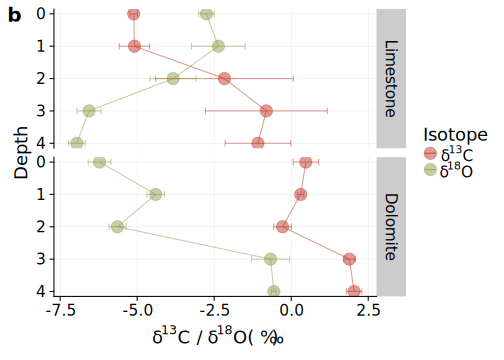<!-- -->

### Desiccation experiment

```r
read_csv("Data/desiccation_data.csv") %>%
  select(-c(`Capped Marly dolomite`, `Bare Marly dolomite`)) %>%
  gather(., Sample, `Residual water content (%)`, -`Time (h)`) %>%
  cbind(., str_split(.$Sample, "\\s", simplify = TRUE)) %>%
  dplyr::rename("Crust" = "1" , "Rock" = "2") ->
  Desiccation_long

Desiccation_long$Rock %<>% fct_relevel(., "Limestone")
Desiccation_long$Crust %<>% 
  fct_recode(., Present = "Capped", Removed = "Bare") %>% 
  fct_relevel(., "Present")

Desiccation_mods <- tibble(Sample = character(), Intercept = numeric(), b = numeric(), a = numeric(), P = numeric(), R2 = numeric())
mods <- list()
j <- 1
for (i in unique(Desiccation_long$Sample)) {
  data2model <- Desiccation_long[Desiccation_long$Sample == i, ]
  mod <- lm(`Residual water content (%)` ~ poly(`Time (h)`,2, raw = TRUE), data = data2model)
  # mod <- lm(`Residual water content (%)` ~ sqrt(1/(`Time (h)` + 1)), data = data2model)
  mods[[j]] <- mod
  Desiccation_mods[j, "Sample"] <- i
  Desiccation_mods[j, "Intercept"] <- mod$coefficients[1]
  Desiccation_mods[j, "b"] <- mod$coefficients[2]
  Desiccation_mods[j, "a"] <- mod$coefficients[3]
  Desiccation_mods[j, "P"] <- summary(mod)$coefficients[2, "Pr(>|t|)"]
  Desiccation_mods[j, "R2"] <- summary(mod)$adj.r.squared
  j <- j + 1 
}

# comapre with and without crust
mod_all <- lm(`Residual water content (%)` ~ poly(`Time (h)`, 2, raw = TRUE), data = Desiccation_long)
mod_treatment <- lm(`Residual water content (%)` ~ poly(`Time (h)`, 2, raw = TRUE) * Crust, data = Desiccation_long)
anova(mod_all, mod_treatment)
```

<div class="kable-table">

<table>
 <thead>
  <tr>
   <th style="text-align:right;"> Res.Df </th>
   <th style="text-align:right;"> RSS </th>
   <th style="text-align:right;"> Df </th>
   <th style="text-align:right;"> Sum of Sq </th>
   <th style="text-align:right;"> F </th>
   <th style="text-align:right;"> Pr(&gt;F) </th>
  </tr>
 </thead>
<tbody>
  <tr>
   <td style="text-align:right;"> 29 </td>
   <td style="text-align:right;"> 12348.671 </td>
   <td style="text-align:right;"> NA </td>
   <td style="text-align:right;"> NA </td>
   <td style="text-align:right;"> NA </td>
   <td style="text-align:right;"> NA </td>
  </tr>
  <tr>
   <td style="text-align:right;"> 26 </td>
   <td style="text-align:right;"> 1925.944 </td>
   <td style="text-align:right;"> 3 </td>
   <td style="text-align:right;"> 10422.73 </td>
   <td style="text-align:right;"> 46.90184 </td>
   <td style="text-align:right;"> 0 </td>
  </tr>
</tbody>
</table>

</div>

```r
# comapre limestone vs dolomite - with crust
mod_all <- lm(`Residual water content (%)` ~ poly(`Time (h)`, 2, raw = TRUE), data = Desiccation_long[Desiccation_long$Crust == "Present", ])
mod_treatment <- lm(`Residual water content (%)` ~ poly(`Time (h)`, 2, raw = TRUE) * Rock, data = Desiccation_long[Desiccation_long$Crust == "Present", ])
anova(mod_all, mod_treatment)
```

<div class="kable-table">

<table>
 <thead>
  <tr>
   <th style="text-align:right;"> Res.Df </th>
   <th style="text-align:right;"> RSS </th>
   <th style="text-align:right;"> Df </th>
   <th style="text-align:right;"> Sum of Sq </th>
   <th style="text-align:right;"> F </th>
   <th style="text-align:right;"> Pr(&gt;F) </th>
  </tr>
 </thead>
<tbody>
  <tr>
   <td style="text-align:right;"> 13 </td>
   <td style="text-align:right;"> 195.42714 </td>
   <td style="text-align:right;"> NA </td>
   <td style="text-align:right;"> NA </td>
   <td style="text-align:right;"> NA </td>
   <td style="text-align:right;"> NA </td>
  </tr>
  <tr>
   <td style="text-align:right;"> 10 </td>
   <td style="text-align:right;"> 15.60204 </td>
   <td style="text-align:right;"> 3 </td>
   <td style="text-align:right;"> 179.8251 </td>
   <td style="text-align:right;"> 38.41914 </td>
   <td style="text-align:right;"> 8.5e-06 </td>
  </tr>
</tbody>
</table>

</div>

```r
# comapre limestone vs dolomite - without crust
mod_all <- lm(`Residual water content (%)` ~ poly(`Time (h)`, 2, raw = TRUE), data = Desiccation_long[Desiccation_long$Crust == "Removed", ])
mod_treatment <- lm(`Residual water content (%)` ~ poly(`Time (h)`, 2, raw = TRUE) * Rock, data = Desiccation_long[Desiccation_long$Crust == "Removed", ])
anova(mod_all, mod_treatment)
```

<div class="kable-table">

<table>
 <thead>
  <tr>
   <th style="text-align:right;"> Res.Df </th>
   <th style="text-align:right;"> RSS </th>
   <th style="text-align:right;"> Df </th>
   <th style="text-align:right;"> Sum of Sq </th>
   <th style="text-align:right;"> F </th>
   <th style="text-align:right;"> Pr(&gt;F) </th>
  </tr>
 </thead>
<tbody>
  <tr>
   <td style="text-align:right;"> 13 </td>
   <td style="text-align:right;"> 1730.5166 </td>
   <td style="text-align:right;"> NA </td>
   <td style="text-align:right;"> NA </td>
   <td style="text-align:right;"> NA </td>
   <td style="text-align:right;"> NA </td>
  </tr>
  <tr>
   <td style="text-align:right;"> 10 </td>
   <td style="text-align:right;"> 519.6724 </td>
   <td style="text-align:right;"> 3 </td>
   <td style="text-align:right;"> 1210.844 </td>
   <td style="text-align:right;"> 7.766716 </td>
   <td style="text-align:right;"> 0.0057221 </td>
  </tr>
</tbody>
</table>

</div>

```r
# comapre with and without crust - limestone
mod_all <- lm(`Residual water content (%)` ~ poly(`Time (h)`, 2, raw = TRUE), data = Desiccation_long[Desiccation_long$Rock == "Limestone", ])
mod_treatment <- lm(`Residual water content (%)` ~ poly(`Time (h)`, 2, raw = TRUE) * Crust, data = Desiccation_long[Desiccation_long$Rock == "Limestone", ])
anova(mod_all, mod_treatment)
```

<div class="kable-table">

<table>
 <thead>
  <tr>
   <th style="text-align:right;"> Res.Df </th>
   <th style="text-align:right;"> RSS </th>
   <th style="text-align:right;"> Df </th>
   <th style="text-align:right;"> Sum of Sq </th>
   <th style="text-align:right;"> F </th>
   <th style="text-align:right;"> Pr(&gt;F) </th>
  </tr>
 </thead>
<tbody>
  <tr>
   <td style="text-align:right;"> 13 </td>
   <td style="text-align:right;"> 7255.187 </td>
   <td style="text-align:right;"> NA </td>
   <td style="text-align:right;"> NA </td>
   <td style="text-align:right;"> NA </td>
   <td style="text-align:right;"> NA </td>
  </tr>
  <tr>
   <td style="text-align:right;"> 10 </td>
   <td style="text-align:right;"> 347.053 </td>
   <td style="text-align:right;"> 3 </td>
   <td style="text-align:right;"> 6908.134 </td>
   <td style="text-align:right;"> 66.35042 </td>
   <td style="text-align:right;"> 7e-07 </td>
  </tr>
</tbody>
</table>

</div>

```r
mod_all <- lm(`Residual water content (%)` ~ poly(`Time (h)`, 2, raw = TRUE), data = Desiccation_long[Desiccation_long$Rock == "Dolomite", ])
mod_treatment <- lm(`Residual water content (%)` ~ poly(`Time (h)`, 2, raw = TRUE) * Crust, data = Desiccation_long[Desiccation_long$Rock == "Dolomite", ])
anova(mod_all, mod_treatment)
```

<div class="kable-table">

<table>
 <thead>
  <tr>
   <th style="text-align:right;"> Res.Df </th>
   <th style="text-align:right;"> RSS </th>
   <th style="text-align:right;"> Df </th>
   <th style="text-align:right;"> Sum of Sq </th>
   <th style="text-align:right;"> F </th>
   <th style="text-align:right;"> Pr(&gt;F) </th>
  </tr>
 </thead>
<tbody>
  <tr>
   <td style="text-align:right;"> 13 </td>
   <td style="text-align:right;"> 3961.8047 </td>
   <td style="text-align:right;"> NA </td>
   <td style="text-align:right;"> NA </td>
   <td style="text-align:right;"> NA </td>
   <td style="text-align:right;"> NA </td>
  </tr>
  <tr>
   <td style="text-align:right;"> 10 </td>
   <td style="text-align:right;"> 188.2214 </td>
   <td style="text-align:right;"> 3 </td>
   <td style="text-align:right;"> 3773.583 </td>
   <td style="text-align:right;"> 66.82881 </td>
   <td style="text-align:right;"> 6e-07 </td>
  </tr>
</tbody>
</table>

</div>

```r
Desiccation_mods %>% 
  kable(., digits = 1, caption = "Model coefficients") %>%
  kable_styling(bootstrap_options = c("striped", "hover", "condensed", "responsive"), full_width = F)
```

<table class="table table-striped table-hover table-condensed table-responsive" style="width: auto !important; margin-left: auto; margin-right: auto;">
<caption>Model coefficients</caption>
 <thead>
  <tr>
   <th style="text-align:left;"> Sample </th>
   <th style="text-align:right;"> Intercept </th>
   <th style="text-align:right;"> b </th>
   <th style="text-align:right;"> a </th>
   <th style="text-align:right;"> P </th>
   <th style="text-align:right;"> R2 </th>
  </tr>
 </thead>
<tbody>
  <tr>
   <td style="text-align:left;"> Capped Dolomite </td>
   <td style="text-align:right;"> 99.0 </td>
   <td style="text-align:right;"> -0.4 </td>
   <td style="text-align:right;"> 0.0 </td>
   <td style="text-align:right;"> 0 </td>
   <td style="text-align:right;"> 1.0 </td>
  </tr>
  <tr>
   <td style="text-align:left;"> Bare Dolomite </td>
   <td style="text-align:right;"> 90.8 </td>
   <td style="text-align:right;"> -3.0 </td>
   <td style="text-align:right;"> 0.0 </td>
   <td style="text-align:right;"> 0 </td>
   <td style="text-align:right;"> 0.9 </td>
  </tr>
  <tr>
   <td style="text-align:left;"> Capped Limestone </td>
   <td style="text-align:right;"> 97.9 </td>
   <td style="text-align:right;"> -0.8 </td>
   <td style="text-align:right;"> 0.0 </td>
   <td style="text-align:right;"> 0 </td>
   <td style="text-align:right;"> 1.0 </td>
  </tr>
  <tr>
   <td style="text-align:left;"> Bare Limestone </td>
   <td style="text-align:right;"> 91.9 </td>
   <td style="text-align:right;"> -5.0 </td>
   <td style="text-align:right;"> 0.1 </td>
   <td style="text-align:right;"> 0 </td>
   <td style="text-align:right;"> 0.9 </td>
  </tr>
</tbody>
</table>

```r
p_dessication <-
  ggplot(
    Desiccation_long,
    aes(
      `Time (h)`,
      `Residual water content (%)`,
      colour = Rock,
      shape = Crust
    )
  ) +
  geom_point(size = 4, alpha = 2/3) +
  # geom_smooth(method = "lm", se = FALSE, alpha = 1/2, formula = (y ~ sqrt(1/(x+1)))) +
  geom_smooth(method = "lm", se = FALSE, alpha = 1/2, formula = (y ~ poly(x, 2)), size = 0.5) +
  # geom_line(alpha = 1/2) +
  scale_y_continuous(limits = c(0, 100), expand = c(0.01, 0.01)) +
  scale_x_continuous(limits = c(0, 50), expand = c(0.01, 0.01)) +
  scale_color_manual(values = pom4)
print(p_dessication)
```

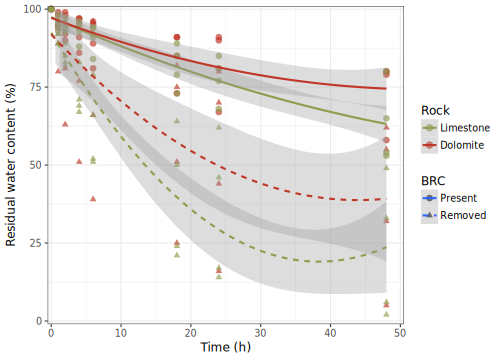<!-- -->


```r
devtools::session_info()
```

```
##  setting  value                       
##  version  R version 3.4.4 (2018-03-15)
##  system   x86_64, linux-gnu           
##  ui       X11                         
##  language en_GB                       
##  collate  en_GB.UTF-8                 
##  tz       Europe/Prague               
##  date     2018-07-11                  
## 
##  package              * version   date      
##  abind                  1.4-5     2016-07-21
##  acepack                1.4.1     2016-10-29
##  ade4                   1.7-11    2018-04-05
##  affy                   1.56.0    2018-07-10
##  affyio                 1.48.0    2018-07-10
##  agricolae            * 1.2-8     2017-09-12
##  ALDEx2               * 1.10.0    2018-07-10
##  AlgDesign              1.1-7.3   2014-10-15
##  ape                    5.1       2018-04-04
##  artyfarty            * 0.0.1     2018-07-11
##  assertthat             0.2.0     2017-04-11
##  backports              1.1.2     2017-12-13
##  base                 * 3.4.4     2018-03-16
##  base64enc              0.1-3     2015-07-28
##  bayesm                 3.1-0.1   2017-07-21
##  BiasedUrn              1.07      2015-12-28
##  bindr                  0.1.1     2018-03-13
##  bindrcpp             * 0.2.2     2018-03-29
##  Biobase              * 2.38.0    2018-07-10
##  BiocGenerics         * 0.24.0    2018-07-10
##  BiocInstaller          1.28.0    2018-07-10
##  BiocParallel           1.12.0    2018-07-10
##  BiodiversityR        * 2.9-2     2018-02-28
##  biomformat             1.6.0     2018-07-10
##  Biostrings             2.46.0    2018-07-10
##  bitops                 1.0-6     2013-08-17
##  boot                   1.3-20    2017-07-30
##  brew                   1.0-6     2011-04-13
##  broom                  0.4.5     2018-07-03
##  BSDA                   1.2.0     2017-07-30
##  car                  * 3.0-0     2018-04-02
##  carData              * 3.0-1     2018-03-28
##  cellranger             1.1.0     2016-07-27
##  checkmate              1.8.5     2017-10-24
##  class                  7.3-14    2015-08-30
##  cli                    1.0.0     2017-11-05
##  cluster              * 2.0.7-1   2018-04-09
##  coda                   0.19-1    2016-12-08
##  codetools              0.2-15    2016-10-05
##  coin                   1.2-2     2017-11-28
##  colorspace             1.3-2     2016-12-14
##  combinat               0.0-8     2012-10-29
##  compiler               3.4.4     2018-03-16
##  compositions           1.40-2    2018-06-14
##  cowplot              * 0.9.2     2017-12-17
##  crayon                 1.3.4     2017-09-16
##  curl                   3.2       2018-03-28
##  data.table             1.11.4    2018-05-27
##  data.tree              0.7.6     2018-06-16
##  datasets             * 3.4.4     2018-03-16
##  DelayedArray           0.4.1     2018-07-10
##  deldir                 0.1-15    2018-04-01
##  DEoptimR               1.0-8     2016-11-19
##  DescTools              0.99.24   2018-03-19
##  devtools             * 1.13.6    2018-06-27
##  DiagrammeR             1.0.0     2018-03-01
##  digest                 0.6.15    2018-01-28
##  diptest                0.75-7    2016-12-05
##  doParallel           * 1.0.11    2017-09-28
##  downloader             0.4       2015-07-09
##  dplyr                * 0.7.6     2018-06-29
##  e1071                  1.6-8     2017-02-02
##  effects                4.0-2     2018-06-19
##  EMT                    1.1       2013-01-29
##  energy                 1.7-4     2018-05-27
##  evaluate               0.10.1    2017-06-24
##  expm                   0.999-2   2017-03-29
##  extrafont            * 0.17      2014-12-08
##  extrafontdb            1.0       2012-06-11
##  fBasics                3042.89   2017-11-17
##  forcats              * 0.3.0     2018-02-19
##  foreach              * 1.4.4     2017-12-12
##  foreign                0.8-70    2018-04-23
##  Formula                1.2-3     2018-05-03
##  gdata                  2.18.0    2017-06-06
##  gdtools              * 0.1.7     2018-02-27
##  GenomeInfoDb           1.14.0    2018-07-10
##  GenomeInfoDbData       1.0.0     2018-07-10
##  GenomicRanges          1.30.3    2018-07-10
##  GGally                 1.4.0     2018-05-17
##  ggplot2              * 2.2.1     2016-12-30
##  ggpomological        * 0.1.2     2018-07-10
##  ggrepel                0.8.0     2018-05-09
##  ggridges               0.5.0     2018-04-05
##  ggtern               * 2.2.0     2016-11-23
##  glue                   1.2.0     2017-10-29
##  gmodels                2.18.1    2018-06-25
##  GPArotation            2014.11-1 2014-11-25
##  graphics             * 3.4.4     2018-03-16
##  grDevices            * 3.4.4     2018-03-16
##  grid                   3.4.4     2018-03-16
##  gridExtra              2.3       2017-09-09
##  gtable                 0.2.0     2016-02-26
##  gtools                 3.8.1     2018-06-26
##  haven                  1.1.2     2018-06-27
##  hermite                1.1.2     2018-05-17
##  hexbin               * 1.27.2    2018-01-15
##  highr                  0.7       2018-06-09
##  Hmisc                  4.1-1     2018-01-03
##  hms                    0.4.2     2018-03-10
##  htmlTable              1.12      2018-05-26
##  htmltools              0.3.6     2017-04-28
##  htmlwidgets            1.2       2018-04-19
##  httpuv                 1.4.4.2   2018-07-02
##  httr                   1.3.1     2017-08-20
##  igraph                 1.2.1     2018-03-10
##  influenceR             0.1.0     2015-09-03
##  IRanges                2.12.0    2018-07-10
##  iterators            * 1.0.9     2017-12-12
##  jsonlite               1.5       2017-06-01
##  kableExtra           * 0.9.0     2018-05-21
##  klaR                   0.6-14    2018-03-19
##  knitr                * 1.20      2018-02-20
##  labeling               0.3       2014-08-23
##  later                  0.7.3     2018-06-08
##  latex2exp              0.4.0     2015-11-30
##  lattice              * 0.20-35   2017-03-25
##  latticeExtra           0.6-28    2016-02-09
##  lavaan                 0.6-1     2018-05-22
##  lazyeval               0.2.1     2017-10-29
##  LearnBayes             2.15.1    2018-03-18
##  limma                  3.34.9    2018-07-10
##  lme4                   1.1-17    2018-04-03
##  lmtest                 0.9-36    2018-04-04
##  lubridate              1.7.4     2018-04-11
##  magrittr             * 1.5       2014-11-22
##  manipulate             1.0.1     2014-12-24
##  MASS                 * 7.3-50    2018-04-30
##  Matrix                 1.2-14    2018-04-09
##  matrixStats          * 0.53.1    2018-02-11
##  maxLik                 1.3-4     2015-11-09
##  MBESS                  4.4.3     2018-01-10
##  mc2d                   0.1-18    2017-03-06
##  memoise                1.1.0     2017-04-21
##  methods              * 3.4.4     2018-03-16
##  mgcv                   1.8-24    2018-06-18
##  mime                   0.5       2016-07-07
##  miniUI                 0.1.1.1   2018-05-18
##  minpack.lm             1.2-1     2016-11-20
##  minqa                  1.2.4     2014-10-09
##  miscTools              0.6-22    2016-11-25
##  mnormt                 1.5-5     2016-10-15
##  modelr                 0.1.2     2018-05-11
##  modeltools             0.2-21    2013-09-02
##  multcomp               1.4-8     2017-11-08
##  multcompView           0.1-7     2015-07-31
##  multtest               2.34.0    2018-07-10
##  munsell                0.5.0     2018-06-12
##  mvtnorm                1.0-8     2018-05-31
##  nlme                   3.1-137   2018-04-07
##  nloptr                 1.0.4     2017-08-22
##  nnet                   7.3-12    2016-02-02
##  nortest                1.0-4     2015-07-30
##  openxlsx               4.1.0     2018-05-26
##  ordinal                2018.4-19 2018-04-19
##  packrat                0.4.9-3   2018-06-01
##  pairwiseAdonis       * 0.0.1     2018-07-10
##  pander                 0.6.2     2018-07-08
##  parallel             * 3.4.4     2018-03-16
##  pbivnorm               0.6.0     2015-01-23
##  permute              * 0.9-4     2016-09-09
##  phyloseq             * 1.22.3    2018-07-10
##  pillar                 1.2.3     2018-05-25
##  pkgconfig              2.0.1     2017-03-21
##  plyr                   1.8.4     2016-06-08
##  preprocessCore         1.40.0    2018-07-10
##  promises               1.0.1     2018-04-13
##  proto                  1.0.0     2016-10-29
##  psych                  1.8.4     2018-05-06
##  purrr                * 0.2.5     2018-05-29
##  pwr                    1.2-2     2018-03-03
##  questionr              0.6.2     2017-11-01
##  R6                     2.2.2     2017-06-17
##  Rcmdr                  2.4-4     2018-04-16
##  RcmdrMisc              1.0-10    2018-04-02
##  RColorBrewer           1.1-2     2014-12-07
##  rcompanion           * 1.13.2    2018-04-27
##  Rcpp                   0.12.17   2018-05-18
##  RCurl                  1.95-4.10 2018-01-04
##  readr                * 1.1.1     2017-05-16
##  readxl                 1.1.0     2018-04-20
##  relimp                 1.0-5     2016-03-30
##  reshape                0.8.7     2017-08-06
##  reshape2               1.4.3     2017-12-11
##  rgexf                  0.15.3    2015-03-24
##  rhdf5                  2.22.0    2018-07-10
##  rio                    0.5.10    2018-03-29
##  rlang                  0.2.1     2018-05-30
##  rmarkdown            * 1.10      2018-06-11
##  robustbase             0.93-1    2018-06-23
##  Rook                   1.1-1     2014-10-20
##  rpart                  4.1-13    2018-02-23
##  rprojroot              1.3-2     2018-01-03
##  rstudioapi             0.7       2017-09-07
##  Rttf2pt1               1.3.7     2018-06-29
##  RVAideMemoire          0.9-69-3  2018-05-14
##  rvest                  0.3.2     2016-06-17
##  S4Vectors              0.16.0    2018-07-10
##  sandwich               2.4-0     2017-07-26
##  scales               * 0.5.0     2017-08-24
##  SCRT                   1.2.2     2018-03-07
##  shiny                  1.1.0     2018-05-17
##  sp                     1.3-1     2018-06-05
##  spatial                7.3-11    2015-08-30
##  spData                 0.2.9.0   2018-06-17
##  spdep                  0.7-7     2018-04-03
##  splines                3.4.4     2018-03-16
##  stats                * 3.4.4     2018-03-16
##  stats4                 3.4.4     2018-03-16
##  stringi                1.2.3     2018-06-12
##  stringr              * 1.3.1     2018-05-10
##  SummarizedExperiment   1.8.1     2018-07-10
##  SuppDists              1.1-9.4   2016-09-23
##  survey                 3.33-2    2018-03-13
##  survival               2.42-4    2018-06-30
##  svglite              * 1.2.1     2017-09-11
##  tcltk                * 3.4.4     2018-03-16
##  tcltk2                 1.2-11    2014-12-20
##  tensorA                0.36      2010-12-01
##  TH.data                1.0-8     2017-01-23
##  tibble               * 1.4.2     2018-01-22
##  tidyr                * 0.8.1     2018-05-18
##  tidyselect             0.2.4     2018-02-26
##  tidyverse            * 1.2.1     2017-11-14
##  timeDate               3043.102  2018-02-21
##  timeSeries             3042.102  2017-11-17
##  tools                  3.4.4     2018-03-16
##  ucminf                 1.1-4     2016-08-18
##  userfriendlyscience  * 0.7.1     2018-05-02
##  utils                * 3.4.4     2018-03-16
##  vegan                * 2.5-2     2018-05-17
##  viridis                0.5.1     2018-03-29
##  viridisLite            0.3.0     2018-02-01
##  visNetwork             2.0.4     2018-06-14
##  vsn                  * 3.46.0    2018-07-10
##  withr                  2.1.2     2018-03-15
##  WRS2                   0.10-0    2018-06-15
##  XML                    3.98-1.11 2018-06-11
##  xml2                   1.2.0     2018-01-24
##  xtable                 1.8-2     2016-02-05
##  XVector                0.18.0    2018-07-10
##  yaml                   2.1.19    2018-05-01
##  zip                    1.0.0     2017-04-25
##  zlibbioc               1.24.0    2018-07-10
##  zoo                    1.8-2     2018-06-11
##  source                                         
##  CRAN (R 3.4.4)                                 
##  CRAN (R 3.4.4)                                 
##  CRAN (R 3.4.4)                                 
##  Bioconductor                                   
##  Bioconductor                                   
##  CRAN (R 3.4.4)                                 
##  Bioconductor                                   
##  CRAN (R 3.4.4)                                 
##  CRAN (R 3.4.4)                                 
##  Github (datarootsio/artyfarty@e2b3804)         
##  CRAN (R 3.4.4)                                 
##  CRAN (R 3.4.4)                                 
##  local                                          
##  CRAN (R 3.4.4)                                 
##  CRAN (R 3.4.4)                                 
##  CRAN (R 3.4.4)                                 
##  CRAN (R 3.4.4)                                 
##  CRAN (R 3.4.4)                                 
##  Bioconductor                                   
##  Bioconductor                                   
##  Bioconductor                                   
##  Bioconductor                                   
##  CRAN (R 3.4.4)                                 
##  Bioconductor                                   
##  Bioconductor                                   
##  CRAN (R 3.4.4)                                 
##  CRAN (R 3.4.1)                                 
##  CRAN (R 3.4.4)                                 
##  CRAN (R 3.4.4)                                 
##  CRAN (R 3.4.4)                                 
##  CRAN (R 3.4.4)                                 
##  CRAN (R 3.4.4)                                 
##  CRAN (R 3.4.4)                                 
##  CRAN (R 3.4.4)                                 
##  CRAN (R 3.4.0)                                 
##  CRAN (R 3.4.4)                                 
##  CRAN (R 3.4.4)                                 
##  CRAN (R 3.4.4)                                 
##  CRAN (R 3.3.1)                                 
##  CRAN (R 3.4.4)                                 
##  CRAN (R 3.4.4)                                 
##  CRAN (R 3.4.4)                                 
##  local                                          
##  CRAN (R 3.4.4)                                 
##  CRAN (R 3.4.4)                                 
##  CRAN (R 3.4.4)                                 
##  CRAN (R 3.4.4)                                 
##  CRAN (R 3.4.4)                                 
##  CRAN (R 3.4.4)                                 
##  local                                          
##  Bioconductor                                   
##  CRAN (R 3.4.4)                                 
##  CRAN (R 3.4.4)                                 
##  CRAN (R 3.4.4)                                 
##  CRAN (R 3.4.4)                                 
##  CRAN (R 3.4.4)                                 
##  CRAN (R 3.4.4)                                 
##  CRAN (R 3.4.4)                                 
##  CRAN (R 3.4.4)                                 
##  CRAN (R 3.4.4)                                 
##  CRAN (R 3.4.4)                                 
##  CRAN (R 3.4.4)                                 
##  CRAN (R 3.4.4)                                 
##  CRAN (R 3.4.4)                                 
##  CRAN (R 3.4.4)                                 
##  CRAN (R 3.4.4)                                 
##  CRAN (R 3.4.4)                                 
##  CRAN (R 3.4.4)                                 
##  CRAN (R 3.4.4)                                 
##  CRAN (R 3.4.4)                                 
##  CRAN (R 3.4.4)                                 
##  CRAN (R 3.4.4)                                 
##  CRAN (R 3.4.4)                                 
##  CRAN (R 3.4.4)                                 
##  CRAN (R 3.4.4)                                 
##  CRAN (R 3.4.4)                                 
##  Bioconductor                                   
##  Bioconductor                                   
##  Bioconductor                                   
##  CRAN (R 3.4.4)                                 
##  url                                            
##  Github (gadenbuie/ggpomological@5d0c335)       
##  CRAN (R 3.4.4)                                 
##  CRAN (R 3.4.4)                                 
##  url                                            
##  CRAN (R 3.4.4)                                 
##  CRAN (R 3.4.4)                                 
##  CRAN (R 3.4.4)                                 
##  local                                          
##  local                                          
##  local                                          
##  CRAN (R 3.4.4)                                 
##  CRAN (R 3.4.4)                                 
##  CRAN (R 3.4.4)                                 
##  CRAN (R 3.4.4)                                 
##  CRAN (R 3.4.4)                                 
##  CRAN (R 3.4.4)                                 
##  CRAN (R 3.4.4)                                 
##  CRAN (R 3.4.4)                                 
##  CRAN (R 3.4.4)                                 
##  CRAN (R 3.4.4)                                 
##  CRAN (R 3.4.4)                                 
##  CRAN (R 3.4.4)                                 
##  CRAN (R 3.4.4)                                 
##  CRAN (R 3.4.4)                                 
##  CRAN (R 3.4.4)                                 
##  CRAN (R 3.4.4)                                 
##  Bioconductor                                   
##  CRAN (R 3.4.4)                                 
##  CRAN (R 3.4.4)                                 
##  CRAN (R 3.4.4)                                 
##  CRAN (R 3.4.4)                                 
##  CRAN (R 3.4.4)                                 
##  CRAN (R 3.4.4)                                 
##  CRAN (R 3.4.4)                                 
##  CRAN (R 3.4.4)                                 
##  CRAN (R 3.3.3)                                 
##  CRAN (R 3.4.4)                                 
##  CRAN (R 3.4.4)                                 
##  CRAN (R 3.4.4)                                 
##  CRAN (R 3.4.4)                                 
##  Bioconductor                                   
##  CRAN (R 3.4.4)                                 
##  CRAN (R 3.4.4)                                 
##  CRAN (R 3.4.4)                                 
##  CRAN (R 3.4.4)                                 
##  CRAN (R 3.4.4)                                 
##  CRAN (R 3.4.4)                                 
##  CRAN (R 3.4.4)                                 
##  CRAN (R 3.4.4)                                 
##  CRAN (R 3.4.4)                                 
##  CRAN (R 3.4.4)                                 
##  CRAN (R 3.4.4)                                 
##  CRAN (R 3.4.4)                                 
##  local                                          
##  CRAN (R 3.4.4)                                 
##  CRAN (R 3.4.4)                                 
##  CRAN (R 3.4.4)                                 
##  CRAN (R 3.4.4)                                 
##  CRAN (R 3.4.4)                                 
##  CRAN (R 3.4.4)                                 
##  CRAN (R 3.4.4)                                 
##  CRAN (R 3.4.4)                                 
##  CRAN (R 3.4.4)                                 
##  CRAN (R 3.4.4)                                 
##  CRAN (R 3.4.4)                                 
##  Bioconductor                                   
##  CRAN (R 3.4.4)                                 
##  CRAN (R 3.4.4)                                 
##  CRAN (R 3.4.4)                                 
##  CRAN (R 3.4.4)                                 
##  CRAN (R 3.4.0)                                 
##  CRAN (R 3.4.4)                                 
##  CRAN (R 3.4.4)                                 
##  CRAN (R 3.4.4)                                 
##  CRAN (R 3.4.4)                                 
##  Github (pmartinezarbizu/pairwiseAdonis@17be405)
##  CRAN (R 3.4.4)                                 
##  local                                          
##  CRAN (R 3.4.4)                                 
##  CRAN (R 3.4.4)                                 
##  Bioconductor                                   
##  CRAN (R 3.4.4)                                 
##  CRAN (R 3.4.4)                                 
##  CRAN (R 3.4.4)                                 
##  Bioconductor                                   
##  CRAN (R 3.4.4)                                 
##  CRAN (R 3.4.4)                                 
##  CRAN (R 3.4.4)                                 
##  CRAN (R 3.4.4)                                 
##  CRAN (R 3.4.4)                                 
##  CRAN (R 3.4.4)                                 
##  CRAN (R 3.4.4)                                 
##  CRAN (R 3.4.4)                                 
##  CRAN (R 3.4.4)                                 
##  CRAN (R 3.4.4)                                 
##  CRAN (R 3.4.4)                                 
##  CRAN (R 3.4.4)                                 
##  CRAN (R 3.4.4)                                 
##  CRAN (R 3.4.4)                                 
##  CRAN (R 3.4.4)                                 
##  CRAN (R 3.4.4)                                 
##  CRAN (R 3.4.4)                                 
##  CRAN (R 3.4.4)                                 
##  CRAN (R 3.4.4)                                 
##  Bioconductor                                   
##  CRAN (R 3.4.4)                                 
##  CRAN (R 3.4.4)                                 
##  CRAN (R 3.4.4)                                 
##  CRAN (R 3.4.4)                                 
##  CRAN (R 3.4.4)                                 
##  CRAN (R 3.4.3)                                 
##  CRAN (R 3.4.4)                                 
##  CRAN (R 3.4.4)                                 
##  CRAN (R 3.4.4)                                 
##  CRAN (R 3.4.4)                                 
##  CRAN (R 3.4.4)                                 
##  Bioconductor                                   
##  CRAN (R 3.4.4)                                 
##  CRAN (R 3.4.4)                                 
##  CRAN (R 3.4.4)                                 
##  CRAN (R 3.4.4)                                 
##  CRAN (R 3.4.4)                                 
##  CRAN (R 3.2.5)                                 
##  CRAN (R 3.4.4)                                 
##  CRAN (R 3.4.4)                                 
##  local                                          
##  local                                          
##  local                                          
##  CRAN (R 3.4.4)                                 
##  CRAN (R 3.4.4)                                 
##  Bioconductor                                   
##  CRAN (R 3.4.4)                                 
##  CRAN (R 3.4.4)                                 
##  CRAN (R 3.4.4)                                 
##  CRAN (R 3.4.4)                                 
##  local                                          
##  CRAN (R 3.4.4)                                 
##  CRAN (R 3.4.4)                                 
##  CRAN (R 3.4.4)                                 
##  CRAN (R 3.4.4)                                 
##  CRAN (R 3.4.4)                                 
##  CRAN (R 3.4.4)                                 
##  CRAN (R 3.4.4)                                 
##  CRAN (R 3.4.4)                                 
##  CRAN (R 3.4.4)                                 
##  local                                          
##  CRAN (R 3.4.4)                                 
##  CRAN (R 3.4.4)                                 
##  local                                          
##  CRAN (R 3.4.4)                                 
##  CRAN (R 3.4.4)                                 
##  CRAN (R 3.4.4)                                 
##  CRAN (R 3.4.4)                                 
##  Bioconductor                                   
##  CRAN (R 3.4.4)                                 
##  CRAN (R 3.4.4)                                 
##  CRAN (R 3.4.4)                                 
##  CRAN (R 3.4.4)                                 
##  CRAN (R 3.4.4)                                 
##  Bioconductor                                   
##  CRAN (R 3.4.4)                                 
##  CRAN (R 3.4.4)                                 
##  Bioconductor                                   
##  CRAN (R 3.4.4)
```

## References
